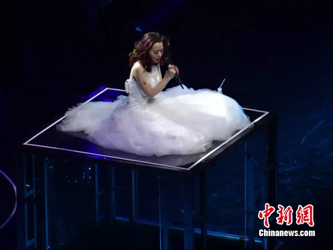
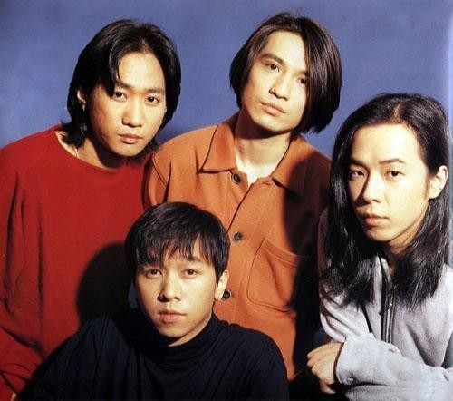
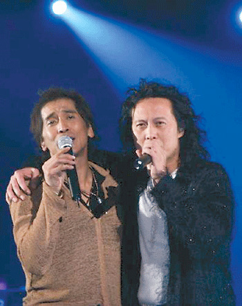
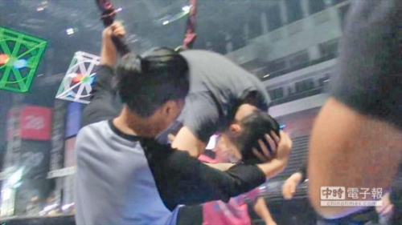
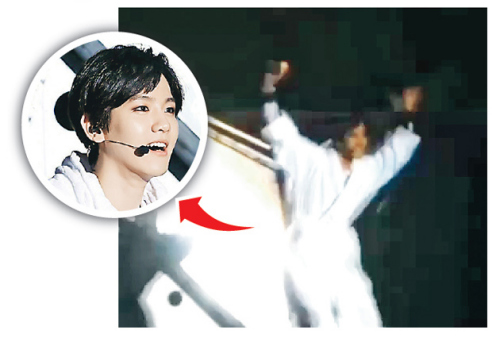
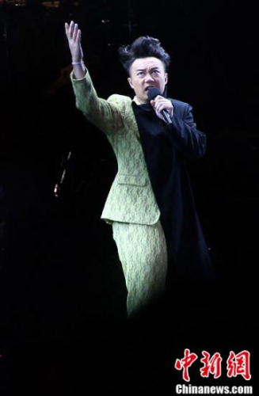
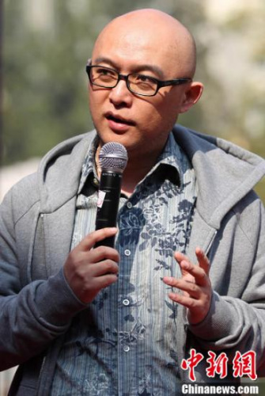

张靓颖在演唱会上。

中新网8月4日电

日前，张靓颖在北京举行个人演唱会，期间她从升降台处摔下，令在场歌迷担心不已，所幸她后来就医检查，身体并无大碍。

近年来，随着各类现场的演出增多，舞台上的事故也时有发生，除张靓颖外，陈奕迅、周杰伦、蔡依林等明星亦曾受伤，黄家驹、齐秦乐手甚至还付出了生命的代价，令人唏嘘。

## 张靓颖从升降台跌下 | 坐舞台上继续演唱

8月1日晚，张靓颖在北京举行个人演唱会，开始时，她从高空悬吊的巨型球中缓缓降落到舞台，引发全场尖叫。但好景不长，正在演唱《BangBang》时，张靓颖突然从升降台处摔下，好友王铮亮连忙救场自弹自唱，并告知全场，张靓颖确实不慎摔下舞台。

大约10分钟后，换上一袭白纱长裙的张靓颖再次登台，主动跟导演要求坐着继续唱，唱毕一曲后，她说：“我觉得慢慢缓过来了，后面我会给大家补偿回来。”

8月2日，张靓颖在微博表示自己没有问题，并感谢大家，“检查完，没有问题，放心地回到庆功宴。谢谢大家的关心！我很好，有音乐，有朋友，有你们！”

其实，这并非张靓颖第一次遭遇舞台事故，2011年3月29日，张靓颖在广州海心沙举行演唱会。现场，张靓颖兴奋地不停甩头，却突然毫无征兆地摔倒在地上，需要工作人员抬下舞台。在休息了几分钟后，张靓颖重新回到舞台上，继续高歌，她还开玩笑说“吓到大家了，对不起，刚刚是灵魂出窍”。张靓颖突然摔倒在舞台上，让很多现场歌迷以为她是体力不支晕倒，但后据了解，真实原因是张靓颖的高跟鞋太高，卡到了舞台上的地板，才险酿出事故。

Beyond乐队。图片来源：新华网

## 黄家驹坠台身亡

最令人心痛的明星坠台事故发生在1993年6月24日。当时，摇滚乐队Beyond主唱黄家驹在东京富士台录游戏节目，应邀与主持人一起玩游戏。由于舞台上有积水，黄家驹不慎从近3米高的台上失足跌下，头部首先着地，当即昏迷。当年6月30日，他在被救治144小时后去世。死亡时年仅31岁。

该起意外引发各界争议，日本警方就怀疑电台方面有过失嫌疑，令有关人士录口供协助调查，不少网友也对日本的舞台及游戏安全性提出质疑。

齐秦与鼓手黄建福。图片来源：重庆晚报

## 齐秦演唱会中鼓手坠台 不治身亡

2005年12月31日，“黄金20年齐秦首体音乐会”在北京举行。节目返场环节时，乐队鼓手黄建福要求与齐秦合唱《大约在冬季》，两人边走边唱。正当两人由舞台中间走至舞台西侧的时候，这位乐手突然坠入升降台中，而此时的齐秦并没有察觉，继续前行几步后才意识到同伴不见了。随后，齐秦边唱边往回走，走到洞口查询同伴伤情，之后很快结束了演唱会的演出。当时全场观众正沉溺于热闹的气氛中，此意外并没有惊动大部分人。

随后，该乐手被送往医院抢救，经过医生数小时的全力抢救，于2006年1月1日凌晨1时20分宣告不治身亡。

图片来源：台湾“中国时报”

## 潘玮柏排练中从高空摔下 | 头部伤口达17厘米

2014年10月25日，歌手潘玮柏原定在台北小巨蛋举行演唱会，但他在彩排中练习高空特技时，不慎跌落舞台，导致头部大量出血，送医后确诊有17厘米长的伤口，且有脑震荡迹象，经两次缝合手术后留院治疗。

随后，其所属的环球音乐连发两次声明，宣布演唱会取消，而虚弱的潘玮柏还遗憾地对歌迷说“I'm sorry(对不起)”和“I'm fine(我还好)”。

事发后，记录受伤过程的视频曝光，其中可见潘玮柏突然坠落，在空中发出惊叫，落地后以手捂头，头部有大量鲜血涌出，工作人员赶紧用黑布盖住，并迅速送医。

图片来源：香港“明报”

## EXO演唱会屡出事故 | 舞台装置落地砸伤粉丝

2014年6月，韩国男团EXO在香港举行第二场演唱会，期间发生小意外，成员Tao在演出中不慎掉落台下，幸无大碍，队友Lay立即拉他上台。Tao返回舞台时称：“I'm fine ，我没事，谢谢大家！”而成员D.O。在乘坐吊在空中的舞台装置移动落地时，装置也发生偏差，掉到粉丝所在的场地上，有多名观众受伤。

尽管如此，同月在武汉演出时，EXO成员还是遭遇了坠台事故。当时穿着白色浴袍的伯贤边走边跟歌迷挥手，结果误坠入舞台的升降机关，幸好“洞口”并不算深，他随即爬出来并示意“没问题”。

陈奕迅 资料图

## 陈奕迅唱跳时摔倒

2014年4月，陈奕迅在成都举行演唱会，在刚开始的快歌部分，陈奕迅边跳边唱，情绪非常高涨。突然间，他摔了一跤，令全场一片哗然。陈奕迅随即以迅雷不及掩耳之势，一个翻转起身，还笑着来了一句，“摔跤也开心！”瞬间化解尴尬。

不过，陈奕迅的这次摔倒还是把老婆徐濠萦吓得不轻，她在网上留言：“What Happened?! Are You Kidding?”

另据《现代快报》报道，早在2002年，陈奕迅在台湾一场校园演唱会中就曾不慎跌下舞台，拉伤大腿内侧韧带。

蔡依林 资料图

## 蔡依林排练中倒立摔下 | 神经受压迫手脚无力

2012年12月22日，蔡依林在台北为演唱会彩排，与男舞者表演半空倒立动作时，疑似因对方失手，导致蔡依林从离地1米处摔落，以头颈直接着地，吓坏众人。

据了解，蔡依林当时和男舞者进行空中倒立动作，却意外摔下。经纪人汤姆指出，当时男舞者原在高空中抓着蔡依林的手，但出现失误，刚好蔡依林正表演到倒劈的动作，因此在没有防备时摔落，头颈先着地。

蔡依林送医后，医生表示其神经有些受到压迫，因此左手和左脚有点没力气。

周杰伦 资料图

## 周杰伦曾两度踩空坠台

2007年7月28日，在深圳《不能说的秘密》的见面会上，因想和观众作近距离接触，周杰伦不小心踩错脚，坠下舞台，令现场一片寂静。

据悉，当时周杰伦决定和大家合唱一首《千里之外》。歌唱到一半时，台上的周杰伦被现场观众的热情感染，突然想下台和观众靠近一些，也许是因为太兴奋，他跳下台的时候一脚踏空，周围的保安和工作人员眼睁睁看着周杰伦脸朝下跌在地上。

摔倒后，周杰伦马上爬起来继续唱，但已经不太能听到他的歌声。在人群散去后他的宣传人员表示周杰伦并没有大碍。

此前，2006年底，网络盛传一段视频，周杰伦在一个演唱会上表演《龙拳》，先是在舞台前沿没有站稳摔倒，然后爬起来回到舞台又再次摔倒，但是周杰伦依旧马上起身继续演唱。阿尔发唱片随后查证后表示，这段表演是他曾经在美国演出时，不慎被舞台前缘安全护架绊倒的画面，摔倒确有其事，但好在他没受伤。

范玮琪 资料图

## 范玮琪演唱时踏空摔倒 | 膝盖受伤无法站立

2006年7月2日，范玮琪在台湾淡水渔人码头举行新歌演唱会期间，突然在台上失足跌下台底，现场工作人员上前抢救并立刻把她送进医院诊治，情况一度混乱。

据现场工作人员透露，当时范玮琪在台上演唱最后一首歌曲，靠近歌迷处兴奋大喊“谢”时，疑不慎踏上空台板，整个人突然间在台上消失，吓得工作人员立即从台底把她拉出来。由于台与台底之间有一段距离，范玮琪一双膝盖碰到地板时擦损受伤，痛得无法站起来，最后用冰敷住伤口赶忙送医。

孟非 资料图

## 孟非曾遭遇坠台事故 | 肘关节骨折仍坚持录制

其实，不仅在舞台上唱跳的明星会遇到事故，就连一向沉稳的主持人也可能坠台受伤。

据《北京晨报》报道，2012年5月19日，微博名“孟非粉丝团”的一条微博引发了媒体关注：孟非在北京录制《非诚勿扰》的过程中不慎跌落舞台，伤势十分严重。

事发第二天，负责该栏目宣传的张先生证实此消息属实，“经确诊是左手臂手肘关节部位骨折，已经打了石膏。当时是挺严重，不过现在孟非老师的状态好很多，他还要坚持录完今天的两场。”

据张先生回忆，“暖场环节，孟非和舞台左侧的嘉宾互动聊天。开场后，摄像要拍女嘉宾出场镜头，孟非下意识地让出位置，但当时他的站位已经比较靠左，在完全没防备的情况下，从大概半米多高的舞台上跌落。跌落处又是空地，孟非是用手臂撑住身体，当时手臂就不能弯曲了。事情发生后，节目录制一度中断，工作人员建议暂停录制，但孟非坚持录完，3个小时后才去附近的医院就医。当时就打了石膏，医生建议休息一段时间。”
