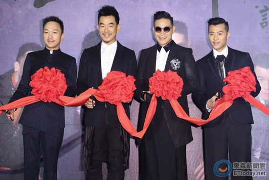

图片来源：台湾“东森新闻”

中新网9月16日电

据台湾“东森新闻”消息，近日，由任贤齐、苏永康、梁汉文、黄家强组成的“男人帮”，在接受采访时，被问如何与当下流行的“小鲜肉”抗衡，黄家强端出“卤肉说”，表示他们是靠时间熬出来的，更有男人味，“小鲜肉”只是口感比较好，但味道比较淡。

此前，同为Beyond团员的黄家强跟黄贯中闹翻，2014年还曾在微博写下长文，反驳黄贯中和前经纪人陈建添的指控。16日，黄家强被问Beyond是否有合体可能，他说道：“现阶段不可能，这一两年没有这个规划，因为我还有一些其他的事情想做。”

近期，苏永康曾透露希望黄贯中来当演唱会嘉宾，黄家强被问到是否愿意跟黄贯中同台，他没说愿不愿意，而是要媒体先去问观众，随后才说：“可以啊！来当他(苏永康)的嘉宾嘛！他们合唱，我觉得很好！”
