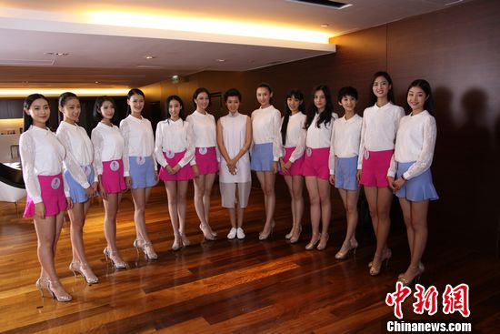
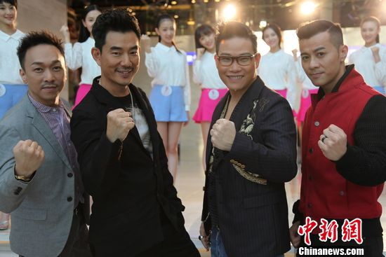

中新网9月25日电

昨晚，由任贤齐、黄家强、苏永康和梁汉文组成的“男人帮”在凤凰卫视，与12位“2015中华小姐环球大赛”候选佳丽见面，并共同录制大赛宣传片。他们还将于10月17日总决赛当晚担任表演嘉宾和评委。

2015中华小姐总决赛在即，12位佳丽虽然做了充足的准备，但是面对激烈的竞争和高难度的比赛环节，仍然感到有些紧张。“男人帮”的四位成员作为资深前辈，纷纷给佳丽们提供建议。黄家强在赞美12位佳丽十分美丽的同时，还提出要通过得体的言谈举止，展现她们的内在美。梁汉文说：“台上一分钟，台下十年功。用功很重要，要享受‘用功’。”苏永康谈到要学会缓解压力，把压力化成正能量，比赛前全力以赴，比赛时尽情享受。任贤齐面对佳丽们说：“人终其一生都在追求梦想，不要放弃。这是一个很难得的机会能够激发你们的潜能、把握真善美，希望你们和谐融洽，享受这段时光。”

录制完大赛宣传片，凤凰卫视主持人田川还邀请男人帮谈一谈他们各自对于“冠军”的标准是什么。任贤齐心目中的“冠军”，是要有端庄的外型，美丽的智慧和善良的心地。梁汉文认为自然的笑容很重要，因为可以从笑容中看出这个女孩有没有亲和力，有没有信心，有没有味道。苏永康和黄家强对于“冠军”标准的看法比较接近，均是要内外兼修，兼具健康的外表和心灵。

“男人帮”四位成员都是有家室的人，他们表示这次能当华姐的评委很开心，因为这是一次光明正大欣赏美女的机会，“太太帮”绝对不会有异议。

据悉，在10月17日2015中华小姐环球大赛总决赛当晚，“男人帮”除了担任评委之一，还将与12位选手们同台演出，为大家奉上一场选美盛宴。
