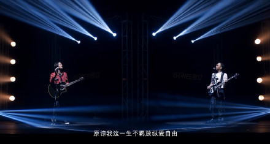
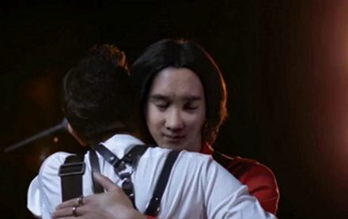

图片来源：台湾“东森新闻”

图片来源：台湾“东森新闻”

中新网12月22日电

据台湾“东森新闻”报道，Beyond主唱黄家驹1993在日本录像时，跌落2.7米的高台，最后重伤不治，虽然逝世22年了，但他的歌依然被很多人熟知。日前，黄家驹弟弟黄家强接下某手机品牌代言，他与哥哥在广告中另类“隔空演出”，最后还相互拥抱。

黄家强在广告中先是拿着贝斯唱起经典的《海阔天空》，紧接着“利用特效CG做出来的”黄家驹身影便从逐渐亮起的灯光中走出，与他跨时空合唱。黄家强表示，虽然失去哥哥的这22年间经历人生起伏，但是“每当我抬头望着你的时候，所有的磨难都不值得一提了。”

最后，黄家强也在音乐结尾奋力奔向黄家驹，紧紧抱住哥哥，表情看起来相当复杂，而哥哥则是闭着眼露出欣慰的微笑。不过，有网友认为这支广告“CG技术做得有点差”，黄家驹的模样有些失真，但黄家强表示广告目的还是以怀念哥哥为重，事后也将会以哥哥的名义捐款110万元。
