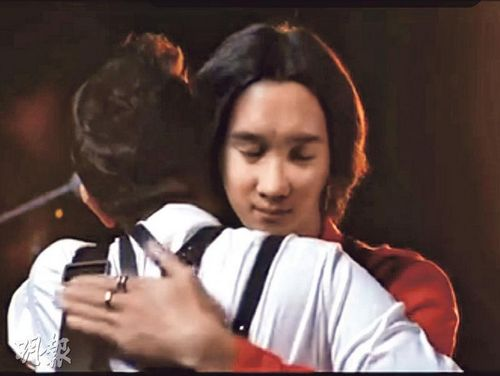
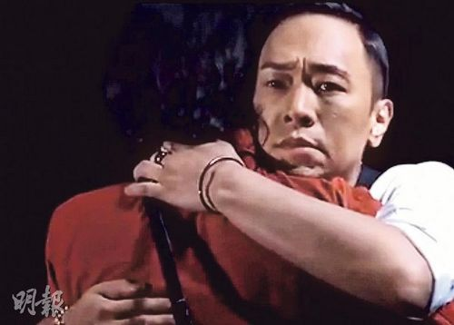

图片来源：香港“明报”

图片来源：香港“明报”

中新网12月23日电

据香港“明报”消息，近日，黄家强最为内地手机品牌担任代言人，日前播映他的广告宣传片。宣传片中，他与亡兄黄家驹隔空合唱《海阔天空》。镜头前他与假“家驹”拥抱，但假“家驹”被网友吐槽像山寨版的蜡像。昨日，黄家强回应拥抱假“家驹”，称自己也觉得不像，但意义上已达到。

据悉，该广告共筹得220万人民币善款，将捐给需要帮助的小朋友。

对假“家驹”遭差评，黄家强称演出时投入唱歌没看清楚。不过，现在看照片她也觉得不像，但他相信品牌已尽力，在科技上未达标，但意义已达到。发布会上他很感动，除了他捐出110万人民币外，该品牌老板还又捐出110万人民币，合共筹得220万人民币。这笔钱将以黄家驹名义建学校、图书馆与儿童快乐家园。对于黄家强此举，有人斥其“发死人财”吗，但也粉丝为其抱不平，称黄家强饱受压力。
