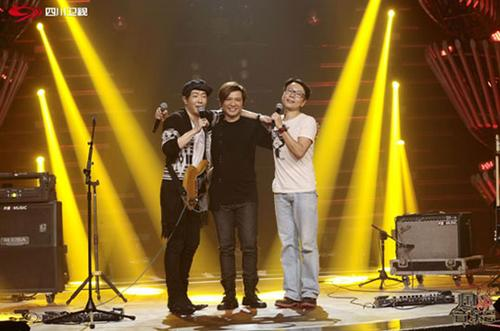
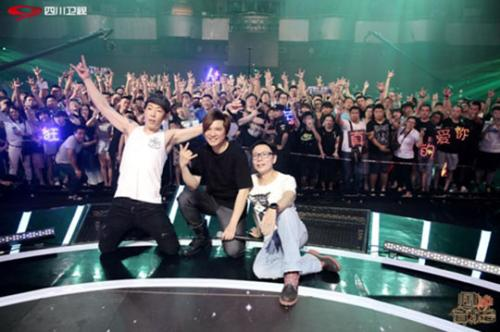

作为内地一档注重音乐性和故事性的优质音乐节目。《围炉音乐会》一直热衷于邀请经典的摇滚歌手，从流行摇滚赵传到摇滚教父崔健，从与中国摇滚同岁的黑豹乐队再到几代人心中的摇滚信念Beyond，摇滚精神一直存在。提到的这支香港殿堂级摇滚乐队——Beyond，人们更是充满着无限感慨。他们是一个人的青春记忆，更是一个时代的标志，本期《围炉》前Beyond成员叶世荣将携手昔日队友黄贯中、刘志远故地重游，围炉重聚。本周四晚20：30，四川卫视《围炉音乐会》，让我们一起重温那些属于我们的光辉岁月！

Beyond三子《围炉》重聚

1983年，Beyond成立，主唱兼节奏吉他手黄家驹和鼓手叶世荣作为首批团员加入。1986年键盘手兼吉他手刘志远加入，1988年，刘志远因出国留学离团，1993年，黄家驹在日本演出时意外去世，1999年，Beyond宣布解散。而此次《围炉音乐会》叶世荣专场，邀请昔日团员黄贯中、刘志远重聚，已经阔别近三十年了。解散后的Beyond成员各自发展，从鼓手变成主唱的叶世荣，刚导演了处女座mv的黄贯中，一直很有才华的刘志远，在节目中，他们不仅带来青春回忆的《光辉岁月》《灰色轨迹》《大地》《海阔天空》等经典歌曲，叶世荣还演绎了自己的新曲《荣光》《蓝蓝的天》。而谈起Beyond每个时期不同的音乐风格，叶世荣坦言：“Beyond只分两个阶段，有家驹的和没家驹的。”阔别三十年后《围炉》重聚，重温他们的光辉岁月。曾经的兄弟们在现场释放着他们的情感，熟悉的旋律和重金属的摇滚惹得粉丝连连尖叫！
