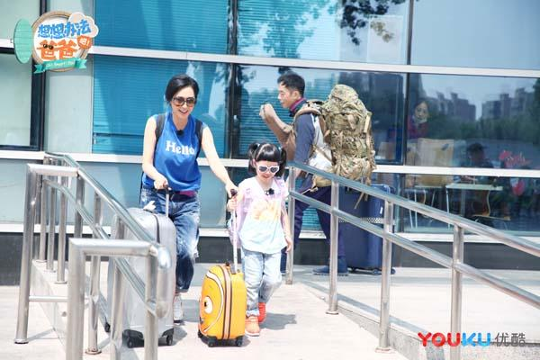

## 《想想办法吧爸爸》朱茵夫妇甜蜜加盟 摇滚老爸黄贯中带娃展露柔情一面

摇滚老爸黄贯中会带娃？还未与孩子分别朱茵就哭成了泪人，是不舍还是不放心？由优酷推出的暑期陪伴综艺《想想办法吧爸爸》还未开播就给大家留足的悬念，黄贯中、朱茵夫妇带女儿黄莺重磅加盟，究竟还有多少趣事即将发生，7月26日优酷《想想办法吧爸爸》首播，敬请期待！

多年来，无论是Beyond的首首金曲还是紫霞仙子一眼万年的回眸都久久萦绕在大众心里，留下难以忘怀的印记。作为娱乐圈的模范夫妻，黄贯中说“追上朱茵花掉了他一生的运气”，而朱茵同样深情表白称“黄贯中就是我的盖世英雄”，两人的爱情浪漫却低调，令不少人艳羡不已。年轻时的黄贯中性格火爆、敢于冒险，在舞台上用一把吉他宣泄着自己的摇滚梦想。但就是这样一位不羁少年却在朱茵面前收起了所有锋芒，甘心做一个温柔体贴的好丈夫、好爸爸。朱茵因一部《大话西游》成为无数人心目中的“女神”，却在最火的时候出乎意料地选择了“退居二线”相夫教子。双方的付出令不少人好奇他们的相处之道。

有粉丝如此评价：“朱茵和黄贯中在所有人都不看好的情况下坚守彼此，让我们看到了爱情的模样。”婚后有了女儿后，一家三口更是幸福甜蜜，无论是外出游玩还是去餐厅就餐，黄贯中都扮演着“跟班”的角色，时刻把妻子女儿放在首位。而朱茵也频频携女儿现身黄贯中的演唱会大胆示爱，满眼的爱意掩藏不住。

两人的爱情故事大家都耳熟能详，但摇滚老爸黄贯中的带娃功力却鲜有人知。前不久有路透放出，朱茵在机场与女儿分别时伤心痛苦，是否是对黄贯中独自带娃放心不下？在24小时全天候带娃找妈妈的过程中，黄贯中能否完成独自带娃的重任？他将会展现摇滚范的带娃风格还是出人意料的反差柔情？一切都将成为未知的惊喜。目前，《想想办法吧爸爸》5组嘉宾已经全部官宣，戚薇和老公李承铉的女儿lucky李乐褀机灵可爱金句多，成为网友心中独宠的“小女王”；洪天明的两个儿子长相清秀性格“火爆”；黄英曹帅的儿子小九呆萌长相和奶味儿东北话已圈粉无数；新晋男神陈飞宇一人带两娃状况百出；朱茵和黄贯中的女儿Debbie也吸引了无数人的目光，Debbie大名黄莺，听说个性乖巧懂事是爸爸妈妈的贴心小棉袄。这么多可爱的萌娃，他们将和爸爸一起经历一段具有挑战又有爱的旅程，在这个暑假，由他们来诠释什么叫“陪伴”。

《想想办法吧爸爸》以“陪伴”为核心，通过“爸在囧途”的体验式旅行，挖掘两代人之间的美好与萌趣。就像节目的名称一样，“想想办法吧爸爸”，看来又是一场为父亲和孩子之间的“终极较量”，那么妈妈究竟担当了何种角色？打破常规带娃印象的关系重组，究竟会发生如何的化学反应？7月26日优酷《想想办法吧爸爸》带你一探究竟！
