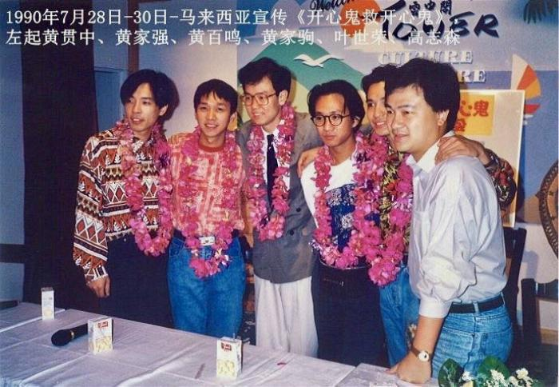

图为香港导演高志森与Beyond乐队的历史合影。 受访者供图 摄

中新网重庆11月13日电

香港导演高志森13日晚携音乐剧《Beyond日记之海阔天空》登陆重庆抗建堂剧场。在接受中新网记者采访时他说，希望通过剧目传达Beyond乐队的“歌曲精神”——“一个人要有自己的梦想，并敢于追求自己的梦想，不要放弃”。

图为香港导演高志森与Beyond乐队的历史合影。 受访者供图

音乐剧《Beyond日记之海阔天空》讲述了4位年轻人因热爱音乐而走到一起，中途遭遇矛盾纠葛，后温暖化解的故事。时长2个小时，以Beyond乐队的30首经典曲目作串联。高志森提到，该剧为虚构剧情，主旨是“不忘初心”。随着剧情发展，Beyond乐队的歌曲与戏剧元素相融合，可让观众直观感受剧中人物的心理状态。

今年61岁的高志森是香港资深舞台剧、电影监制。上世纪90年代初，高志森曾与Beyond合作《开心鬼救开心鬼》《Beyond日记之莫欺少年穷》两部电影，将近一年的合作让双方建立起友谊。

图为音乐剧《Beyond日记之海阔天空》剧照。 主办方供图

“合作中的每次沟通，都由黄家驹为代表。”高志森回忆说，商议电影的主题曲、插曲、宣传工作时，黄家驹对人做事最大的特点是“为对方着想，不搞对抗”。即使双方有意见相左，也是充分沟通，“退一步海阔天空”。

“制作《Beyond日记之海阔天空》是我多年的心愿，也是我与他们工作一年时光的纪念。”高志森说，剧目从写剧本、找演员、编排到上台演出总共用时三个月。剧中乐队成员扮演者多为“90后”，具备唱、演、弹奏乐器功底。

记者看到，音乐剧中的30首曲目包括《海阔天空》《喜欢你》《光辉岁月》《情人》等Beyond乐队脍炙人口的歌曲。高志森说，与常规的音乐剧不同，该剧主要由歌曲和戏剧互相推动，最大的亮点是百分百的现场音乐呈现。场景颇具港风，时空跳跃虽快，但转场一气呵成。

高志森说，他自己是Beyond乐队的歌迷，最爱的歌曲是《真的爱你》，“因为摇滚乐队中，唱亲情的较少。Beyond乐队的歌曲风格多样、包容性很宽，唱环保、爱情、亲情、做人态度等等，大多是正能量的主题。”

据介绍，《Beyond日记之海阔天空》已在香港、新加坡、广东惠州演出，重庆是中国内地的演出第二站。剧目将在重庆抗建堂剧场连演5场，时间为11月13日至11月17日的19时30分。

抗建堂是中国首个抗战戏剧主题话剧类专业博物馆。重庆市话剧院有限公司董事长张剑说，这也是抗建堂修缮运行以来，首次承接香港剧目。下一步，重庆市话剧院将与香港春天实验剧团、香港焦媛实验剧团签订战略合作协议，进一步深化合作。
