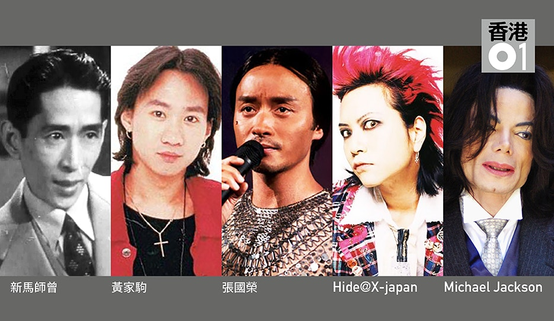
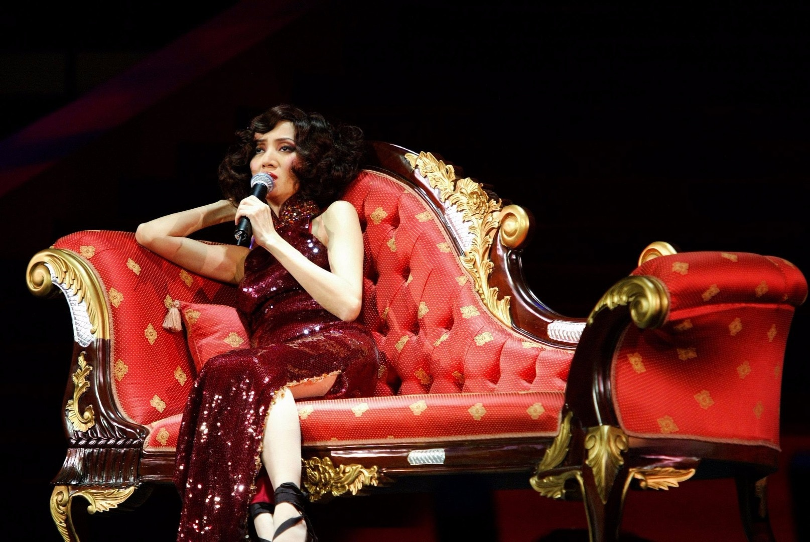
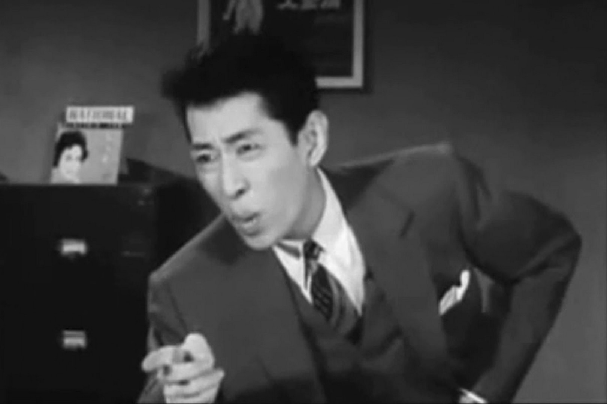
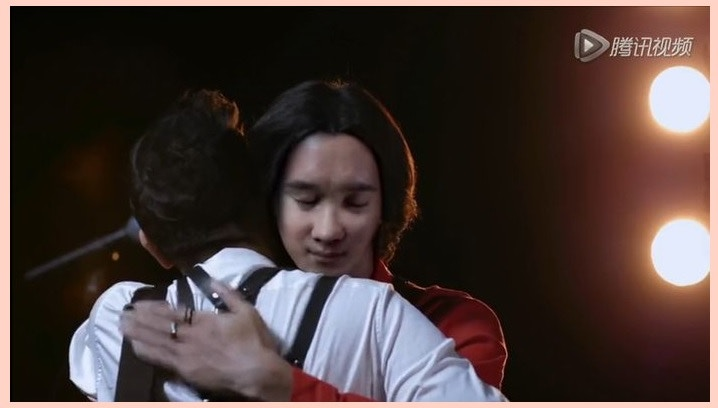
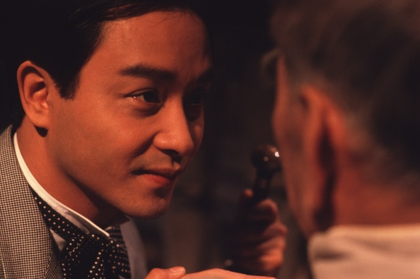
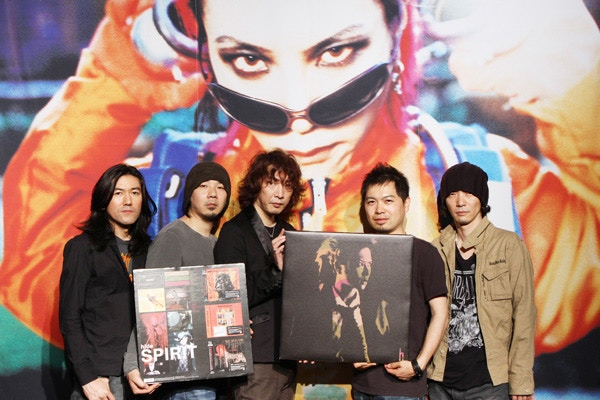
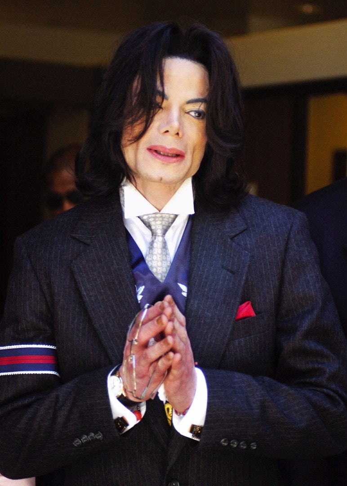

不少已故巨星生前風光，死後卻被好友至親「消費」到盡。

梅艷芳死後不斷被「消費」，令一眾梅迷心痛。(Tung Star)

不經不覺，樂壇天后梅艷芳（梅姐）已離開12年，伴隨而來除了思念，今年卻增添痛恨與不捨。梅姐最後一批遺物早前再度公開拍賣，儘管她一生璀璨，受盡萬千寵愛，死後卻一次又一次被無情「消費」。除梅姐外，其實全球多位已故巨星有類似遭遇，身邊摯友，甚至親人，藉死者之名博見報或歛財，有意無意將已故巨星「抽到盡」。

新馬師曾家族爭產沒完沒了

已故慈善伶王「新馬師曾」鄧永祥（祥哥），1997年因病去世後遺下一筆估值高達4億2千萬遺產予4名子女，結果引發持續10年的爭產風波，祥嫂洪金梅與子女兆尊、兆榮、小艾及碧玉分成兩黨，各人更經常透過傳媒互相對罵。至2006年，法官裁定祥嫂敗訴，同年10月，祥嫂卻戲劇性宣布與鄧家各人和好如初，爭產仇恨煙銷雲散。

祥哥死後接近20年，其遺產仍成為家人因財反目的原因。(YouTube截圖)

正當眾人以為祥嫂與子女有完美結局，誰知沉寂9年後，2015年由祥哥次女鄧小艾與三子鄧兆榮就8,000萬遺產稅上訴，一家人又因財反目斷絕來往，祥嫂不時見報，更大爆祥哥生前爛賭。另外，祥嫂在14年12月曾表示會聯同子女，替亡夫於15年8月搞紀念100歲派對，雖然最後不了了之，但祥嫂再次成為新聞人物。

偽「家駒」與真家強。(騰訊視頻截圖)

黃家駒「翻生」開腔

最近黃家強為內地手機品牌代言拍攝宣傳短片，演唱Beyond經典金曲《海闊天空》，並利用CG技術，令亡兄黃家駒再現片中，最後來個緊緊相擁。廣告一出，網民批評家強一邊自言受Beyond盛名所累，另一邊卻在商業活動中消費家駒。黃家強事後回應廣告主要是懷念哥哥，並會以其名義向多個慈善機構捐贈110萬元，希望能夠延續哥哥的精神，造福社會。

其實早在2009年7月，黃家強和黃貫中（Paul）兩人曾在紅館舉行3場的《THIS IS ROCK N ROLL》演唱會，更邀請台灣五月天樂隊、黃耀明、太極及陳奕迅做嘉賓，當時葉世榮「被飛起」，稱自己沒有檔期可出席。不過去年10月，黃家強表示因不滿一直被Paul抹黑，在微博上發表一篇逾5000字的〈真相〉文章，力數Paul的不是，更爆出樂隊解散的原因是Paul嫌棄世榮，雙方正式決裂。之前一直不參與重組Beyond的葉世榮，於今年5月以個人名義入紙紅館，宣布將舉行紀念黃家駒音樂會，不過其他兩名成員卻還沒答應會同台表演，看來「家駒」之名日後會繼續被「消費」。

自從哥哥離開後，陳淑芬每年4月1日發起的活動總是引人注目。(Getty Images)

停不了的張國榮紀念活動

2013年4月1日，哥哥張國榮逝世10周年，其身邊人包括前經理人陳淑芬，為哥哥舉行連串大型活動，包括紀念演唱會、音樂會、紀念展等等，相比往年只到文華酒店獻花懷念，所有10周年紀念活動難免顯得「商業化」，令「哥迷」認為有人藉哥哥之名斂財，連新加坡傳媒亦稱「所有人口口聲聲訴說着自己對張國榮的愛，但又用一些世俗的聲音去騷擾他。」

自從哥哥離開後的每年4月1日，由陳淑芬發起的活動總是引人注目，自前年舉辦10周年活動後，陳淑芬曾表示不再公開搞紀念活動，但去年突然稱有前輩提議她為哥哥舉行音樂劇，陳淑芬指若有100萬人次對此提議「讚好」，便會決定籌備，雖說音樂劇最後沒辦成，但卻被網友批評此舉對哥哥有欠尊重，並指不要再消費哥哥。

前X JAPAN結他手hide死後不斷有「新作」推出。（網上圖片）

hide死後新作長出長有？

前X JAPAN結他手hide（松本秀人）於1998年5月被發現於家中離世，其死因至今仍充滿謎團，但其搖滾巨星的魅力一直未有減退，於日本橫須賀的紀念博物館每次開放都人頭湧湧，專用結他和相關商品亦長賣長有，而最離奇的是在他過身多年後還不時會推出「未發表新曲」。

事實上作為殿堂級樂手，hide生前曾經和大量音樂人合作，而且作曲無數，這些歌曲的版權持有者大多為hide本人，在他過身後，版權便由經理人兼胞弟松本裕士擁有。哥哥遺留下來的「倉底貨」成為了裕士的資產，他亦曾經在2007年X JAPAN重組時，為了能否讓X JAPAN繼續使用hide的影像而打過官司，這次事件令人覺得裕士靠發「死人財」為生。不過亦有不少作品是其他音樂人真心為紀念hide而推出，例如「hide with Spread Beaver」或一些後輩翻唱hide歌曲的紀念大碟，其銷量數字均非常可觀。

MJ生前的私人物品、紀念品、紀念騷、重製專輯等，均成為其家人、公司等人吸金來源。(Getty Images)

MJ離世「更賺錢」

已故流行天王米高積遜（Michael Jackson，MJ）於2009年6月離世後，以其名義所帶來的利益似乎長做長有，連續多年登上財經雜誌《福布斯》的「最賺錢已故名人」排行榜。

早於MJ去世當年，洛杉磯政府負責舉辦追思會，發起粉絲募捐籌備經費，間接讓地方政府賺一筆。而在MJ離世不久，其家人、公司以至保鑣及粉絲都爭相斂財，除兜售MJ生前私人物品，又推出各款印有其頭像的紀念品，以及舉行致敬騷吸金。

此外，2011年太陽劇團以MJ的作品製作《不朽傳奇》全球巡迴演出，收入高達數十億港元。除多張重製專輯及精選集外，去年唱片公司以MJ遺作推出專輯《Xscape》繼續吸金。
