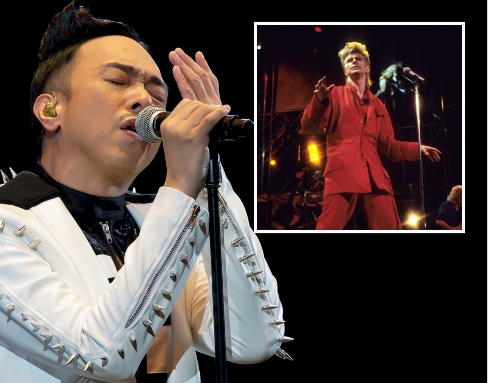

大衛寶兒敵不住癌魔，黃家強祝願偶像好好安息。

英國傳奇男歌手大衞寶兒（David Bowie）今日驚爆死訊，終年69歲，令全球樂迷大感震驚。其實他在本月8日才推出全新專輯《The Next Day and Blackstar》慶祝生日，豈料3日後，其官方社交網卻宣布大衞寶兒因癌症離世，由於事出突然，圈中不少藝人感到難以接受，並紛紛在微博悼念一代巨星。

Paul在微博悼念大衛寶兒。(微博圖片)

在樂壇地位超然的大衛寶兒，跟香港淵源甚深，除曾來港開騷外，更演繹過國語歌，屬Glam Rock及流行音樂界的靈魂人物。近年屢傳不和的Beyond三子，不約而同在微博留言悼念，黃家強寫道：「好沉痛的消息，我的偶像David Bowie因癌病離開了，祝願偶像可以好好安息，永遠懷念您 。」而葉世榮及黃貫中（Paul）則分別寫上：「David Bowie 一路走好」、「David Bowie, RIP !」

除香港歌手外，台灣歌手韋禮安在微博感慨寫道：「Another great has fallen. Rest in peace.」另一台灣歌手吳建豪（Vanness）亦留言悼念偶像。此外，汪峰、許懷欣、A-Lin（黃麗玲）等歌手相繼在微博留言懷念大衛寶兒。
