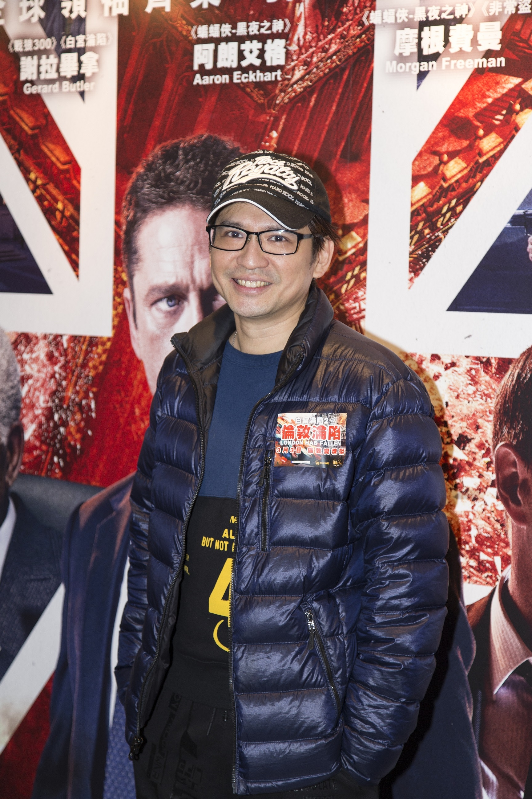

世榮說家強開始軟化，並希望借今次機會，令Paul與家強和好如初。（黃國立攝）

王宗堯、張建聲、莊思敏、葉世榮、陳浩民、何浩文、何佩瑜等藝人出席電影《白宮淪陷2之倫敦淪陷》首映禮，Beyond成員葉世榮表示最近忙於籌備6月舉行的黃家駒紀念音樂會，對於黃貫中（Paul）與黃家強反目拒同台，世榮表示：「Paul一早答應出席了，現在主要看家強的意思，我已與家強見過幾次面，他的態度沒有當初強硬，開始軟化。我明白不能一時三刻改變別人的想法，知道家強始終有些事放不下，仍有矛盾，希望借今次機會，令他們和好如初。」

不刻意擺和頭酒

問到可會為他們擺和頭酒？世榮笑說：「我不是經常喝酒的，但如果真的可以三人一起出席聚會，那是很值得開香檳慶祝，但好像太刻意了。」提到早前家強為內地品牌拍攝廣告，廣告中與CG合成的家駒對唱，引來不少網民批評「家駒」樣子太膠，問到紀念騷可會加入CG畫面？世榮說：「構思舞台內容方面仍然好初步，最重要是宣揚家駒的愛心，現在只想Beyond三子重新見面，同時正邀請其他樂隊出席，太極、草蜢已落實參加。而主題曲也完成了，歌名是《延續》，旨在延續家駒精神。」
