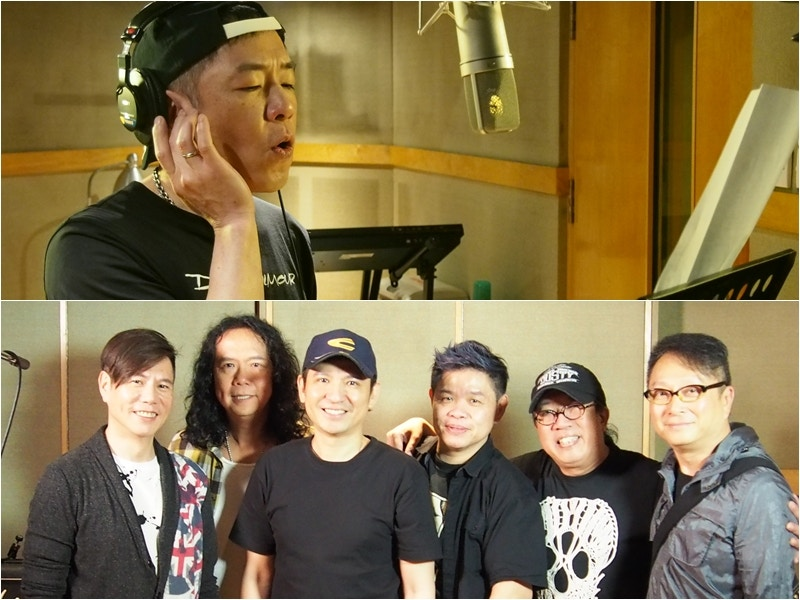

2/3個Beyond將會在家駒生忌當天舉行的演唱會演出。（符祥定攝）

假如黃家駒沒有離開我們，他今年6月10日，將會度過54歲生日；不過，家駒卻又是從來沒有離開過大家，他的歌陪伴香港人走過年年月月。由前Beyond成員葉世榮發起的《家駒……愛心延續慈善演唱會2016》，將會在家駒的生忌當日於灣仔會展舉行，今天Beyond的3位成員，有2位站在台上出席演唱會的發布會，葉世榮與黃貫中（Paul）都會在演唱會演出。發布會上更首播由世榮作曲演唱會主題曲《延續》的MV，演出的歌手除了世榮與Paul外，還有太極樂隊、鄧健泓等。

幫得幾多就幾多

Paul說：「我用了2秒就答應演出（演唱會），希望幫到幾多就幾多，只想做好它，因為是紀念一位朋友。」問到演唱會上，可會與世榮合唱？Paul表示：「少不了的吧！」至於家強缺席演出，Paul對此沒有正面回答，只說：「希望可以多些人參與啦。」到時到場支持的，一定也有老婆朱茵與女兒的吧？「她（朱茵）都很支持的。女兒上次看完我的演唱會上了癮，假如不讓她來就要想辦法騙她呢！」

《家駒……愛心延續慈善演唱會2016》期望可籌得過百萬善款幫忙有需要的人，將家駒的愛心延續下去。（符祥定攝）

希望籌得過百萬

說到舉辦演唱會的因由，就要由去年導演朋友拿了一張家駒慈善演唱會的海報給世榮看說起，「每年都有人以家駒名義籌款，但從不知最後籌得多少錢，我想以身作則舉辦一個認真而有影響力的演唱會，希望大家以後搞紀念家駒演唱會時會認真的去處理，以及我想藉着今次演唱會，將家駒的愛心延續下去。」世榮期望今次可以籌得過百萬善款。

身為今次演唱會的發起人，世榮說要多謝Paul，「我有這個想法，第一時間找他，他很支持。」世榮亦有找黃家強，「他亦很支持，只是他真的沒時間，有工作在身，隨緣吧。」至於連主題曲家強也沒有參與，世榮說他亦是沒時間，「因為首歌做得頗急趕的。」

對於是否因為與Paul有爭拗，家強才沒有參與今次演出，世榮表示家強的態度其實已經軟化，「無奈有工作，沒辦法喇，假如今年辦得成功，明年我會繼續搞，希望善款一年多過一年。

Paul、世榮與太極等為紀念家駒的演唱會錄製主題曲《延續》，今天發布這首歌的MV。
