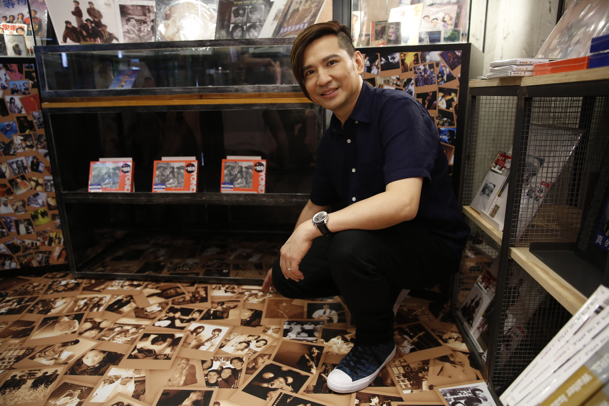
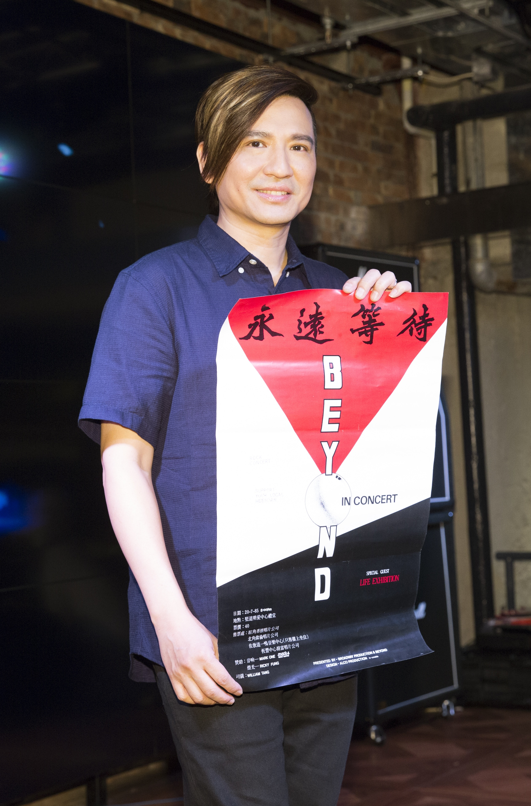
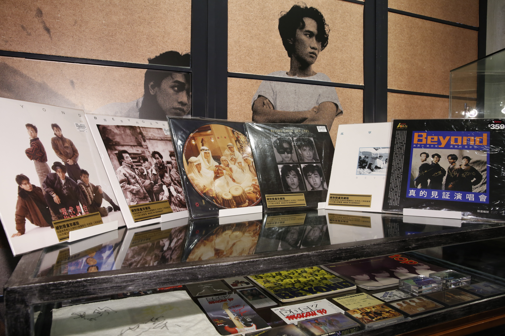

展區地上有多張Beyond以及家駒的照片，大家可以蹲下來慢慢細味，只是，粉絲你們捨得踏上去嗎？（符祥定攝）

世榮帶了多張Beyond珍藏海報，當中少不了首張自資演唱會海報，意義重大。（符祥定攝）

Beyond成員葉世榮到銅鑼灣HMV旗艦店參觀Beyond歌迷珍藏區，據知歌迷為響應6月舉行的《家駒愛心延續慈善演唱會》，將收藏多年的Beyond海報、黑膠唱片，以及已絕迹市面的卡式帶，作展覽用途。世榮亦帶了多張海報，當中包括1985年Beyond首張自資演唱會海報。世榮手執海報時，有很多回憶，「當時自資舉辦演唱會，設計好海報後交給印刷公司製作海報，然後到處張貼，整件事好有畫面。」

問到演唱會門票的銷售狀況，世榮表示情況理想：「好多人想買都未必買到。」不過他表示不會加場，「都會等到明年，因為希望每年家駒的生忌（6月10日）都可以搞演唱會，還有想齊人，可以與家強、阿Paul（黃貫中）一起，明年唔得，就等到再明年。」世榮表示舉辦演唱會，目的就是想把家駒的愛延續下去，所以希望演唱會的效果理想。

世榮到歌迷珍藏區參觀，他看見其中一張在中東拍攝的唱片封套（圖中），大講當年趣事，原來拍攝當天碰巧是齋戒日，他被當地人問何以穿得如此光鮮。（符祥定攝）
