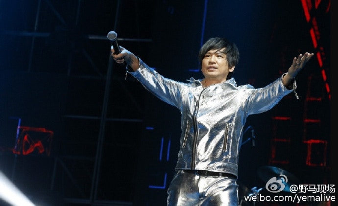
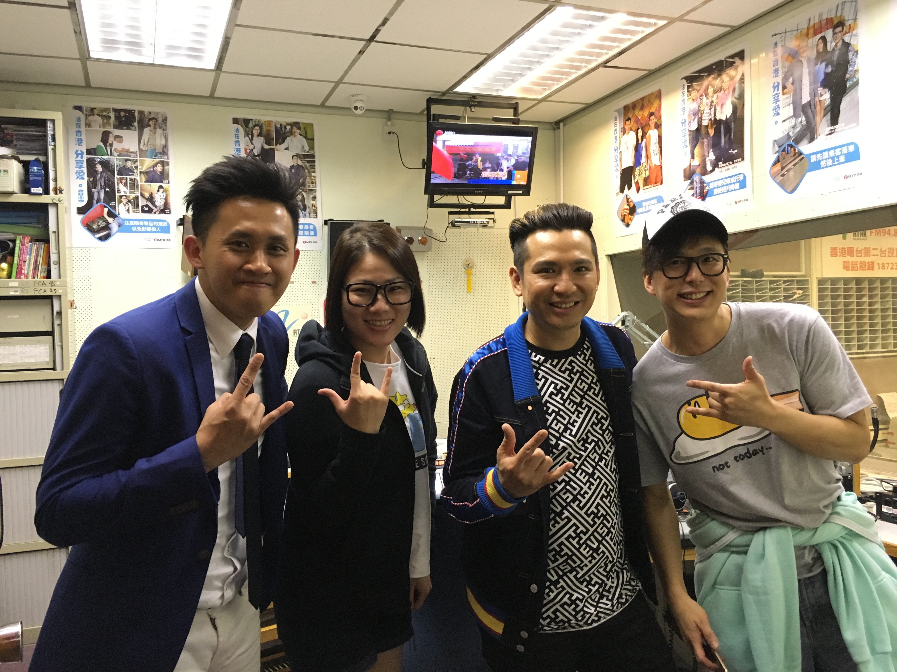

import YouTube from '@/components/patterns/YouTube.astro';

為了紀念家駒54歲生忌，葉世榮（右）出任發起人，舉辦一場《家駒....愛心延續慈善演唱會 2016 》。（微博圖片）

> Youtube：再見家駒 (beyond黃家駒出殯)93.7

「今天只有殘留的軀殼，迎接光輝歲月…」是不是又令你想起很多集體回憶呢？在華語樂壇當中，Beyond可以話是最具代表性的搖滾樂隊之一，不經不覺這個殿堂級搖滾樂隊主音黃家駒亦已離開我們23年，今日（10日）為了紀念家駒54歲生忌，身為樂團鼓手的葉世榮就出任發起人，舉辦一場《家駒.....愛心延續慈善演唱會 2016 》，廣邀一班歌手朋友，包括黃貫中 ( Paul )、鄧紫棋 (G.E.M.)、梁詠琪、側田、盧巧音等人齊齊唱歌，以音樂的形式將家駒的大愛精神延續下去。

一拍即合　音樂結下兄弟緣

Beyond的歌除了對香港人來說影響深遠之外，在世界各地有一定的地位。與家駒相識多年的好兄弟世榮憶起第一次兩人相見情景時，總覺得回憶是美好的。透過友人介紹而互相結識他們，第一次見面就一拍即合，世榮表示見到家駒，對他第一個印象就是健談、喜愛音樂、結他癡。音樂自自然然將他們結下兄弟緣，到83年他們以Beyond名義參加比賽，就開始了Beyond的生命。

（資料圖片）

黃家駒愛心滿瀉　影響身邊人

創作了得又唱得的家駒同樣有愛心，經常參與慈善活動，熱心社會的行為亦影響身邊人，世榮感觸說道：「我們夾band時經常有慈善活動，他好贊成同鼓勵我們去，他又好關心別人、關心世界同社會。」世榮更大爆家駒料表示：「有時他都囉唆，同他討論問題，有時他太有見解，在時間上的折磨下大家就會屈服。」不過就正正因為家駒有主見，使他成為樂團中不可缺一的人。

葉世榮舉辦《家駒....愛心延續慈善演唱會 2016 》，黃貫中全力支持。（微博圖片）

因為家駒的離世，世榮表示當時Beyond突然間失去樂隊靈魂人物，無論感情和事業上都備受沉重打擊。（微博圖片）

Beyond面對低潮　曾經想放棄

一向主張創作的他們，面對市場要求也不得不就範，從開始寫流行曲《昔日舞曲》、《永遠等待》等歌不受歡迎，亦沒有使他們放棄，直到《真的愛你》，《光輝歲月》才真真正正讓人感受到Beyond的魅力。從而奠定Beyond是殿堂級搖滾樂隊的地位。當音樂事業爬上一個高峰期時，不如意的事就發生。93年到日本發展，參加電視台遊戲節目時，黃家駒不幸發生意外，頭部墜地，陷入昏迷狀態，最後亦撒手人寰。

面對家駒的離世，世榮、Paul和家強突然間失去樂隊靈魂人物，無論感情和事業上都備受沉重打擊，世榮面對家駒的離世，仍然記憶猶新：「三個人的時候是冇主導，變了好混亂。因為之前大家依賴性好強，冇了家駒，承受壓力最大，亦是人生中最痛苦的時候，我們曾經有段時間想放棄，休息了一段時間，但我們三個不想辜負歌迷期望，亦不想Beyond就咁停止好可惜，所以硬着頭皮重新企番起身。」對於Beyond過去的黃金十年，真的影響好多人，今次世榮為了好兄弟舉辦紀念演唱會，相信又會引發大家的美好回憶。

> 青春的軌跡：第九集:《驕陽歲月》1993年 《BEYOND – 黃家駒》
RTHK官方youtube頻道

<YouTube id="PVj25_OwMLY" />

> Beyond 黃家駒 - 遥かなる夢に ("海闊天空"日文版)

<YouTube id="wM_LlHoNuTY" />

> 1993年家駒離開後，香港電台電視部製作的特輯《BEYOND黃家駒》，紀錄了家駒最後一次在香港的公開演出《海闊天空live@我哋呀!unplugged》。

<YouTube id="34vO1Xl-pEw" />

世榮為了這次演唱會，真的用心用力。
