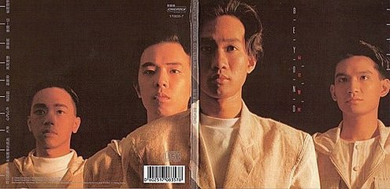
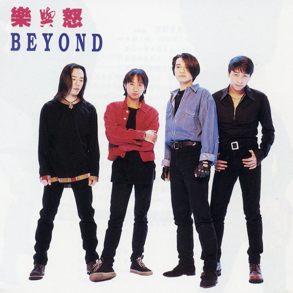
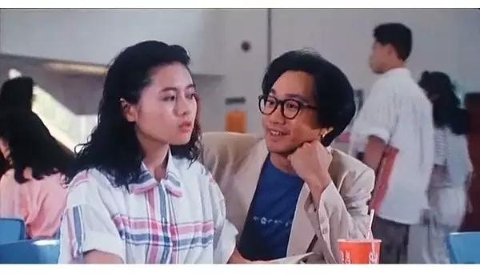
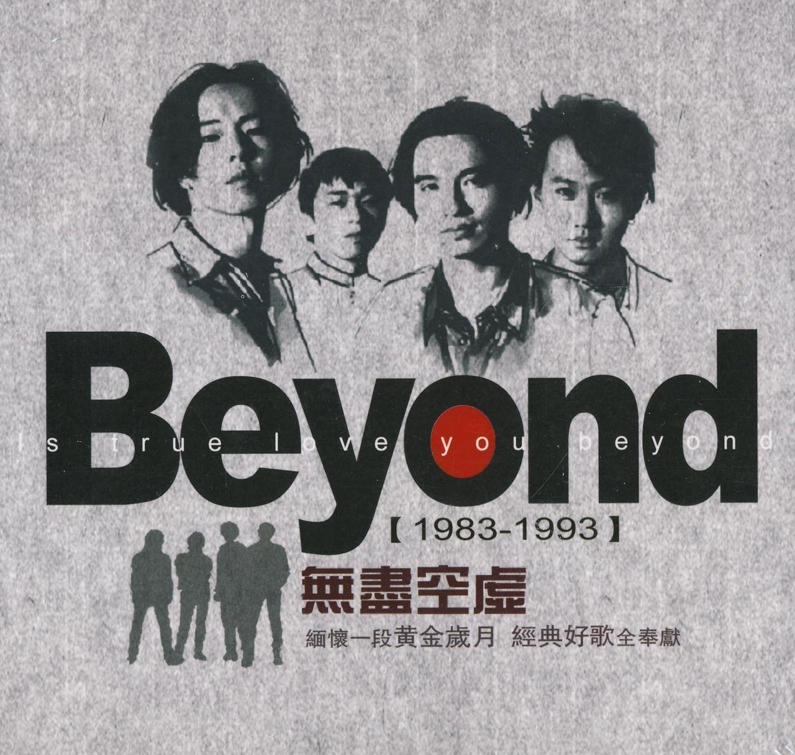
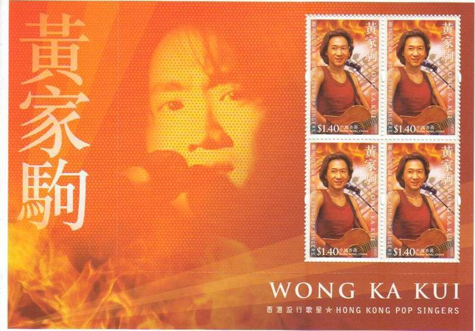

1993年6月30日，Beyond靈魂人物黃家駒逝世，終年31歲。沒有家駒的日子，屈指一算，已經23個年頭。回顧家駒31年的光輝歲月，他奠定了香港樂隊在華人地區的地位，留下了無數經典作品。

Beyond 1988年發行的粵語專輯 《秘密警察》，收錄了《大地》、《喜歡你》等經典金曲。（網上圖片）

BEYOND組成初期曾有不同成員，於1988年結他手劉志遠離隊後，由黃家駒﹑葉世榮﹑黃貫中和黃家強的Beyond組合最為人熟悉。（網上圖片）

家駒的音樂世界

家駒畢生貢獻音樂，Beyond於83至93年間的大多數作品，都屬於家駒作曲及主唱，他的音樂作品對華人地區至今仍有深遠影響。台灣歌手羅大佑更曾表示，除了黃家駒，香港沒有真正的音樂人，足見家駒已獲外間認同。

家駒為人所認識的作品包括《海闊天空》﹑《光輝歲月》﹑《歲月無聲》﹑《Amani》﹑《真的愛你》﹑《情人》和《喜歡你》等。時至2016年，仍有不同歌手重新演繹其經典金曲。據聞家駒仍有眾多未推出的作品在前經理人手上，而當中有兩首作品的聲帶已經遺失，包括Beyond在商台演唱《結他低泣時》和家駒為電影試唱的《也許不易》。

而家駒去世後，Beyond所屬的唱片公司先後推出多張致敬專輯，當中曾收錄了家駒演唱寫予蔡興麟的作品，《為了你，為了我》的家駒版。

家駒的感情生活

比起音樂，家駒的感情生活較為低調，他曾承認16歲初次戀愛，初戀情人是他的同學。這段感情維持了四年，當時家駒指自己熱愛音樂，難以給予對方安全感，而女方分手不到半年便嫁人了。

而家駒的喪禮上，曾有三位女性受外間關注，包括以未亡人姿態出席的林楚麒﹑家駒前女友簡小姐，以及被稱為最後一任女友的Rita。但家強在10年接受記者訪問時，談到林楚麒時稱：「阿哥好憎佢。」

劉威煌和Yan曾演出以Beyond歌曲串連成的舞台劇《誰伴我闖蕩》。（網上圖片）

對後輩的影響

紀念家駒的活動幾乎每年都有，96年3月，Beyond三子在紅館舉行《BEYOND的精彩演唱會》，屬於家駒逝世後的首個大型演唱會；03年Beyond三子慶祝樂隊成立20周年《BEYOND超越BEYOND演唱會》，舉行五場演唱會反應熱烈；香港郵政局於2005年推出的《香港流行歌星》系列中，黃家駒成為其中一名獲致敬的歌手；08年舉行「別了家駒十五載紀念展覽」；今年六月世榮發起《家駒愛心延續慈善演唱會》，世榮更與Paul﹑及舊隊友劉志遠同台演出。

其中今年五月進行的舞台劇《誰伴我闖蕩》，更以Beyond的歌曲串連成故事，將愛心延續至病童，劇中主要演員劉威煌和吳日言，坦承家駒對他們有深厚影響。

1993年推出的《樂與怒》是家駒離世前最後一張專輯，主打歌《海闊天空》更傳頌至今。（網上圖片）

劉威煌：初出茅廬全靠Beyond

威煌指：「家駒對我有很大影響，因為從小媽媽便不停播放Beyond的卡式帶，不斷Loop而令我對他們的作品很熟悉，Beyond打扮十分前衛有型，我都很想模仿Beyond。」威煌說自己最愛Beyond的《誰伴我闖蕩》：「初時出來工作，有很多不如意，又沒有朋友在身邊，這首歌曲首兩句已經很有意思，全靠歌詞的勉勵。」

Yan：最愛《早班火車》

吳日言則指小時候很多事情都不懂，在家駒昏迷時只懂為他打氣，卻不知是什麼一回事。直至有電台DJ介紹家駒的往事，才了解到家駒的成績如此厲害，她說：「現在回想起來，《海闊天空》等作品意義很大，足以代表一個時代的歌曲。」而Yan最愛的則是《早班火車》：「因為歌詞很甜美，很有一種暗戀的情懷，歌詞十分浪漫，這種等車的事情，這個年代已經不會做。」她又表示，《情人》《喜歡你》等作品歌詞很明確，「畫公仔畫出腸」，曾經有男生在唱K時以歌曲向她示愛，令她不知所措。

家駒於《開心鬼救開心鬼》中，與李麗珍有過對手戲。（網上圖片）

家駒的小風波

09年9月25日，四川電視台的節目，曾經發表侮辱黃家駒的言論，嘉賓黃立新直指要唱「皇家狗」的《真的愛你》，更再三堅持是讀「狗」，事件引起內地和香港網民的憤怒，有網民評擊國內節目觸及人性道德底線，事後電視台公開道歉。

2015年，家強為內地手機品牌擔任代言人，在廣告宣傳片中，與「家駒」隔空對唱《海闊天空》，更與「家駒」相擁抱，惜「家駒」被指過於山寨，似足蠟像，更被黃之鋒評擊家強發死人財，不惜與扮阿哥的假人攬頭攬頸。不過，家強粉絲亦有為他抱不平。【家強悼念：感覺你好像回到我身邊】

Beyond雖已解散多年，但唱片公司曾推出多張經典金曲合輯，讓樂迷再聽到家駒的歌聲。（網上圖片）

香港郵政局於05年推出的紀念家駒郵票。（網上圖片）
