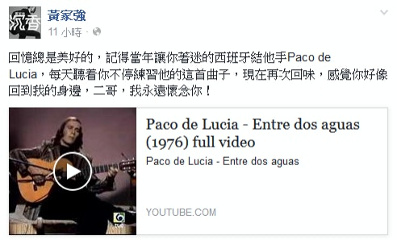
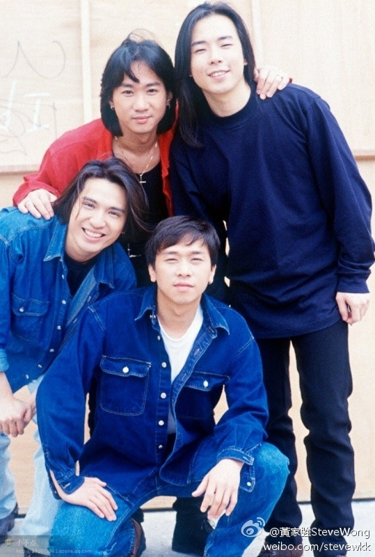

家強在facebook發文悼念，獻上西班牙結他手Paco de Luci一首曲子，送給天上的家駒。（Facebook圖片）

93年6月24日凌晨，樂隊於日本富士電視台錄影遊戲節目時發生意外，家駒不慎由2.7米高台跌下，頭部着地重傷昏迷，留醫六天後，於6月30日日本時間下午4時15分逝世，享年31歲。（微博圖片）

23年前，殿堂級搖滾樂隊Beyond主音黃家駒，在日本富士電視台參與遊戲節目錄影時，從高台一跌，跌碎無數歌迷的心。

今日是其忌辰，他的弟弟、Beyond低音結他手黃家強在facebook發文悼念：「回憶總是美好的，記得當年讓你着迷的西班牙結他手Paco de Lucia，每天聽着你不停練習他的這首曲子，現在再次回味，感覺你好像回到我的身邊，二哥，我永遠懷念你！」不少歌迷紛紛留言表示︰「永遠懷念您」、「謝謝家駒留給我們的音樂和精神」。
