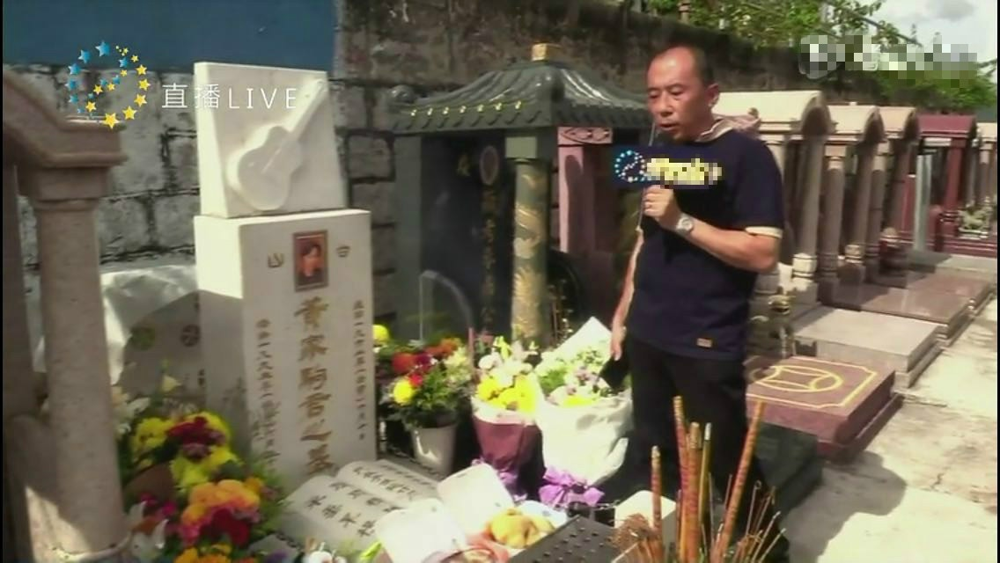
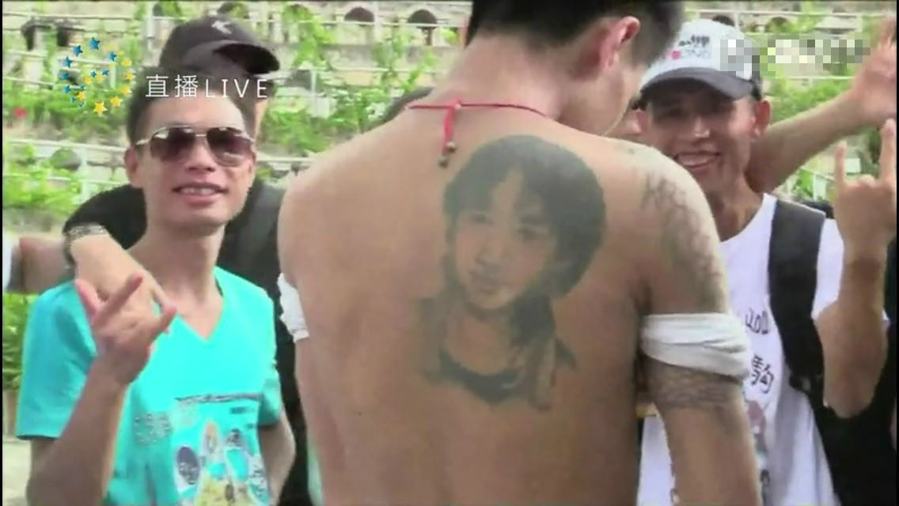
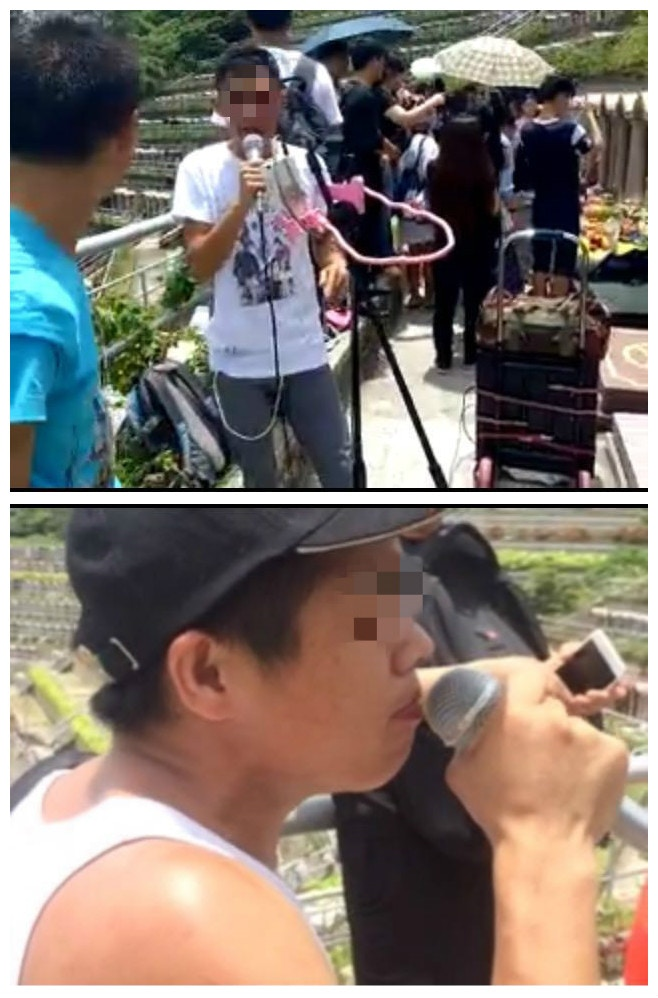
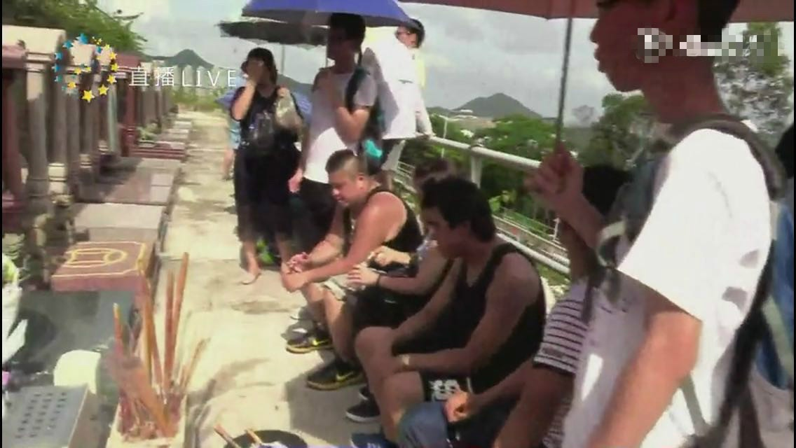

永遠活在歌迷心中的搖滾巨人黃家駒，昨日（6月30日）是他逝世23周年死忌，前Beyond三位成員黃家強、黃貫中和葉世榮各自在微博發文緬懷家駒。

內地有視頻拍攝家駒位於將軍澳的墓地及跟「粉絲」進行訪問，但由於過分胡鬧，被大批網民怒斥不尊重家駒。（網上截圖）

不過一個內地視頻節目，打正旗號直播紀念家駒，並派員來港拍攝家駒的將軍澳墳墓，及訪問現場粉絲。但畫面所見，墓地現場變成嘉年華會場地，有人更帶備音響器材，拎着咪大聲唱歌喧鬧，亦有一名男子赤裸上身，展示紋在背上的家駒肖像，而他身旁兩名男子則笑容滿臉，令家駒墓地變成旅遊景點。片段曝光後，大批網友狂鬧視頻做法不尊重家駒，甚至在微博開話題要求涉及視頻方面之人士道歉，至今點擊人數已超過2,800萬，而今午該視頻更一度關閉。

畫面中有人赤裸上身，展示家駒的肖像紋身，另有兩名男子笑容滿臉入鏡。（網上截圖）

世榮在微博發文，表示家駒墓地不是紀念公園，不是真心拜祭的人，全部給他滾。（上圖符祥定攝，下圖微博截圖）

世榮昨晚已收到粉絲不斷傳給他的相關畫面截圖，他對於這件事既傷心又氣憤，今日凌晨他忍不住在微博留言：「家駒的墓地不是紀念公園，來搗亂的，不是真心來拜祭和致敬的，全部給我滾！」世榮更呼籲：「我並非針對某啲人，係想同所有人講，日後再嚟家駒呢個地方，希望大家係真心拜祭先好嚟，唔好攪攪陣。」世榮亦明白歌迷對家駒的懷念，他表示歌迷可以開口唱Beyond的歌，但卻不要使用到器材，避免騷擾到其他人。

畫面所見有人帶備音響器材及私家咪，到家駒墓前唱歌喧鬧。（網上截圖）

該內地視頻拍攝粉絲拜祭家駒的情況。（網上截圖）
