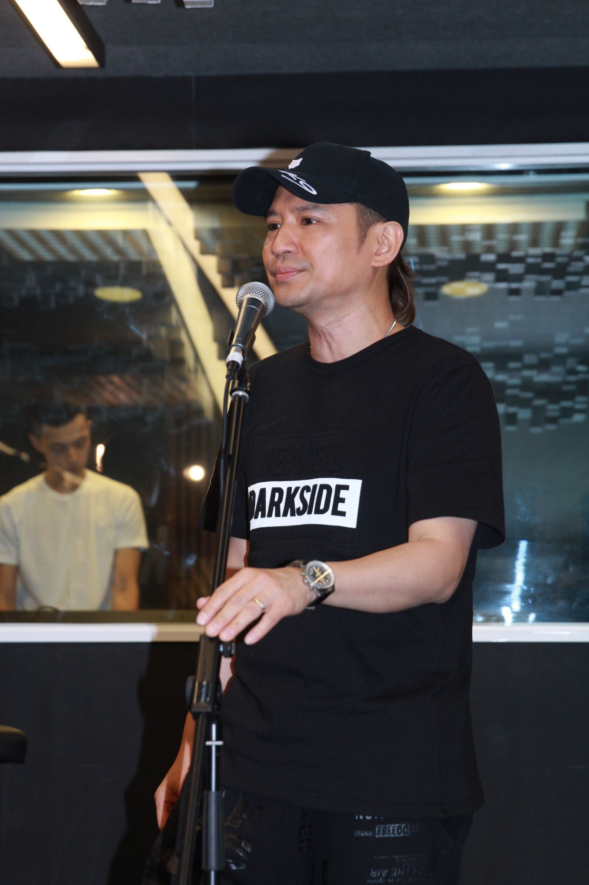

享樂團主音旨呈誤將家駒死忌當作生忌，世榮知悉後即留言鬧對方腦癱。（TungStar圖片）

黃家駒在6月30日的死忌，一班粉絲固然對偶像緬懷一番，其他音樂人亦紛紛留言悼念，而香港七人樂隊享樂團主音旨呈，在Facebook專頁留言向家駒致敬，卻將死忌誤當生忌，並寫著「家駒生日快樂，我們踏著灰色軌跡中，漸漸發現，這個世界已不知不覺的空虛…」。旨呈的感性留言，卻令前Beyond成員葉世榮怒氣衝天，留言「在6月30日這一天你竟然說(生日快樂)，你究竟係攞景定贈慶呀，你係唔係腦癱呀。」

旨呈知道自己錯失，即時發文道歉，求家駒的家人、朋友原諒。（Facebook圖片）

旨呈其後知悉自己搞錯，亦深感抱歉，馬上在Facebook專頁發文認錯，「十分抱歉，對不起，非常嚴重的疏忽，我再一次衷心向各位喜愛家駒的朋友、家人道歉，希望大家能原諒我的錯誤。」世榮看過留言後表示「知道錯誤就OK了，大家都會原諒你」。旨呈終於鬆一口氣，但今日仍再一次留言道歉「謝謝世榮的原諒，再一次衷心致歉，我們會繼續努力做好自己的音樂」。其實彼此也是對音樂充滿熱誠的Band友，那裡會有隔夜仇，說不定不打不相識，將來會有合作機會。

旨呈知衰認錯，其實他都是一時大意，並非對家駒不敬。（Facebook截圖）

旨呈知錯能改，而且再三道歉，世榮亦大方原諒對方，並叫旨呈加油。（Facebook截圖）
