黃貫中、樂隊Kolor、秋紅、Cassette今日到新蒲崗為7月7月的演出作總綵排。十幾人聚集band房，先以Beyond經典《歲月無聲》作熱身，而且Solo全交給阿Paul盡顯結他功架。

接受訪問時，阿Paul表示與秋紅、Kolor等人認識多年，一班朋友玩騷非常開心，而且台上六支結他來個「大兜亂」，自己夾Band三十多年都未試過。除此之外，阿Paul更預告演出當晚會翻唱一些8、90年代的搖滾經典，而且不是《Smoke On the Water》大路歌，保證當晚觀眾一定有驚喜。

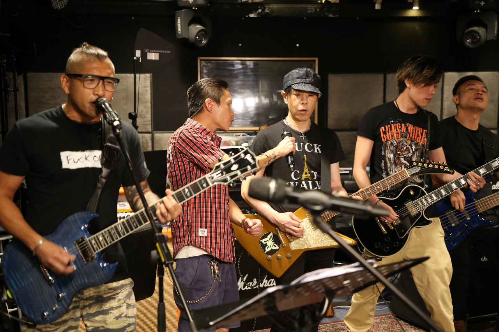
好Band之人的音樂會，一定好睇。

近年，阿Paul都中、港兩邊走，演出都是唱Beyond的經典，被問到「Beyond結他手」的名銜會不會很沉重，蓋過自己的創作？阿Paul表示：「唔緊要啦，人總會被人冚過，只要自己方向揸得正確。事實上我的確係Beyond嘅結他手，我亦都Proud of自己係Beyond嘅結他手，點樣稱呼都係一個名啫。你鍾意叫我阿Paul又得，黃貫中又得，我就係我。」

阿Paul又講到最緊要享受當下演奏的音樂，有些觀眾可能一輩子都未看過Beyond的現場演出，只要享受當下的演出就可以，不用拘泥名銜的問題，而且亦會努力將自己的作品帶給新觀眾，更表示：「冇生活又何來搖滾？」

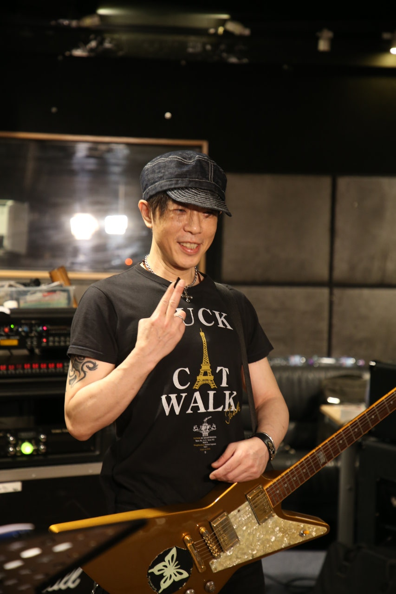
阿Paul！！！

另外問到，多年來Beyond都是香港樂隊的標誌，彷彿後起的樂隊仍未被大眾認識。對此阿Paul認為香港玩音樂的人一直進步，只是外界未留意，而且資訊爆炸，觀眾來不及接收。不過他認識的樂手，包括自己在內都不斷求進步。

同場的Kolor接受訪問時，主音Sammy表示拍住阿Paul演出有一定壓力，但練歌不是最花時間，器材上摸索Beyond經典的音色才最花時間，而且不希望「得個嘈字」。結他手羅斌亦提到當晚各樂隊會Crossover，可能重型樂隊秋紅都有會有柔情一面，所以自己亦非常期待當晚演出。

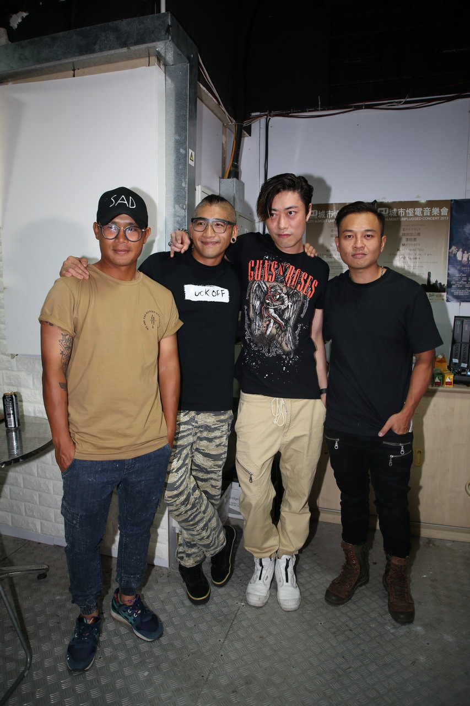

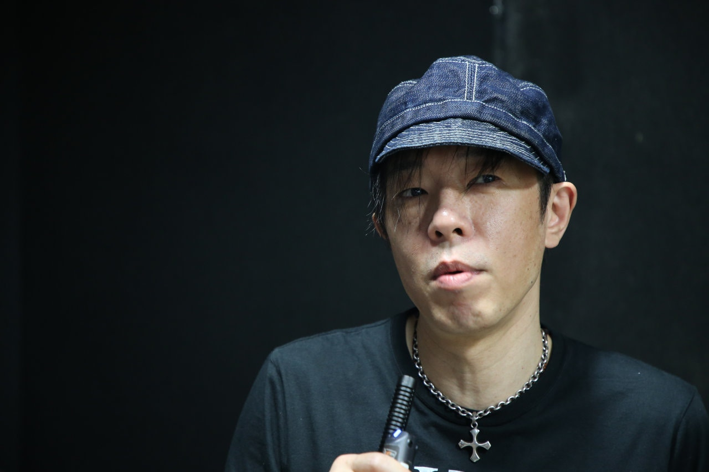

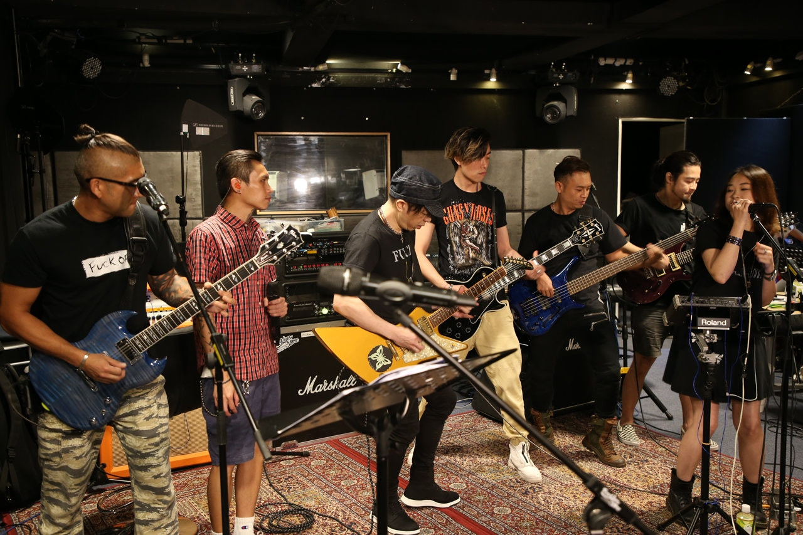

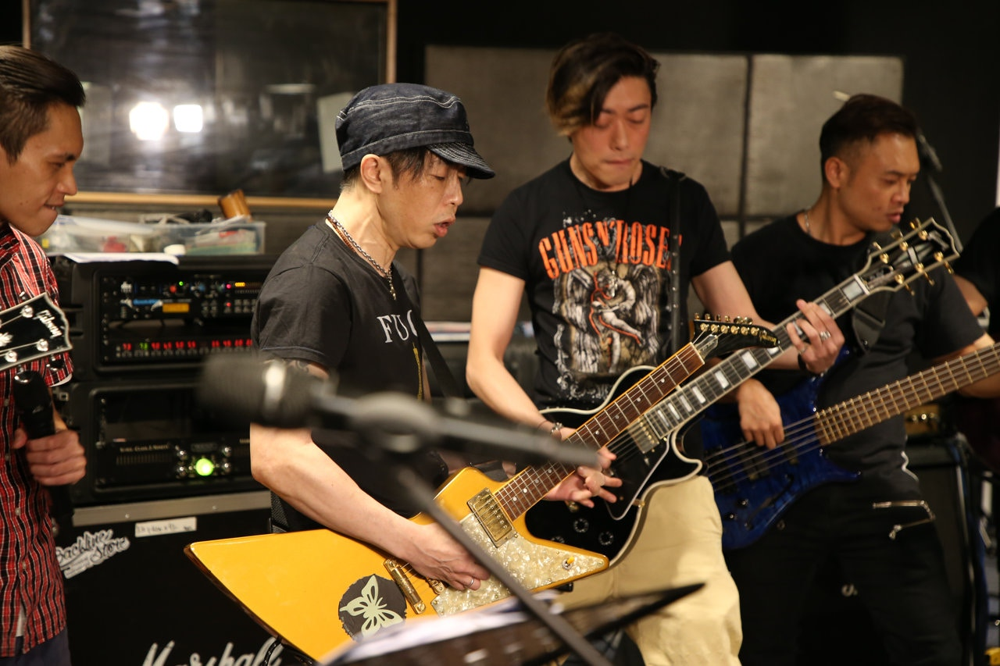

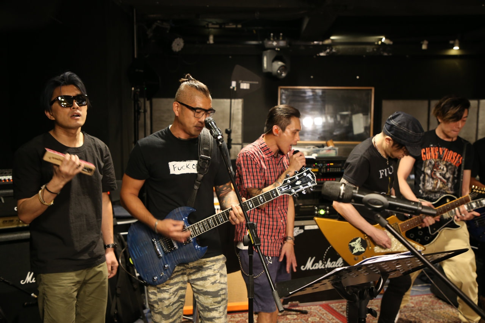

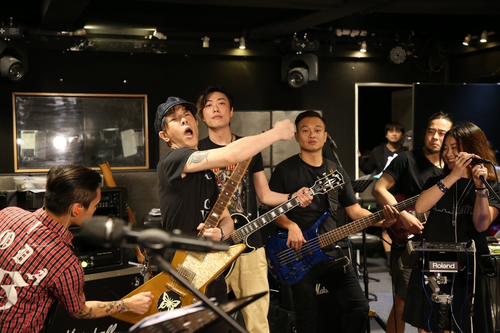

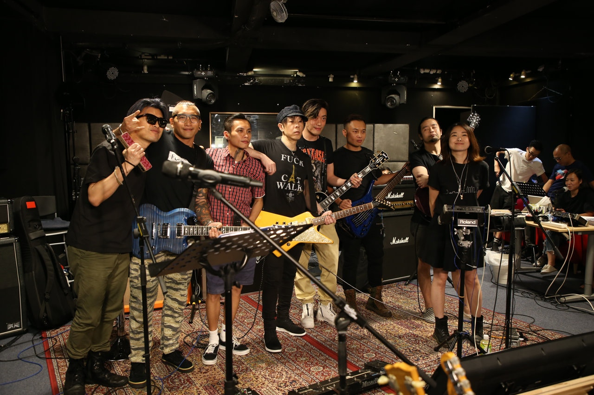

現場更有一段小插曲，話說阿Paul接受TVB訪問時被問及朱茵接拍廣告一事，多次拒絕回答該問題，不過TVB小花再三追問，阿Paul仍然禮貌地婉拒回答，直指該記者沒有做好功課。

> TVB主播Angel 狂Chur阿Paul回答，看來Angel 都幾進取，自己睇相就明。

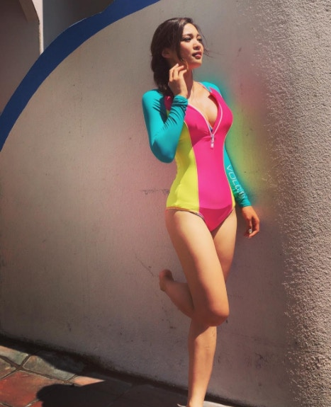

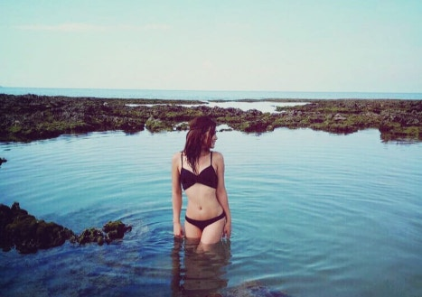

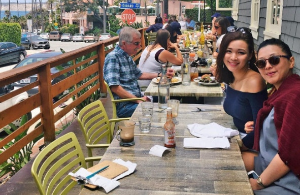

