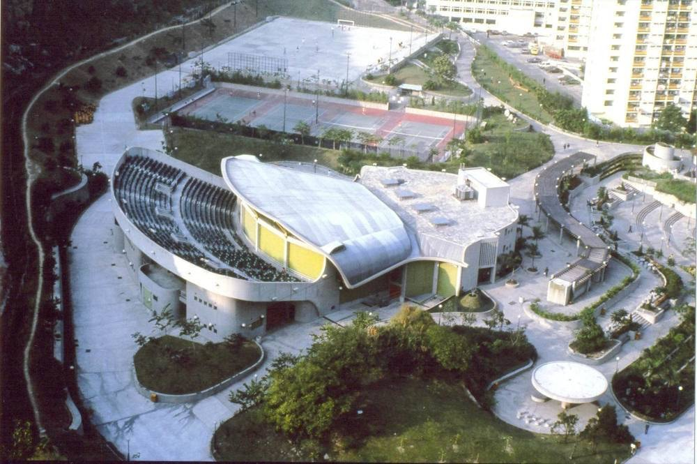
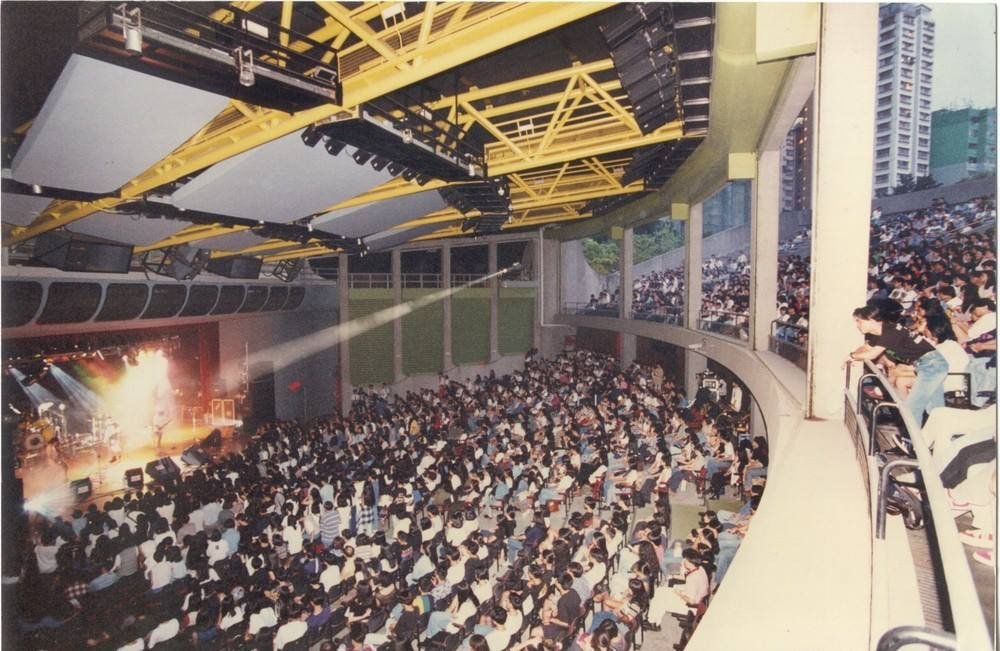
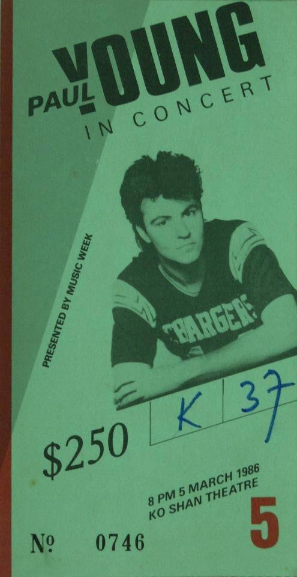
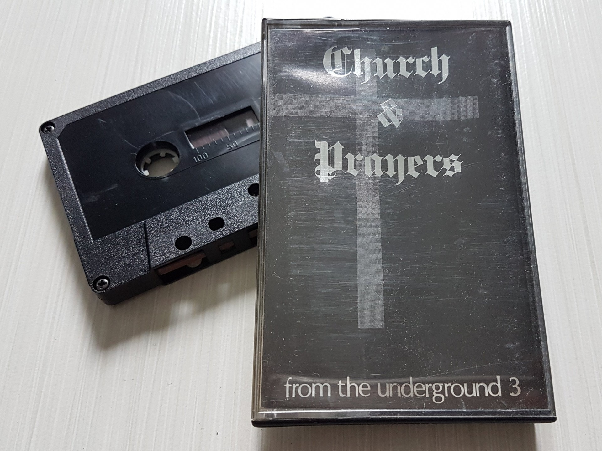
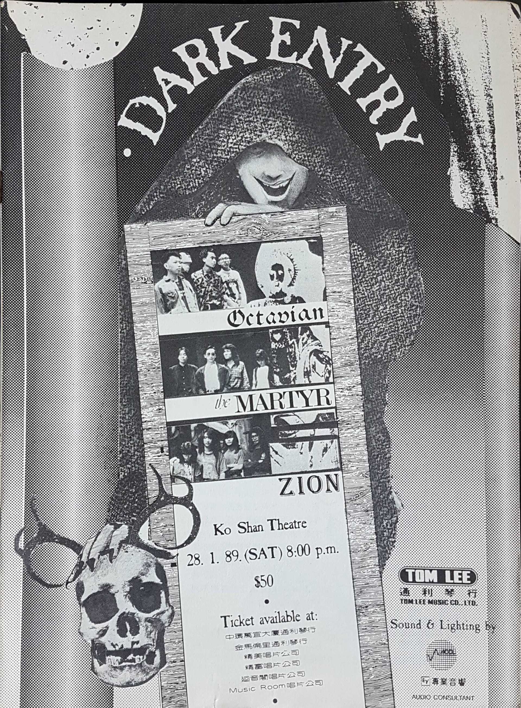
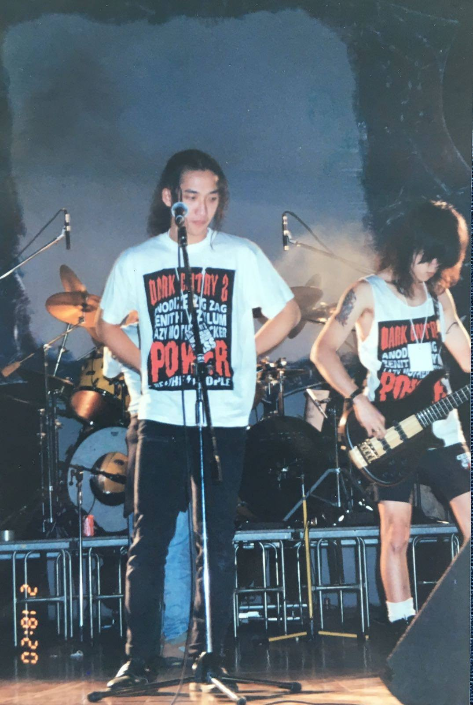
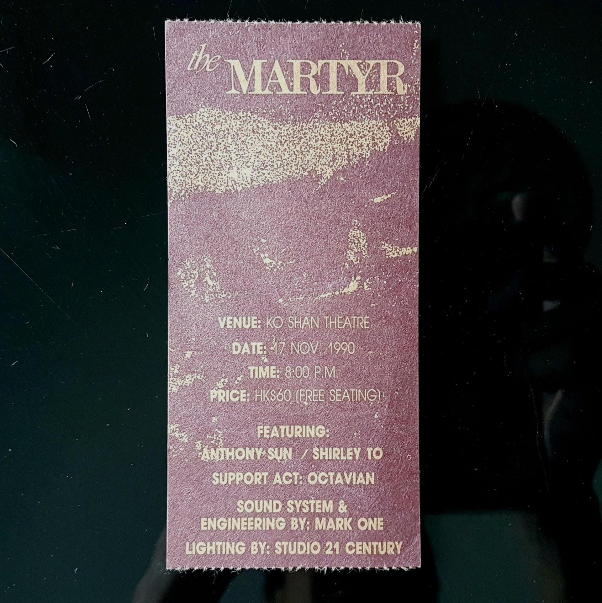
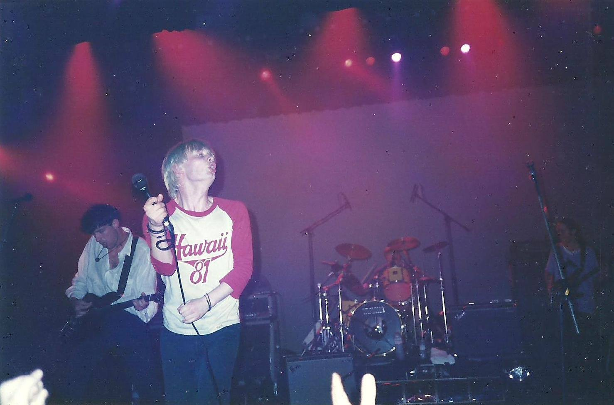
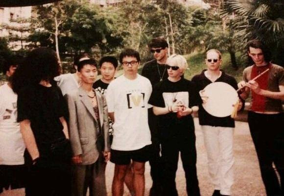

import YouTube from '@/components/patterns/YouTube.astro';

說到高山劇場，大家只會想起粵劇表演、粵劇表演與粵劇表演；也許你聽說過高山劇場曾有「搖滾聖地」之稱，但這個場館現在怎看也沾不上半點搖滾氣息——那些年的「搖滾聖地」，所指是在1994年中改建之前的舊高山劇場，如今看來已彷彿是傳說中的事。

在80、90年代，舊高山劇場見證了香港獨立音樂的重要場景，先後舉行過《From The Underground 地下音樂會》和《Dark Entry》系列音樂會；另一方面，也有不少外國樂隊/歌手曾踏足過高山劇場演出，最為樂迷津津樂道的那肯定是之後一直再沒有來過香港的Radiohead。這也是另一個傳說來。

沒冷氣的熱血搖滾場景

位於紅磡高山道公園內的舊高山劇場於1983年3月落成，屬於前市政局/現康樂及文化事務署管理的場地。原本高山劇場的設計，是個半露天形式的表演場館，上層樓座為露天位置，樓座前設有大閘，如果只租用開放下層觀眾席，便會把大閘關閉。

而昔日高山劇場的一大典故，是場館的舞台與觀眾席空間並不設冷氣空調(後台尚有冷氣開放)，只有懸掛著幾把大風扇，左右牆壁亦設有通風口以助空氣流通。在秋冬或初春舉行演出還可以，然而在大熱天時，無疑是台上表演者抑台下觀眾，大家皆玩得/看得為之熱汗淋漓的狀態，都是我們對高山劇場集體回憶——台上台下長髮rock友都因為看得酷熱而脫去上衣、露出紋身(即日後軟硬所扮演的「高山青龍」)，也造就了場地那股混然天成的熱血搖滾氣氛。

高山劇場是一個極「漏聲」的場地，每當有搖滾音樂會舉行，也少不免會滋擾到鄰近街坊，但當時香港尚未變成「投訴之都」，而附近樂民新村的居民，只有寫一些打油詩街招張貼在場館外。而有音樂會舉行時，場館的通風口外也會聚集了一些沒有購票的樂迷，在場外偷聽演出，那個位置也真的聽得頗清楚。

正因為那時高山劇場的設施簡陋，又不近地鐵站，所以場租也較其他場地為便宜，從而吸引了一些「非主流」音樂會在這裡舉行

舊高山劇場的半露天形式場館外貌。(圖片來源：高山劇場官方網頁)

舊高山劇場的室內場地與露天空間的分水嶺，綠色的牆是場地的通風口。(圖片來源：高山劇場官方網頁)

地下音樂會先河

最先「開發」高山劇場舉行搖滾音樂會，是本地搖滾音樂週報《音樂一週》，他們在1986年3月已為炙手可熱的英國blue-eyed soul歌手Paul Young在這裡主辦音樂會。

Paul Young的香港音樂會門票。(圖片來源：音樂一週)

同年12月，《音樂一週》首次在高山劇場舉行《From The Underground 地下音樂會》，結集了Black Church、Octave of Prayers、Rebel Rockers、Purple Express和眾樹華姿五隊地下樂隊，風格跨越gothic rock/post-punk、punk rock、pop rock，而《From The Underground》正開創了在高山劇場舉行本地獨立樂隊共演音樂會的先河。

而《From The Underground》亦引伸成系列化的音樂會，由1986至89年間共舉行過四次演出，經典時刻包括有《From The Underground 2》裡有黃貫中與葉世榮走出Beyond，聯同前Beyond創團結他手William Tang與主唱馬永基組成純heavy metal廣東歌樂隊「高速啤機」；《From The Underground 3》是Black Church和Octave of Prayers兩隊gothic rock樂隊的聯合演出，音樂會主題喚作《Church &amp; Prayers》，及後他們的部分成員合體成獨立名團The Martyr。

《From The Underground》頭三場音樂會都有出版成卡式帶現場專輯，這是《From The Underground 3: Church & Prayers》。(攝影：袁智聰)

<YouTube id="vt7hnQDuG6g" />

正因為《From The Underground 地下音樂會》，跟著也有無數非主流樂隊音樂會(即所謂的搖滾band show)在高山劇場舉行。最能繼承其衣缽，是《Dark Entry》系列音樂會。

重金屬同學會的Dark Entry

話說The Martyr成員眼見《音樂一週》無意再舉行《From The Underground》音樂會，於是他們便擔崗發起人，聯同gothic rock樂隊Octavian與heay metal樂隊Zion在1989年1月舉行了第一次《Dark Entry》音樂會，當年盛況空前。

The Martyr、Octavian與Zion在1989年1月舉行的《Dark Entry》音樂會廣告。(圖片來源：結他雜誌)

原先《Dark Entry》只是個one-off的活動，本來是無以為繼。繼而Black Church / The Martyr的鼓手張以式在四年後承繼了《Dark Entry》的名義，在1993年1月重新出發舉行《Dark Entry ll》音樂會，包括有Anodize、Zig Zag、Zenith、Azylum、Lazy Mother Fuckers的演出；同時，阿式也成立了「重金屬同學會」Heavy Metal Association(HMA)作為主辦單位(阿式人稱會長)；而Lazy Mother Fuckers也是由他策動的supergroup，是每次《Dark Entry》的壓軸表演大樂隊，如93年的一場便全是以Lazy Mother Fuckers名義演出。Lazy Mother Fuckers即LMF的前身。

Anodize在《Dark Entry ll》的演出。(圖片提供：Jimmy Lo-Jim)

就在1993年初至1994年中的一年半之間，《Dark Entry》在高山劇場舉行過七場音樂會。在那個沒有太多本地獨立樂隊表演活動的年代，每次《Dark Entry》音樂會都可以是一件盛事。從前高山劇場單是樓下觀眾席有900位，那時《Dark Entry》只要起過售出300張門票已可回本，到售出400、500張門票便有賺了。

難能可貴之處，是高山劇場方面都很接納《Dark Entry》的音樂，彼此惺惺相惜，是有人情味的合作關係。阿式說：「當年高山劇場的負責人是個混血兒，他的名字是杜理基，他與其同事們都好接受我們，好歡迎我們租場、相當幫手，甚至已超出其工作範圍。」

他最難忘，是《Dark Entry》在高山劇場閉館前的《Dark Entry VIII：再見高山》音樂會。原定舉行的日子，踫巧遇上商台903在紅館舉行《樂勢力大閱Band》，所以高山方面也因此而延遲閉館兩天，給《Dark Entry》在1994年7月3日舉行他們在舊高山的最後一場演出。

從Beyond到Radiohead

從前高山劇場即使只開放樓下900多人的觀眾席，但曾在這裡舉行專場音樂會的香港樂隊卻不多。最典故是剛走上地面的Beyond，他們在1987年舉行的《超越亞拉伯演唱會》便是在高山舉行。

<YouTube id="LbId60ysjo8" />

然後便要數到在90年代初最炙手可熱的The Martyr，他們得以屢次在高山劇場舉行過專場音樂會。

The Martyr的1990年專場音樂會門票。(攝影：袁智聰)

在高山劇場舉行的外國非主流/另類樂手音樂會，1988年《音樂一週》帶來過前英國gothic rock元老樂隊Bauhaus主唱Peter Murphy的個人演出。在我記憶中，我還曾在1993、94年間看過英國樂團The Wedding Present、美國hip hop大團Public Enemy、Bob Marley之子的樂隊Ziggy Marley &amp; The Melody Makers，但更神話式的，是在1994年看過Radiohead可一不可再的香港場音樂會。

Radiohead在高山劇場的演出。 (圖片提供：Alok Leung)

這晚在1994年6月的Radiohead香港場音樂會，那是他們出版了首張專輯《Pablo Honey》的一年後、《My Iron Lung》EP發表前夕，當年的Thom Yorke等人的演出，仍是那麼富有初生之犢；另一典故，是當晚的暖場樂隊，是前黑豹主唱竇唯的樂隊，而當晚竇唯演出時，我見到王菲站在我身邊！

竇唯樂隊與Radiohead在高山劇場外的生硬合照。(互聯網圖片)

高山重開後

經過重建優化後的高山劇場在1996年秋天重開，全館加裝了冷氣，換上了舒適的觀眾椅子，一切也不同日而語，搖滾氣氛不再。阿式說只去過新高山一次，感覺也不是味兒。

之前，尚有搞手抱著對高山的情意結而繼續在這裡辦搖滾演出，如在1999年由我任統籌、由商台903主辦的《拉闊Band Show：中國搖滾新生代》仍選址在新高山舉行。但勉強無幸福，昔日的搖滾場景在重建後的高山劇場已蕩然無存，所以搖滾的聲音也漸漸消失於這個場館裡。

扭耳仔定期專題，今次講【場做場有】，跟進新場地消息，回顧消失的場地；由老牌的藝穗會、昔日的搖滾聖地高山劇場，講到近代的Hidden Agenda、XXX等，以及研習各地live house文化，希望這個圈真的可以「場做場有」！
