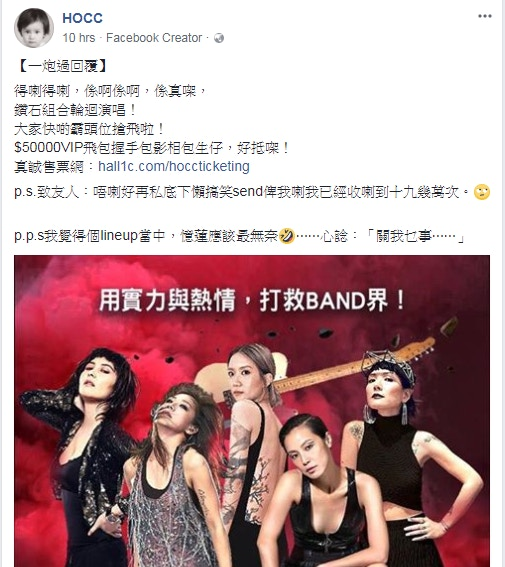
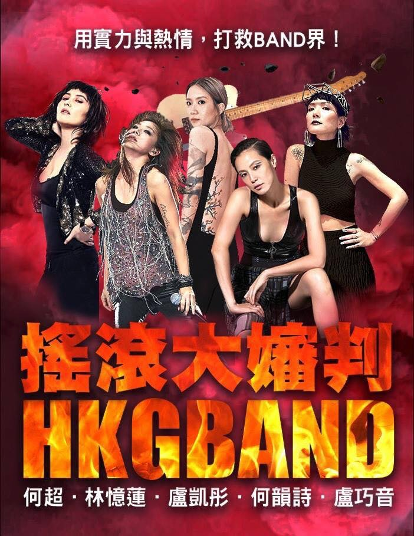
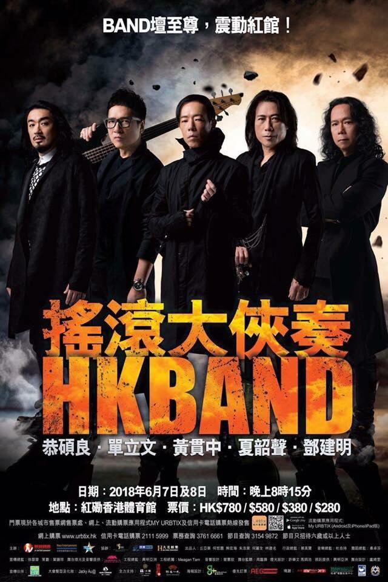
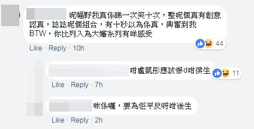
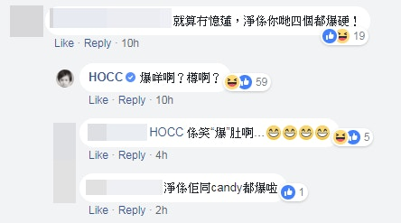
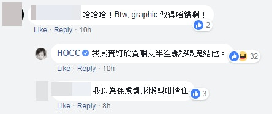
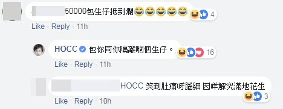
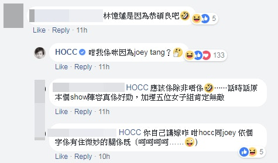
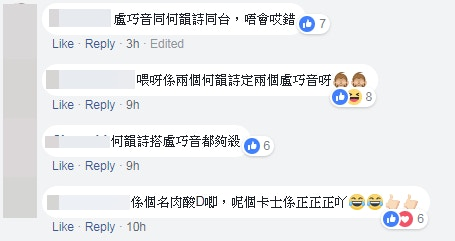

主角之一的何韻詩昨晚在facebook專頁貼出惡搞海報，笑指「$50000VIP飛包握手包影相包生仔，好抵㗎！」（fb專頁「HOCC」截圖）

惡搞海報出現5位一身型格全黑打扮的女歌手，包括何超蓮、林憶蓮、盧凱彤、何韻詩及盧巧音。（fb專頁「HOCC」圖片）

原圖本是宣傳5大經典Band友組成的「HK Band搖滾大俠」，將於6月舉辦演唱會。（fb專頁「HOCC」圖片）

演唱會本周初開始進行宣傳，海報一出街即引起受網民熱議，甚至有人將它惡搞改圖，將本來「搖滾大俠奏」變成「 搖滾大嬸判」，又出現5位一身型格全黑打扮的女歌手，包括何超蓮、林憶蓮、盧凱彤、何韻詩及盧巧音。她們擺出各種pose，當中盧凱彤更疑似單肩托起懸在半空的電結他，非常符合海報的標語「用實力與熱情，打救BAND界！」

主角之一的何韻詩昨晚在facebook專頁貼出惡搞海報，笑指「得喇得喇，係啊係啊，係真㗎，鑽石組合輪迴演唱！大家快啲霸頭位搶飛啦！$50000VIP飛包握手包影相包生仔，好抵㗎！」帖文附載一條售票網連結，原來是她下月在美加舉辦巡迴演唱會的售票網站。

不少網民都讚海報有創意，又稱「哩個組合有得諗wor，堅想睇」。（fb專頁「HOCC」截圖）

不少網民都讚海報有創意，又稱「哩個組合有得諗wor，堅想睇」。（fb專頁「HOCC」截圖）

不少網民都讚海報有創意，又稱「哩個組合有得諗wor，堅想睇」。（fb專頁「HOCC」截圖）

不少網民都讚海報有創意，又稱「哩個組合有得諗wor，堅想睇」。（fb專頁「HOCC」截圖）

不少網民都讚海報有創意，又稱「哩個組合有得諗wor，堅想睇」。（fb專頁「HOCC」截圖）

不少網民都讚海報有創意，又稱「哩個組合有得諗wor，堅想睇」。（fb專頁「HOCC」截圖）

何韻詩還奉勸朋友們勿再私下傳這張海報給她，「我已經收喇到十九幾萬次」，笑稱5位女歌手中憶蓮應該最無奈，「心諗『關我乜事』」，有網民抵死地以林憶蓮的歌詞回覆「但現在心中只有灰色 霞～蝦～吓～」。另有網民笑說林憶蓮有份演出是因為恭碩良，何韻詩隨即自抽「咁我係咪因為joey tang？」，不過何韻詩亦指這海報反而搶過真正「HK BAND」的風頭，相信「佢哋比憶蓮更無奈s」。

不過，惡搞還惡搞，帖文上載不足半日已有超過5700人讚好，不少網民都留言稱「哩個組合有得諗wor，堅想睇」；又指這海報有創意，但看到這個組合時，「有十秒以為係真，興奮到我」；亦有網民問HOCC「被列入大嬸系列有咩感受？」

除了八、九十代歌手，網絡上亦有另一張惡搞海報，是由新一代香港不同樂隊成員組成的「HK BAND J（Junior）」，又名「搖滾大細怒」，當中有樂隊「野佬」的小胡、「Kolor」的Sammy、「Supper Moment」的Sunny、「ToNick」的恆仔以及Dear Jane的「Tim」，宣傳口號就變成「BAND壇大細路，ROCK出大直路!」，相當押韻順口！
