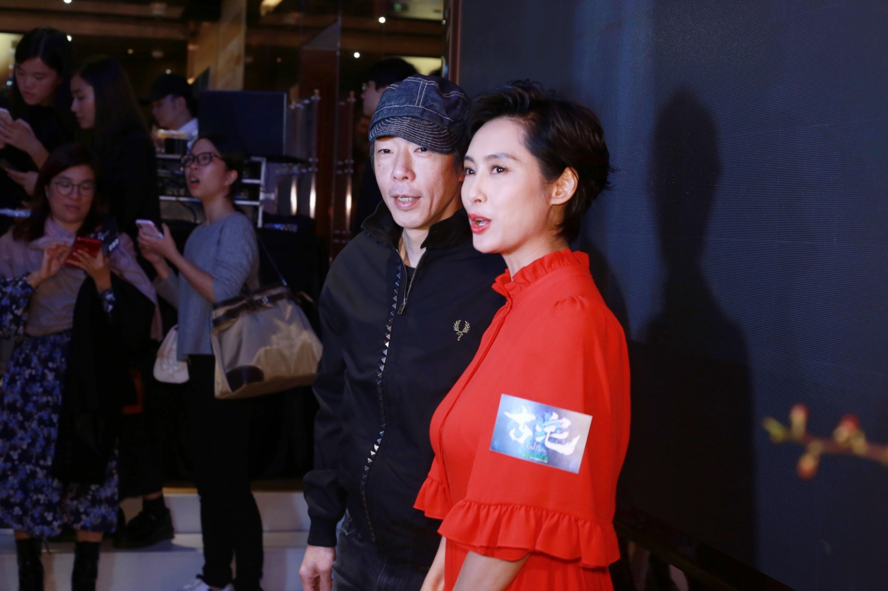
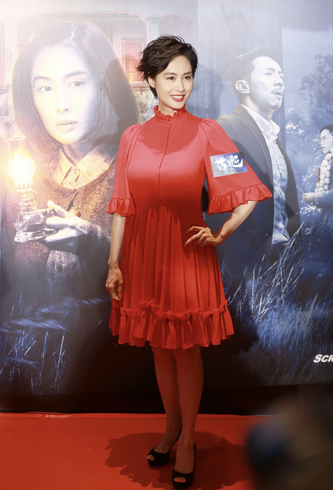
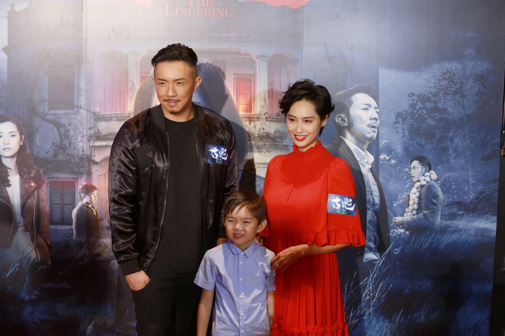

朱茵闊別大銀幕多年，今晚（27/9）現身出銅鑼灣舉行的電影《古宅》群星首映禮。朱茵透露接拍《古宅》這部電影原因是自己好喜歡驚慄片：「呢套戲嘅劇本我好鍾意，今晚呢個首映我一早話咗畀阿Paul知一定要陪我睇，因為佢支持咗我咁耐，我好希望喺戲院裏面同佢一齊欣賞，我一路都冇透露過造型及劇情係點呀，希望佢睇得開心。」

黃貫中（Paul）陪老婆朱茵一齊出席電影《古宅》首映禮。（梁碧玲攝）

由兩位新晉導演打造驚慄片《古宅》，故事講一對母子在百年古宅裡面發生一連串怪事，驚慄之中探究比鬼魂更恐怖的內心陰暗面。朱茵直言：「其實拍攝嘅過程壓力好大，呢部電影好高壓，每一場戲都講我屋企有好多靈異嘅事發生，咁變咗會維持喺過嗰個情緒好高壓嘅狀態底下，所以返到屋企都會有啲影響嘅，但好彩喺香港，有老公囡囡有屋企，攬住個女又會減到啲壓，送佢返學嘅時候又曬吓太陽個人會好啲。」

朱茵拍攝完驚慄片《古宅》後，精神狀態需要一段時間平伏。（梁碧玲攝）

（梁碧玲攝）

（梁碧玲攝）

（梁碧玲攝）

（梁碧玲攝）

（梁碧玲攝）

（梁碧玲攝）

（梁碧玲攝）
