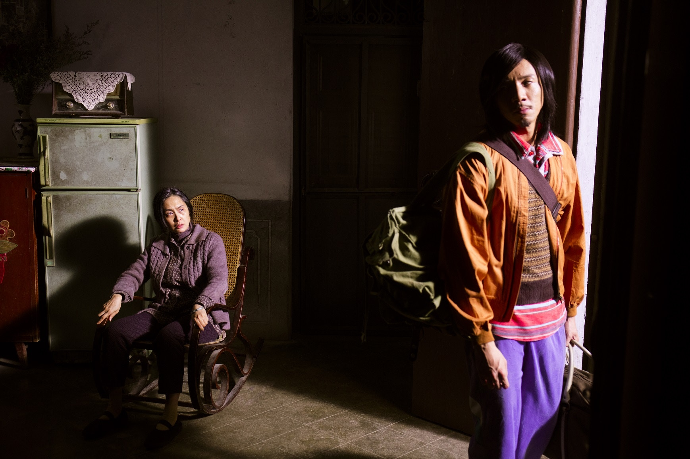
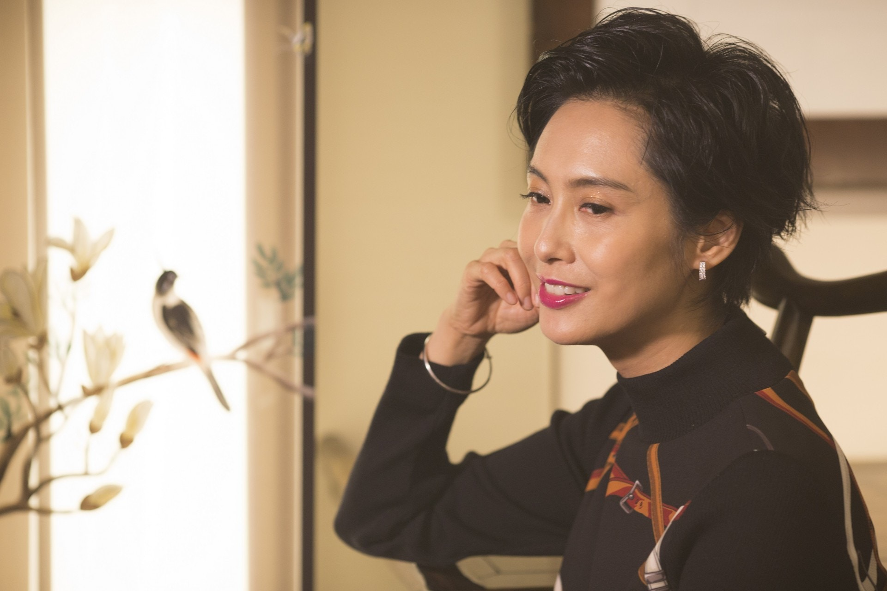

朱茵說女兒漸漸長大，接下來她可以更投入拍戲。（微博圖片）

自2012年誕下女兒後，朱茵幾乎消失於觀眾眼前，直至去年才復出，拍了部內地愛情片《二次初戀》，更為她27年演員生涯帶來首個最佳女主角獎（2017年中美電影節）。而本周上映的新作《古宅》，朱茵飾演張繼聰媽媽，由二十多歲的年輕女子演到年過六十的花甲婆婆，齋聽都充滿挑戰性。

朱茵在戲中由廿幾歲演到六十幾歲，要用上7、8個小時完成特技化妝。（網上圖片）

## 【無雙】郭富城「挑燈夜戰」了解劇本　演藝生涯就是做到極致

親情鬼故事電影講述朱茵飾演的農村女子，獨力撫養兒子成人，兩母子一同住在有點陰森的百年大宅中，雖偶然會有怪事發生，但總算安然渡過，直到兒子長大後，終下定決心要離鄉出外闖一番事業，年事已高的母親在古宅離開人世，兒子重返古宅後，又再接連遇上怪事，以驚慄包裝一個子欲養而親不在的故事。

朱茵與張繼聰都是畢業於演藝學院，份屬同門。

戲裡戲外都是媽媽，朱茵拍攝《古宅》時都會份外投入，尤其戲中有一名跟囡囡年紀相若的兒子，入戲更得心應手，「這部戲講到媽媽的偉大，講到無私奉獻，令我回想起跟媽媽的關係、跟女兒的關係，是有反思，拍得好開心，過足戲癮。」戲中跟兒子的相處經歷，彷彿在若干年後都會發生在自己身上，難怪朱茵拍攝一場送別兒子的戲份，投入到淚流不止。

朱茵保養得宜，點擊下圖欣賞更多靚相

## 【黃金兄弟‧專訪】陳小春受傷唔敢同老婆講　續集竟然改過呢個名

假以時日，真要送女兒出嫁或離家升學之類，朱茵會怎麼辦？「我知道會有這一天，但我想無論你幾有心理準備，到那時候都會受不了。」不過慶幸的是，女兒年紀小小已懂得安慰媽咪：「最近個女氹我：『媽媽，第日我結婚生仔，當媽媽後，我都要同你一齊住』，我問：『住樓上樓下，還是隔離屋？』，『唔係，要一齊住』，『一間屋？』，『是！』，『你畀間房我？』，『係！』，我就好Sweet，現在這些童言要多享受，以後將來再算。」

朱茵指囡囡遺傳了她跟黃貫中的優良基因，不單喜歡唱歌跳舞，踏上舞台毫不怯場，但朱茵不太關心女兒能否繼承衣缽，因為在她眼中，入行並非取決於天份。（微博圖片）

不認同紫霞仙子是代表作入行多年，朱茵拍過近50部電影，當中最為人熟悉的演出，應該是1995年上映的《西遊記大結局之仙履奇緣》中「紫霞仙子」一角，經典到事隔二十幾年，她再以紫霞仙子的造型上內地電視節目，都能引起轟動成為新聞人物，問朱茵會否認同紫霞仙子是其代表作，她斬釘截鐵地說：「我當然覺得不是，提名不是這一部，拿獎亦不是這一部，我覺得作為一個演員，有一部戲、一個角色、一個作品，能夠在觀眾心目中有如此大感觸或感覺，是我們的福氣，我不會停留在一部作品上，我有不同的嘗試，但我會感恩。」

她是在觀眾心目中，永遠的紫霞仙子。(劇照)

重溫靚到無朋友的紫霞仙子

畢竟當演員都有好一段日子，朱茵自言經歷過港產片的興、衰及復甦，隨著女兒成長，她亦樂於再投入影圈：「我覺得身為一個電影人，或業界裡熱愛電影的工作者，我覺得要大家努力去撐，我相信會有更多好作品。」

髮型：Jackson Yung (IL COLPO) PP HK化妝：Emma Lee服裝：MARELLA

場地：灣仔龍門棧
