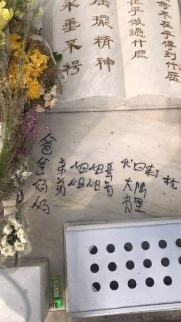
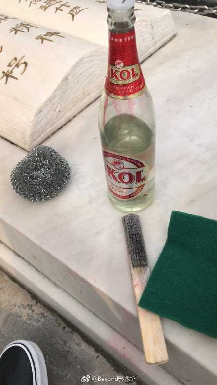
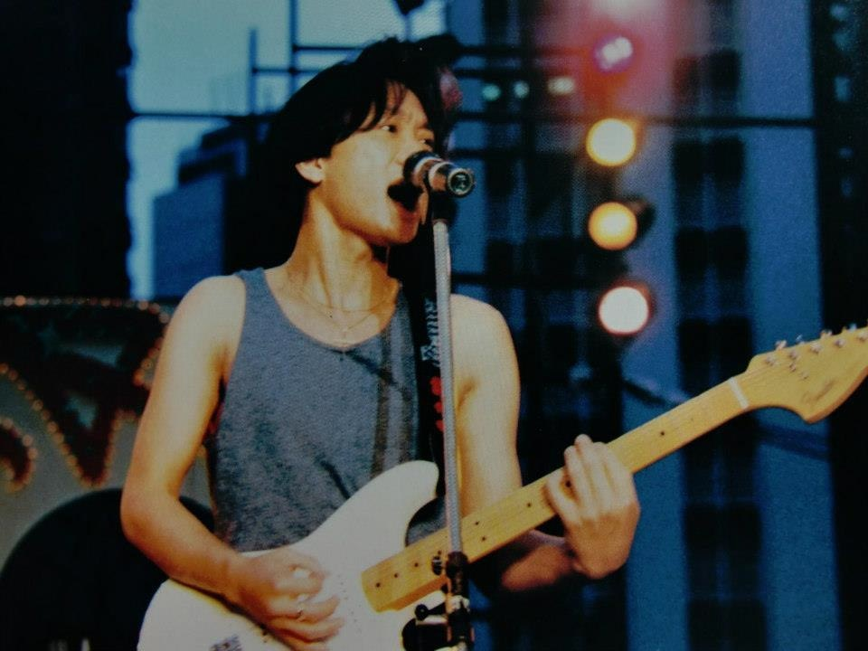
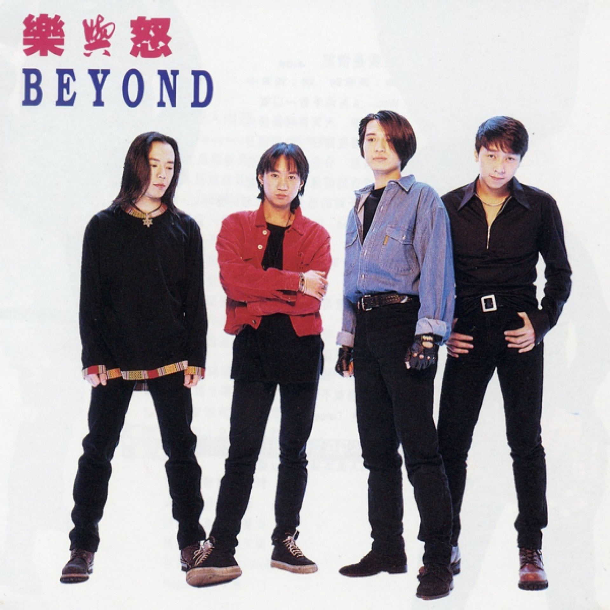
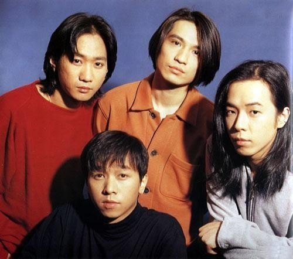

黃家駒逝世25年，在華人樂壇仍然有著崇高的地位。（微博圖片）

家駒的墓碑慘遭塗鴉。（FB「天下搖滾一樣Rock」專頁圖片）

有樂迷在Facebook 專頁「天下搖滾一樣Rock」，上載一組家駒墓碑被塗鴉照片，家駒的墓碑被人用難以清洗的麥克筆，以簡體字寫上「爸爸／媽媽／弟弟／姐姐／姐姐／哥哥／我回來了杭州／大陸書里」。發現事件的樂迷將照片放上網，並強烈譴責肇事者的行為，「墓地是去者最後的寧靈地，讓逝安寧休歇、生者追思懷記的崇潔地方，不是遊樂園，不是舞廳、不是卡拉 OK 房，不是定格展覽品，更不是隨意隨時地被騷擾侮辱」，認為家駒與肇事者並無深仇大恨，卻被這樣騷擾安寧。後有樂迷自發到家駒墳前清潔，但因為要用到含化學物品的清潔劑，所以難免對碑石造成損壞。

有樂迷自發清潔家駒的墓碑，但由於使用化學物品，多少會蝕損碑石。（FB圖片）

黃家駒 1993 年出席一個日本綜藝節目時，意外從3米高台墮地，送院昏迷6日後，於6月30日終告不治，院方公布黃家駒的死因是急性腦膜下血腫、頭蓋骨骨折、腦挫傷及急性腦腫脹，終年僅31歲。黃家駒生前包辦樂隊多首歌曲的詞曲創作，是華人樂壇公認的巨星及搖滾樂的代表人物 。

網上圖片

網上圖片

網上圖片

影片截圖

網上圖片
