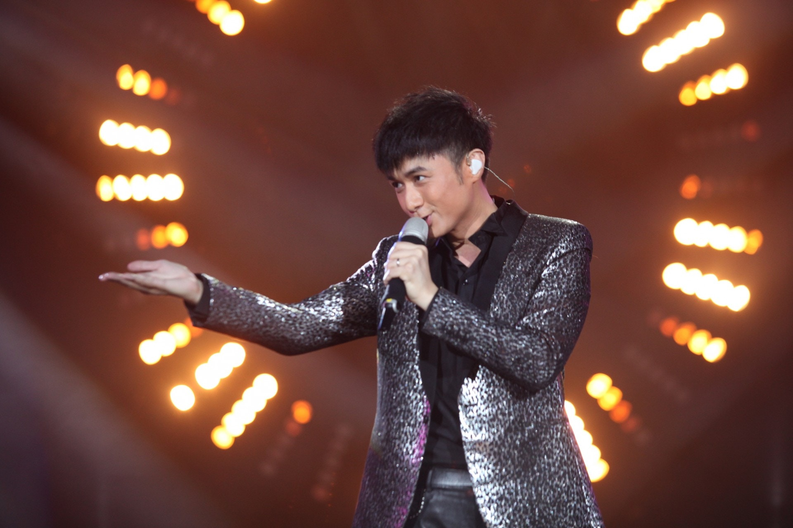
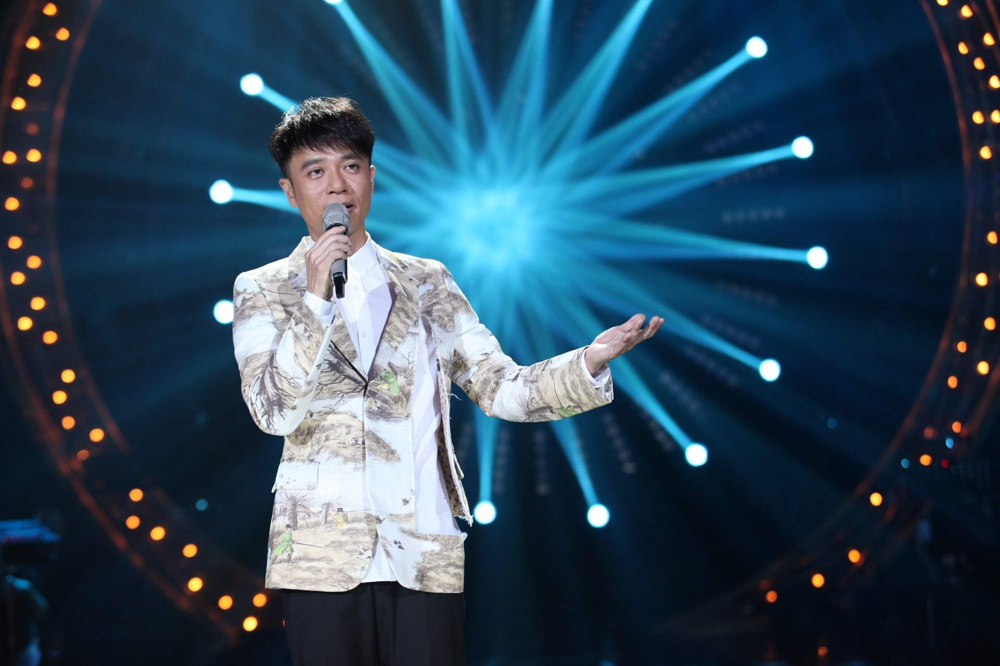
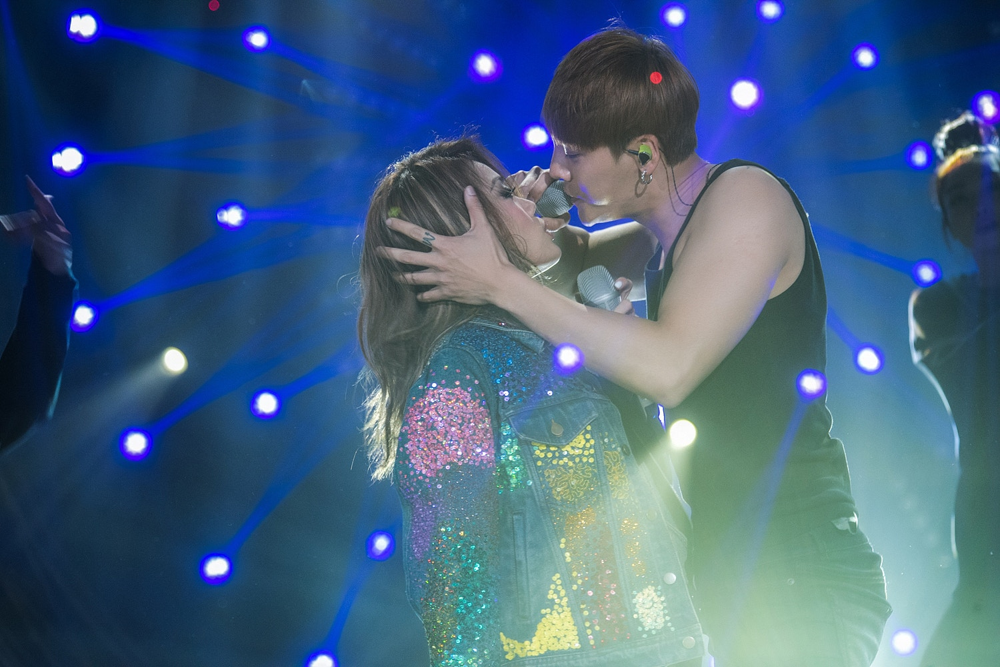
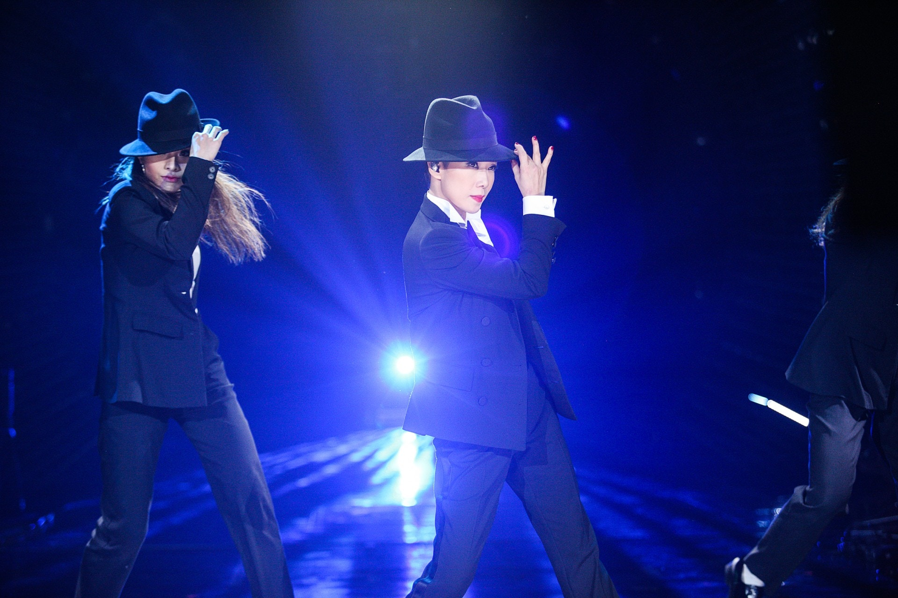
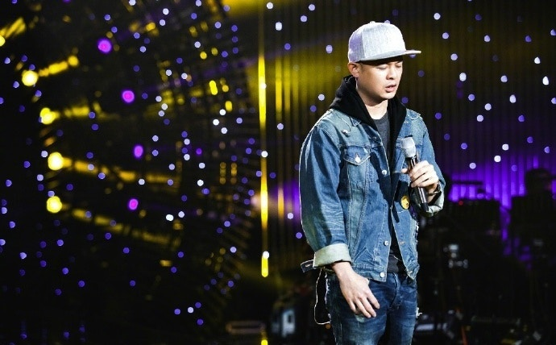
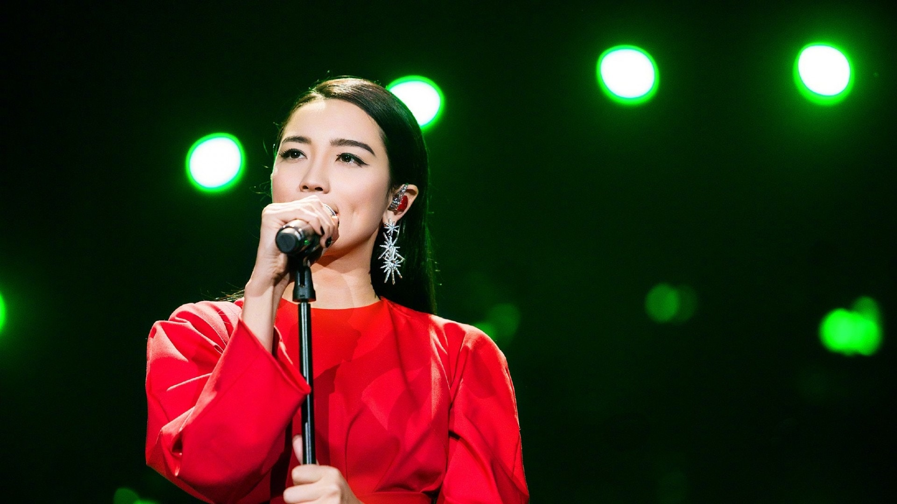

2013年《我是歌手》熱播成為全城熱話，當中黃貫中作為香港唯一代表成為首發歌手，在第一輪的排位賽中他選擇《海闊天空》，果不然引起共鳴在七位歌手中最終成績排第三名。原以為成績如此要好肯定難遭淘汰，沒想到在第一輪淘汰賽中，他唱張學友的《吻別》獲得最後一名排第七，最終總結排名結果他是最後一名慘遭淘汰。雖然只是唱了兩首歌，但當時已令他人氣有所急升，打開內地市場，直到現在他在內地演出亦大受歡迎。（視覺中國）

2014年《我是歌手》邀請G.E.M.（鄧紫棋），更令她歌唱事業更上一層樓。作為當時新生代的流行歌手，G.E.M.年紀輕輕就要面對一眾前輩歌手，包括曹格﹑張宇﹑動力火車等，但她就冇有怕反而愈戰愈勇，在五輪比賽中（包括：排位賽﹑淘汰賽）她總共奪得四次第一名，三次第二名，成績一直在頭前幾名，當時令人十分意想不到。  憑高音在該節目唱出名堂的G.E.M.，殺入總決賽她選擇唱方大同的《春天裡》﹑Queen的《We Will Rock You》﹑《We Are The Champions》同崔健的《一無所有》，令她一舉奪得總排名第二名。在十位參賽香港歌手中，她的成績絕對超晒班，連天后容祖兒﹑杜麗莎等都比唔上。亦因為歌聲出眾關係，使她快速地打開內地市場，直到今時今日仍在內地大受歡迎，每每舉行演唱會都坐無虛席。（視覺中國）

2015年《我是歌手》就吸引了古巨基參加，作為首發歌手同主持人的他，成績一直排在後半段，第一輪排位賽他就只獲得第六名，到第二輪的踢館賽他則獲得第七名慘遭淘汰，到之後的突圍賽他亦只是獲得第六名同總決賽無緣。但古巨基就創下了一個歷史，就是他在該節目上唱得最多廣東歌的一位，包括《愛與誠》﹑《情人》﹑《Monica》﹑《明星》﹑《愛是永恆》，同時他亦是該節目上被淘汰最快的主持人。（視覺中國）

2016年的《我是歌手》就闖下一個先例，就是邀請兩位香港歌手參賽。第一位首發歌手是李克勤，他的成績排名一直保持中等水平，拿過四次第五名兩次第二﹑三名，因此取得總決賽資格，可是在第一輪比賽中就只排第六名，令他未能殺入第二輪，但他的成績已經是十位香港歌手中排第三位最好了。而另一位歌手則是他的好朋友容祖兒。（視覺中國）

天后容祖兒雖然不是首發歌手，但身為補位歌手的她成績其實一向都好好，就在第四輪的排位賽中，她選擇唱許茹芸的《突然想愛你》，可惜最終只獲得第七名，但幸好她愈戰愈勇最終取得資格殺入總決賽，但在第一輪的比賽中她同師弟陳偉霆合作唱《加大力度》，可惜只獲得第七名未能順利殺入第二輪。（視覺中國）

來到2017年的《我是歌手》就改名為《歌手》，在這一屆有三位香港歌手參加，包括首發歌手林憶蓮﹑杜麗莎同踢館歌手側田。身為天后的林憶蓮果然實力非凡，從頭帶落尾取得三次第二名兩次第一名，更在半決賽同決賽中以第一名的姿態奪冠。她打破了以往一個傳聞就是非內地歌手都難以奪冠，是十位香港參賽歌手中成績最好一位。（視覺中國）

與林憶蓮是師徒關係的杜麗莎事實上好少參加比賽型節目，同屬是首發歌手的他一開始成績非常亮眼，第一輪以《Imagine》應戰就取得第三名，其歌聲感染力強，情感十足令在場觀眾聽出耳油。可惜就在第二輪比賽中她成績欠佳，最終被淘汰出局。雖然最後被淘汰但之後的突圍賽她成功獲得第二名殺入半決賽，以《假如》同《是否》應戰，但成績未如理想最終同決賽無緣。（網上圖片）

作為2017年《歌手》舞台唯一一位香港踢館歌手，側田絕對無令人失望。他當時以首本名曲《命硬》應戰，果然踢館失功排第四名。但是他後繼無力在第三輪淘汰賽中唱《很想很想說再見》，最終只排第七名慘遭淘汰。在突圍賽中他成績仍未如理想排最後一名第十名，但他的聲音廣受內地觀眾關注，成功為他打開內地市場。（網上圖片）

2018年的《歌手》更是有史以來邀請年紀最細的香港創作歌手張天，雖然一開始大家對她並不熟悉，但她在舞台上的表演的確出眾，令她的詢問度大增。作為首發歌手她一開始就要面對一班資深歌手，有李聖傑﹑汪峰等但她冇有怕，第一輪以《舞孃》﹑《Lady Marmalade》應戰，成功獲得大家喜愛取得第二名，但之後的表演就似乎欠佳獲第八﹑第七，就在第二輪淘汰賽以第八名慘遭淘汰。即使在突圍賽的表演她都欠佳獲得第八名，但無論成績如何都好已經令她在內地有一定知名度。（網上圖片）

來到2019年的《歌手》許靖韻的演出絕對成功。25歲的她透過「全民舉薦」成為踢館歌手，在踢館預賽中以一曲《獻世》PK畢書盡的《Nothing At All》，最終她取得勝利獲得踢館資格賽。雖然，在踢館資格賽中她以《夢伴》應戰最終未能挑戰成功，但她的表演已經廣受關注獲得不少內地觀眾喜愛，更認為她勇氣可加來到這個舞台接受挑戰。  事實上，對於許靖韻只唱了兩首歌就慘遭淘汰，其實她是雖敗猶榮。因為在《歌手》舞台上一定有壓力，除了面對前輩歌手還要面對全中國人民，在他們面前展現歌唱實力，這一點並不是所有歌手可以做到的。作為一個年輕的流行歌手，她的實力有目共睹只是需要時間磨練而已，接下來她將挑戰突圍賽，大家都對她十分有信心。（網上圖片）
