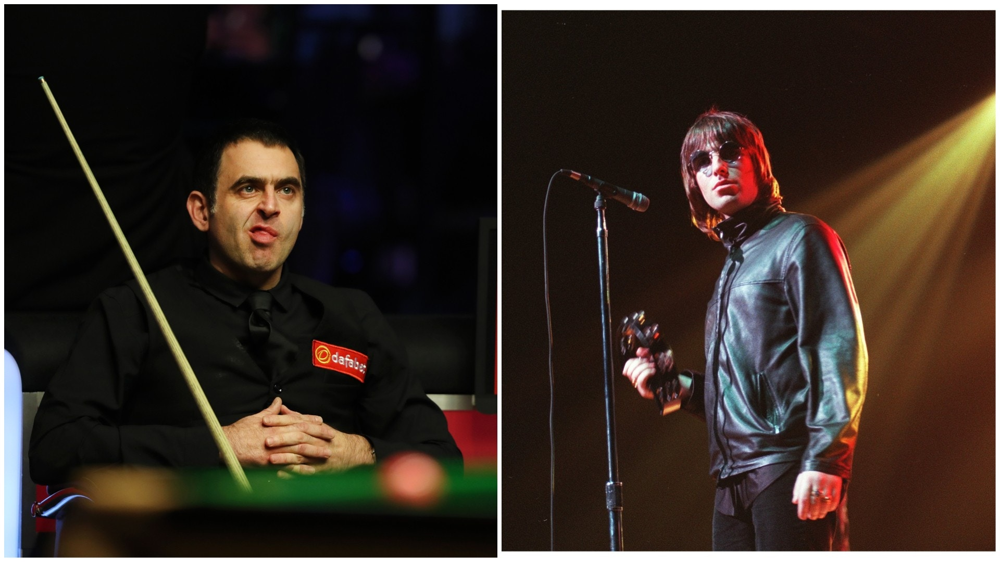
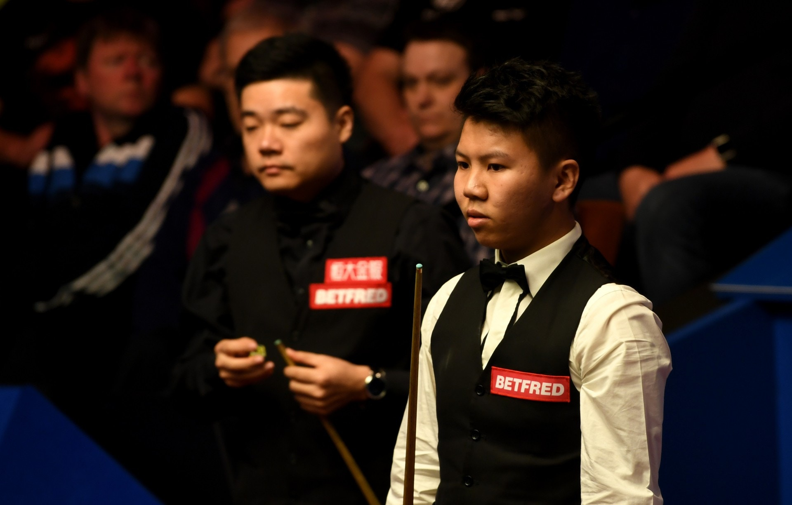
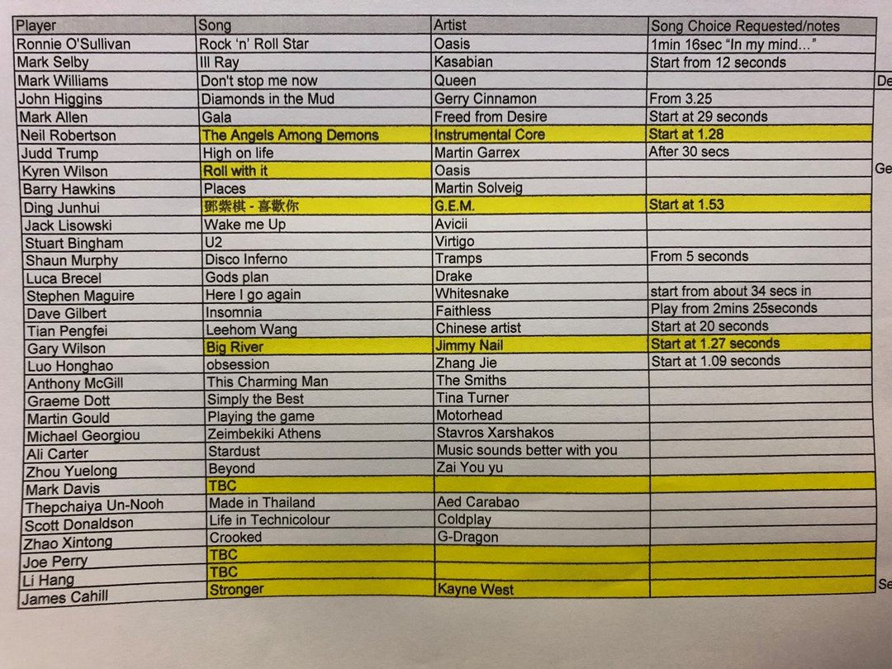

曼徹斯特樂團Oasis成為球手熱門之選，奧蘇利雲（Ronnie O'Sullivan） 挑選了Definitely Maybe中的Rock 'n' Roll Star，威爾遜心水是What's the Story Morning Glory?的Roll with It。奧蘇曾透露首次去演唱會就是Oasis1996年於Knebworth舉行的演唱會，又曾在訪問中唱Wonderwall，可見他對Oasis情有獨鍾。

衛冕的威廉斯同樣有品味，選擇了神級樂隊Queen霸氣十足的名曲Don't Stop Me Now，此曲在1978年面世，多年來在多個廣告成為配樂，又在2012倫敦奧運被英國運動員「重製」MV。

奧蘇利雲喜愛林子祥外，也愛聽Oasis。（網上圖片）

部份球手出場音樂（按圖放大）

丁俊暉出場音樂是香港歌手鄧紫棋（G.E.M）翻唱Beyond的喜歡你。（資料圖片）

威廉斯出場音樂是Queen的Don’t Stop Me Now。（資料圖片）

沙比選了李斯特樂隊Kasabian的 Ill Ray (The King)  。（資料圖片）

田鵬飛的音樂是王力宏。（資料圖片）

周躍龍的選擇如無意外應該是Beyond的不再猶豫。（資料圖片）

丁俊暉在首圈局數領以6︰3安東尼麥基，他的出場音樂是香港歌手鄧紫棋（G.E.M.）翻唱Beyond金曲喜歡你，還標明要1分53秒開始播放。另一中國桌球手周躍龍在名單上是播BEYOND的ZAI YOU YU，估計是翻譯有遺漏，相信是Beyond的不再猶豫。田鵬飛就選擇了王力宏，但歌曲不明。

希堅斯及沙比同樣撐同鄉，前者選了蘇格蘭歌手Gerry Cinnamon的歌曲，後者撐李斯特的Kasabian。另外Coldplay、Drake、The Smiths等都榜上有名。

世界桌球錦標賽2019球手出場音樂。（網上圖片）

【第一屆武博】眼界．決定境界！5月3至5日在九展舉行的第一屆香港武術及搏擊運動博覽（武博），活動包括解構武術電影的光影武林隧道、有趣好玩的武館街遊戲，以及超過100個體驗班，讓市民、初學者或武術專家，透過這個多元化體驗型博覽會，從武博擴闊眼界、提升境界！

按此立即購票 按此瀏覽武博專頁
