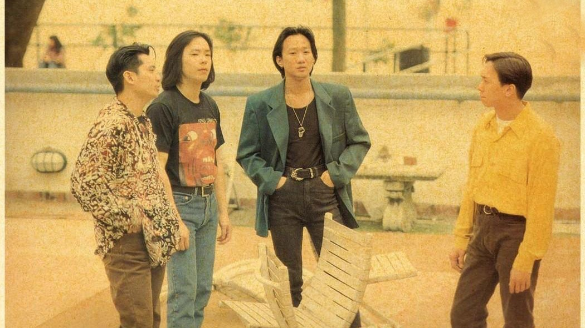
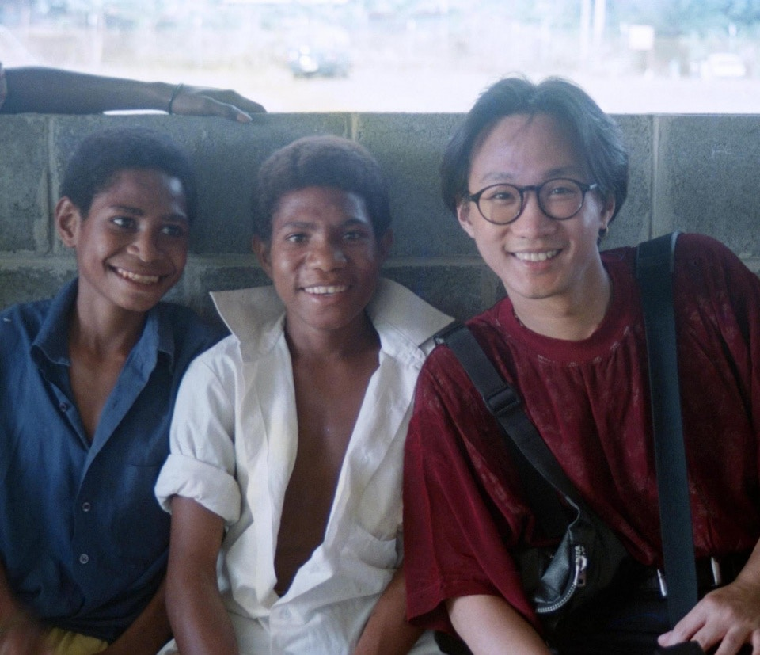
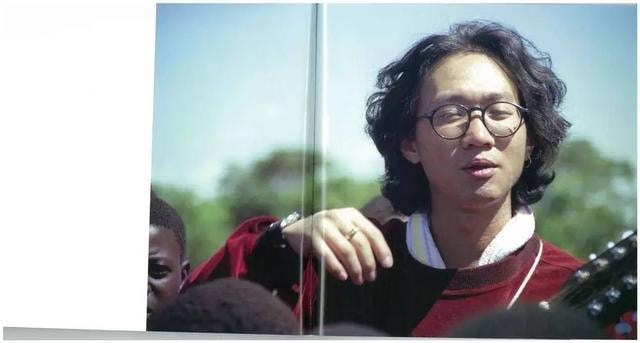
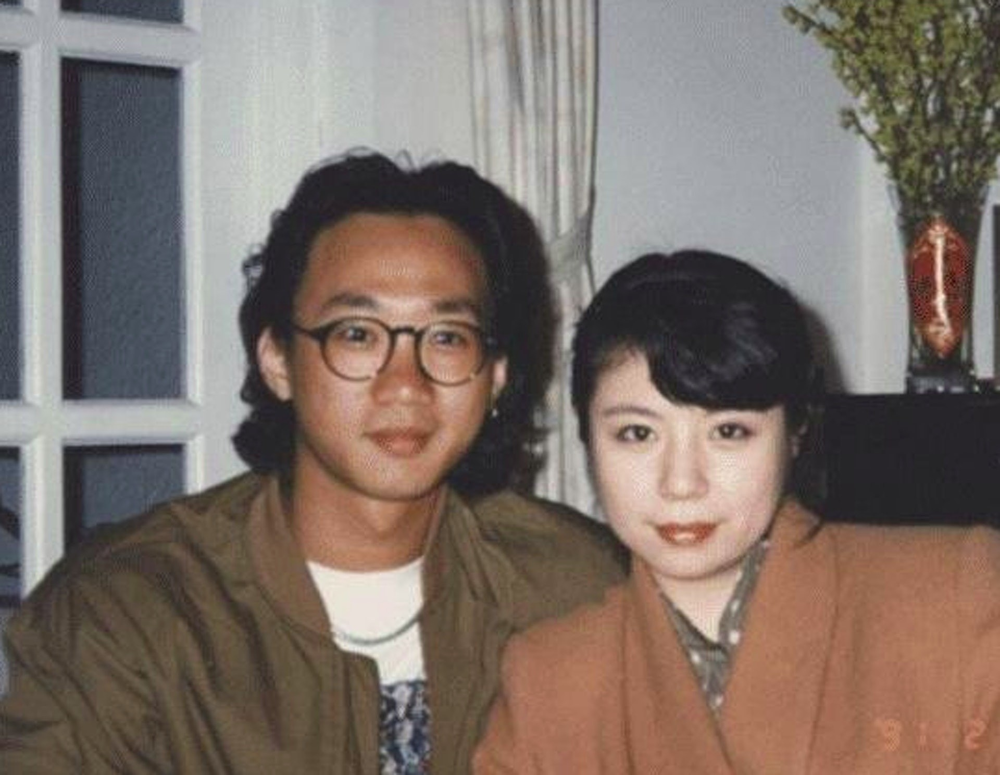
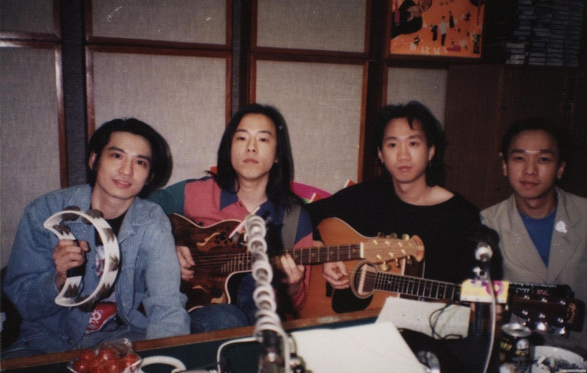
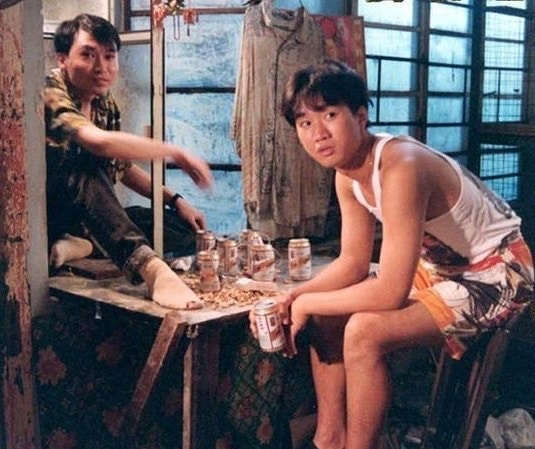
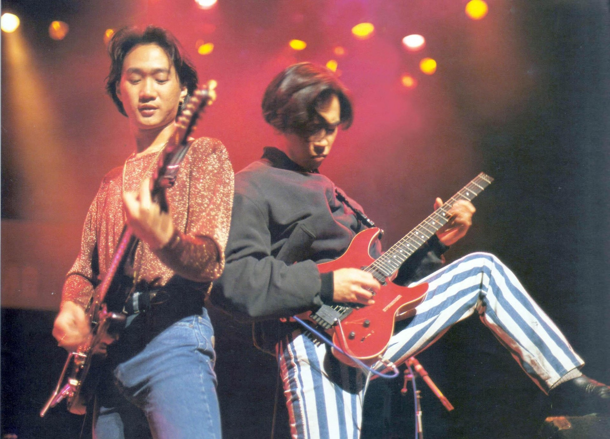

（資料圖片）

（資料圖片）

（資料圖片）

3.	Beyond的首個獎項，是1983年地下時期參加《結他雜誌》的樂隊比賽而奪得。當時訪問他們的記者，是90年代著名樂評人馮禮慈。 (網絡圖片)

4.	家駒私下原來都被Beyond成員們稱為「黃伯」，因為他年紀輕輕已經愛管事，更愛講人生道理，十足一位有經歷的老人。 (網絡圖片)

5.	1985年前後，黃家駒與Beyond經常在band房練習，更不時被鄰居投訴，但最後卻在那裡創作了很多成名曲。 (網絡圖片)

6.	《AMANI》的副歌其實是家駒用了10分鐘便寫起。1990年，Beyond隨香港電台到非洲肯雅探訪當地兒童，並學會了簡單的非洲語。「AMANI」是和平的意思；「NAKUPENDA NAKUPENDA WEWE」則意指「我們愛你」；而「TUNE TAKE WE WE」是「我們需要你」。 (網絡圖片)

7.	《光輝歲月》其實是家駒被南非前總統曼德拉啟發而寫。當時他在報紙上讀到被困獄中的曼德拉的故事，引起了他內心的共鳴。據大陸《央視》製作的記錄片敘述，曼德拉在出獄多年、南非與中國建立正式外交關係後，曾透過翻譯聽過這首歌，他當下忍不住感動流淚。 (網絡圖片)

8.	《海闊天空》推出初期原來不受歡迎，連電台的播放率亦不算高。歌曲原名為《Piano Song》，正是Beyond在日本發展時完成。當中一句「也會怕有一天會跌倒 Oh No！」其實原本應為「Oh Yeah！」 (網絡圖片)

（資料圖片）

（資料圖片）

（資料圖片）

（資料圖片）

（資料圖片）

14.	家駒有一位舊愛林楚麒，亦是《曾經擁有》的填詞人。兩人曾拍拖，當年家駒的遺體從日本運返香港，林楚麒頭戴一朵白花，身份仿似未亡人。但她的身份卻不被家駒家屬承認，家強更指她「很對不起家駒」才導致分手。 (網絡圖片)

15.	「香港沒有樂壇，只有娛樂圈」，其實這句常被媒體引用的家駒名句，並不完全合乎事實。1993年5月，Beyond在旺角的排練室接受採訪，曾經提到的原句應是「香港沒有樂壇，只有歌壇」不過媒體為了把標題放大亦稍作修改。 (網絡圖片)

16.	黃家駒一共參與過九齣電影的演出及配樂，演出中往往離不開Beyond的影子，如《開心鬼救開心鬼》飾演Behind樂隊的阿文、《Beyond日記之莫欺少年窮》中的吳駒。《籠民》的毛仔則是他的最後演出，這部電影獲得第12屆金像獎最佳影片、導演、編劇和男配角（廖啟智）四個大獎。 (電影劇照)

17.	Beyond的作品中，不少也是跟「理想」有關，屈指一算，足足有32首作品也出現了「理想」一詞。當中包括：《海闊天空》、《真的愛你》、《喜歡你》、《大地》、《再見理想》、《誰伴我闖蕩》等等。 (網絡圖片)

（資料圖片）

（資料圖片）

（資料圖片）
