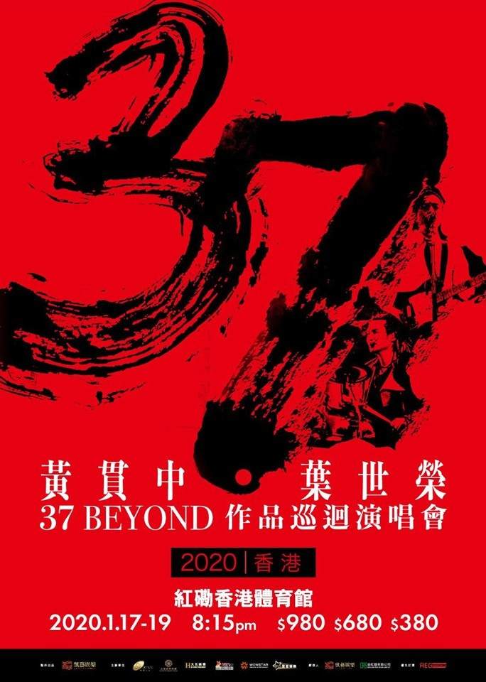
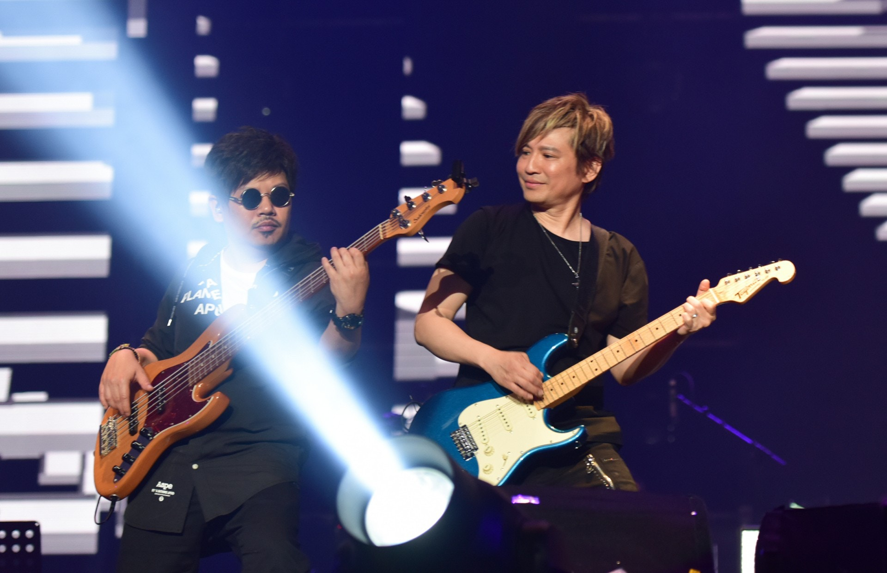
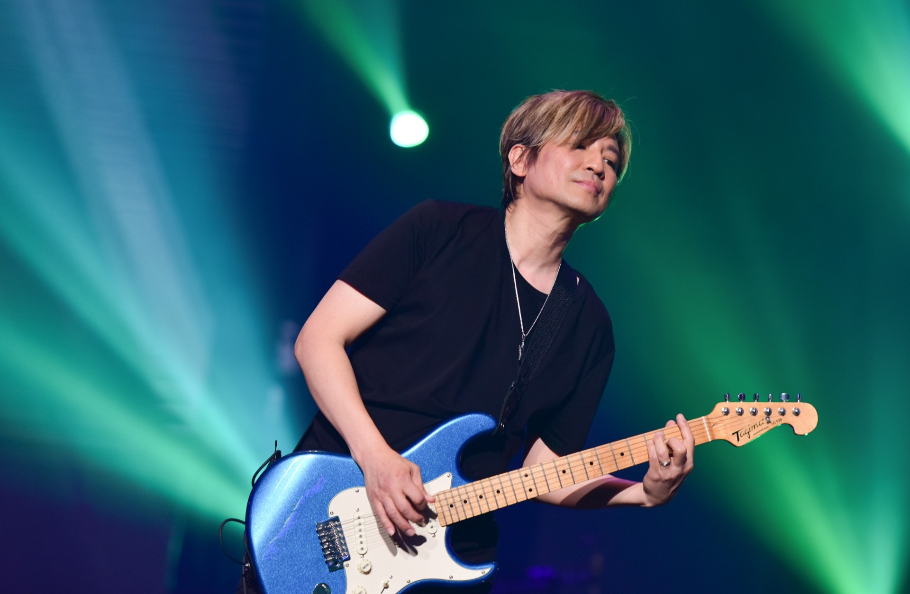
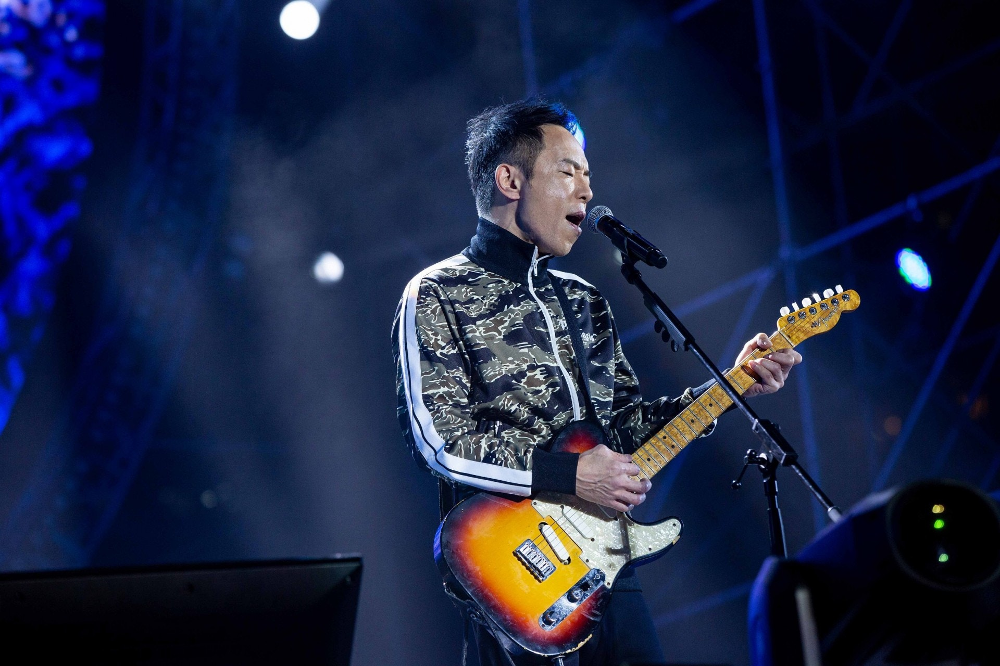
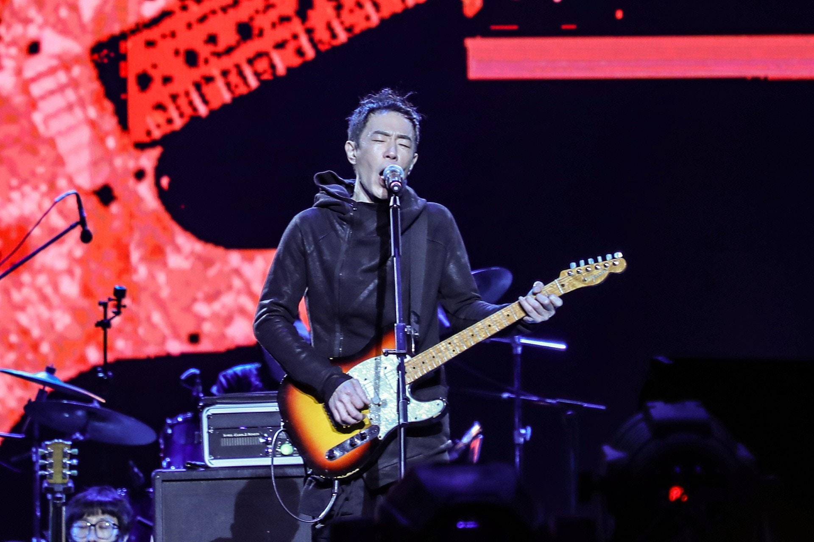

Beyond早於1983年由黃家駒、黃貫中、黃家強及葉世榮組成，劉志遠亦曾短暫加入樂隊2年，之後一直維持於4人狀態，而家駒更加可說是樂隊的靈魂人物，曾為Beyond寫下無數經歷歌曲，亦就此奠定他們在香港樂隊的神級地位。在家駒1993年意外離世後，Beyond各成員繼續走下去，直至2005年舉辦《Beyond The Story Live 2005》告別世界巡迴演唱會後，便各自朝目標努力。時隔15年，黃貫中和葉世榮宣布明年1月17日至19日，將於紅館舉辦《37 BEYOND》作品巡迴演唱會香港站，與樂迷重溫當年的樂壇經典！

（資料圖片）

樂迷可透過AEG Ticketing進行優先購票，由11月11日早上9時開始至11月15日晚上11時59分結束，門票分$980、$680及$380。另外，接受以Visa、Mastercard及 AE信用卡進行付款，每次限購12張門票，而每張門票將收取$35手續費。

《37 BEYOND作品巡迴演唱會》將於明年初舉行。（Facebook@AEG Ticketing）

距離2005年的告別演唱會，時隨15年黃貫中及葉世榮再次以Beyond名義開騷。（視覺中國）

直至今天，Beyond仍是一眾樂迷心中的經典。（視覺中國）

樂迷們絕對要睇準時間去搶飛呀！（視覺中國）

距離2005年的告別演唱會，時隨15年黃貫中及葉世榮再次以Beyond名義開騷。（視覺中國）
