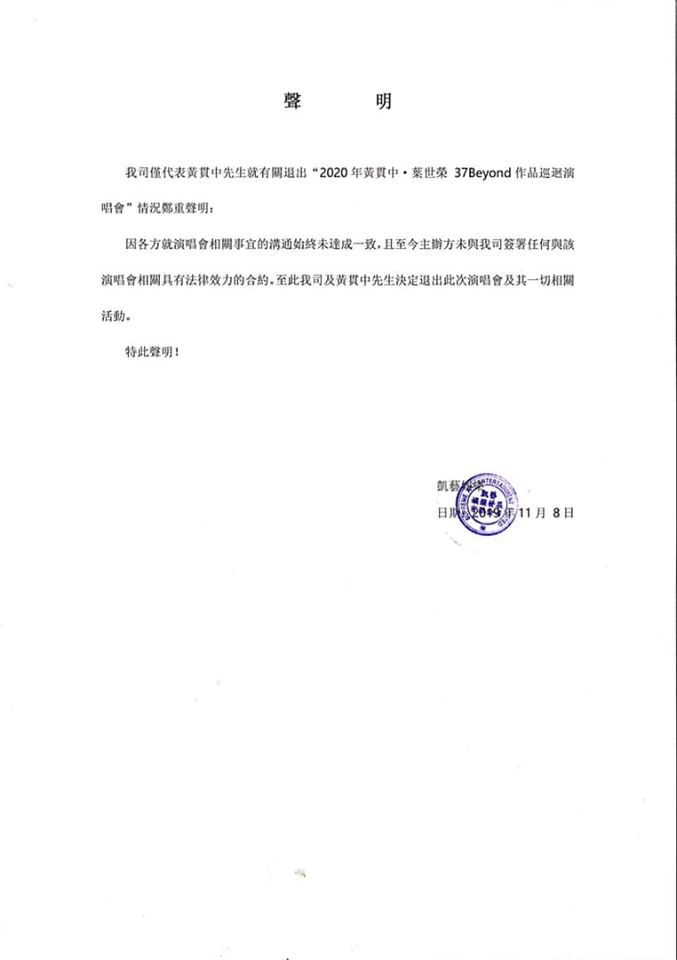

《37 BEYOND》作品巡迴演唱會原定明年1月17日至19日於紅館舉行，雖然演唱會三缺一，只有黃貫中及葉世榮參與演出，但仍讓一眾樂迷期待不已。豈料，今日凱藝娛樂代表黃貫中發聲明退演，詳細內容如下：

「我司僅代表黃貫中先生就有關退出「2020年黃貫中．葉世榮37Beyond作品巡迴演唱會」情況鄭重聲明：

因各方就演唱會相關事宜的溝通始終未達成一致，且至今主辦方未與我司簽署任何與該演唱會相關具法律效力的合約。至此我司及黃貫中先生決定退出此次演唱會及其一切相關活動。

特此聲明！」

黃貫中除了在個人Facebook上轉發聲明，另已特別作出回應：「公司已發出聲明作出回應，沒有其他補充了，謝謝關心！」

凱藝娛樂代表黃貫中發聲明退出演唱會。（Facebook@凱藝娛樂）
