黃貫中與葉世榮原定於明年1月17日至19日假紅館舉行《37 BEYOND》作品巡迴演唱會，但黃貫中昨日發聲明退演，不少樂迷對此感到失望。相關文章：Beyond時隔15年重聚開騷夢碎 黃貫中發聲明宣布退出演唱會

不過，近日有網民發現「抖音黃家駒」，其聲線的相似度令人嘖嘖稱奇，更留言表示：「一定係咪嘴嘅！似成咁都有！」

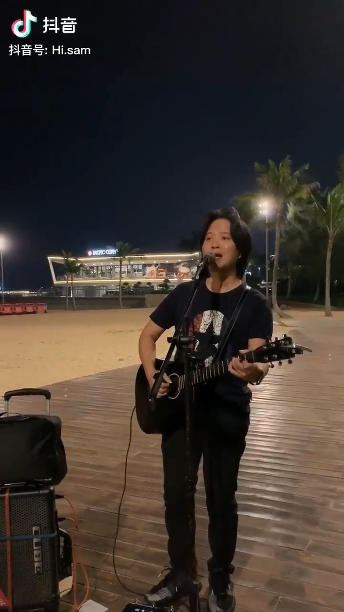
這位街頭藝人聲線酷似Beyond已故主音黃家駒，就連髮型也相近，有網民表示：「一定係咪嘴嘅！似成咁都有！」(影片截圖)

網民對這個街頭藝人的身份十分好奇，但仍未有人確實知道，只知抖音帳號是「Hi.sam」，即使片尾有QR Code或許因為地區問題於App內查找亦一無所獲。不過，有網民表示認出片中地點是珠海大劇院，又有人指是在珠海情侶路；更有網民希望黃家強邀請他重組Beyond。但亦有網民不喜歡他的表演，留言表：「唔該唔好同黃家駒相提並論，連唱歌都要扮人，不知所謂。」他更批評這樣模仿有辱家駒本尊。

> 點擊查看網民對「抖音黃家駒」的看法(按圖放大)

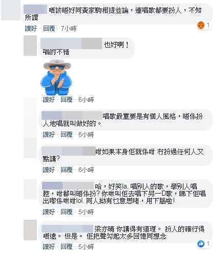
(網頁截圖)

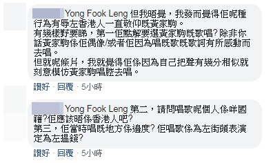
(網頁截圖)

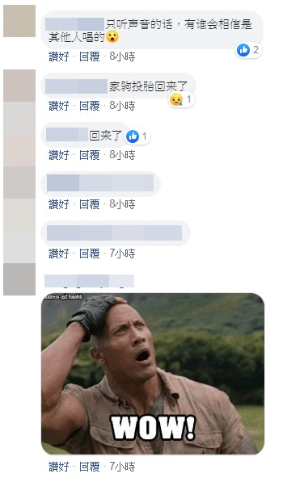
(網頁截圖)

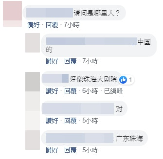
(網頁截圖)

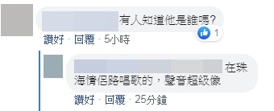
(網頁截圖)

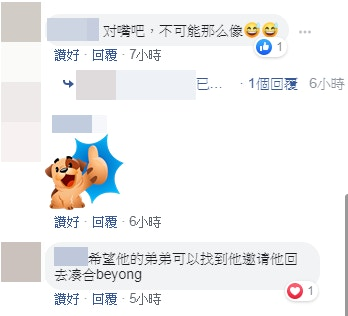
(網頁截圖)

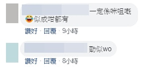
(網頁截圖)

> 黃家駒是歷代香港樂迷的搖滾英雄。(資料圖片)(按圖放大)

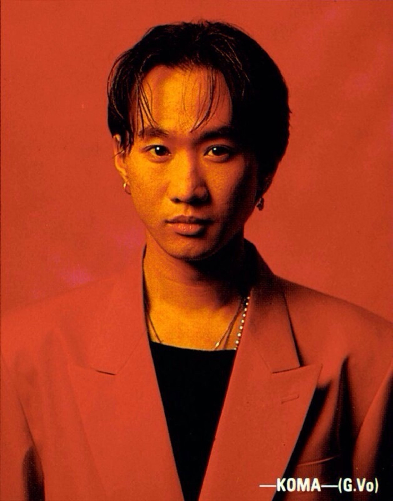
（資料圖片）

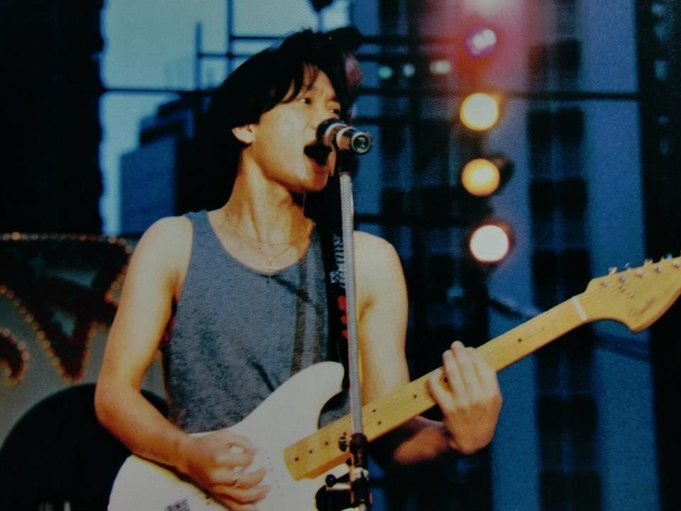
（資料圖片）

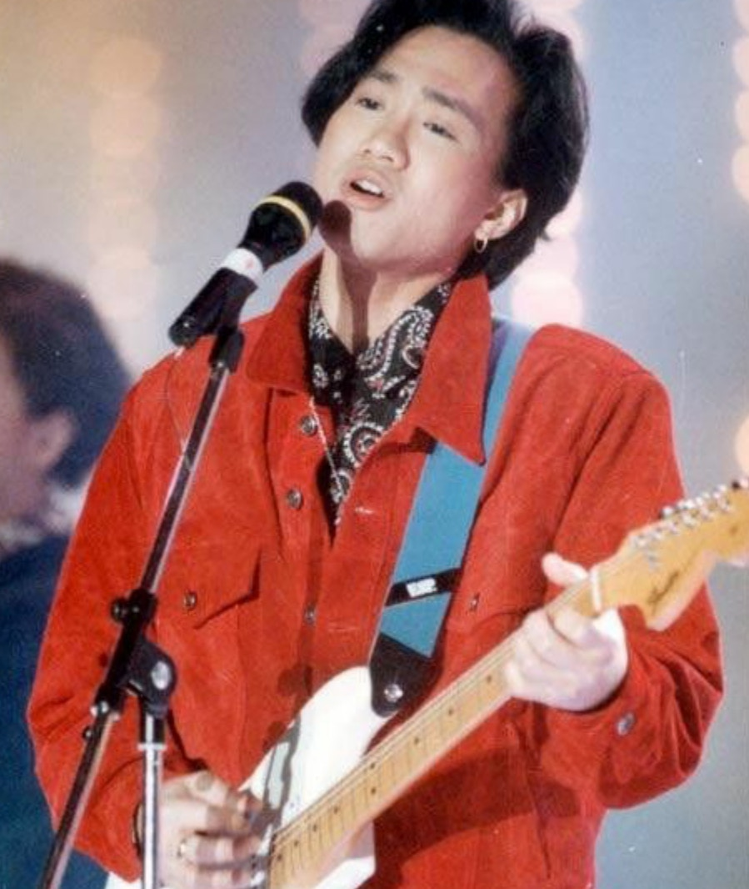
（資料圖片）

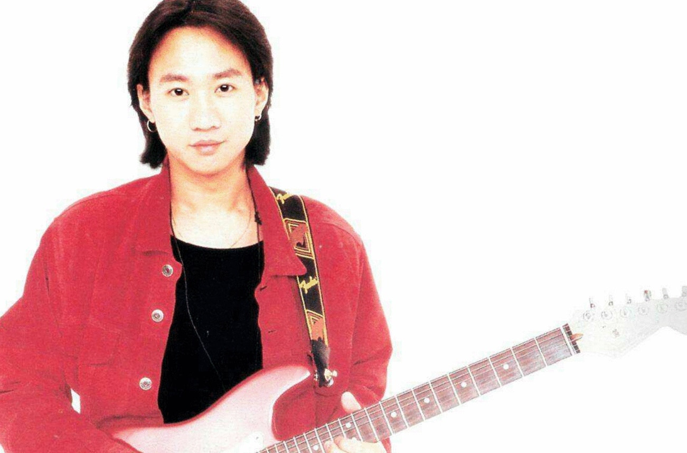
（資料圖片）

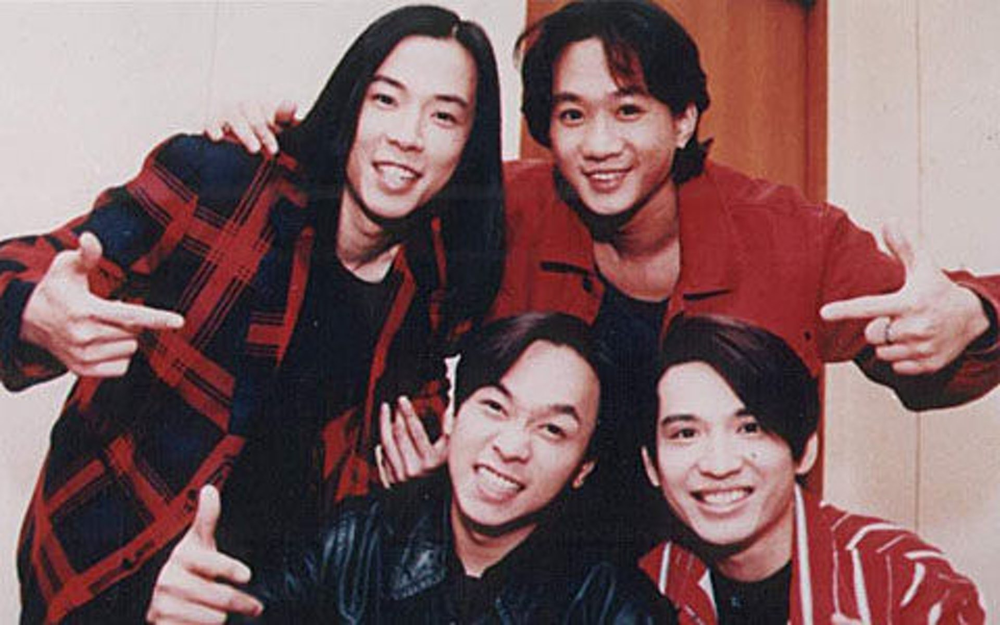
（資料圖片）

（資料圖片）

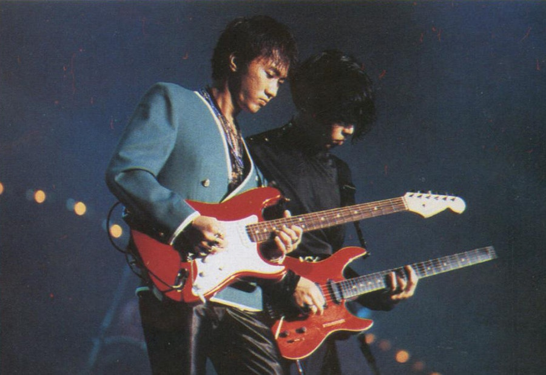
（資料圖片）

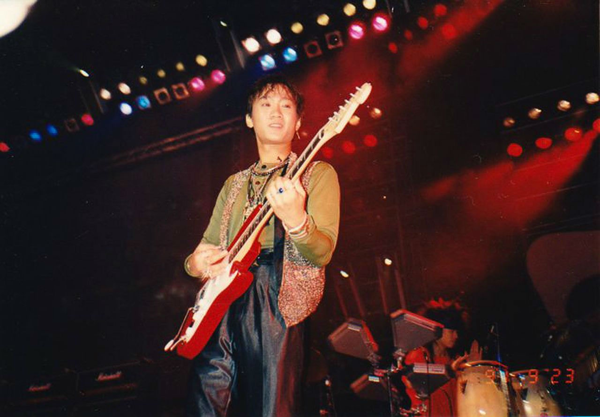
（資料圖片）

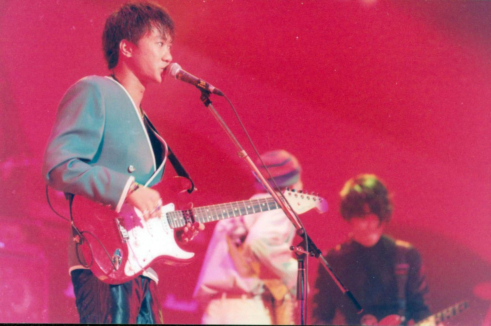
（資料圖片）

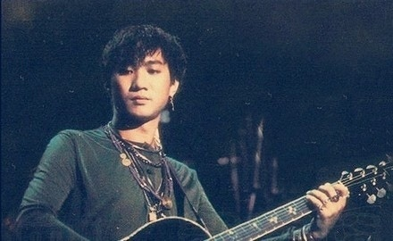
（資料圖片）

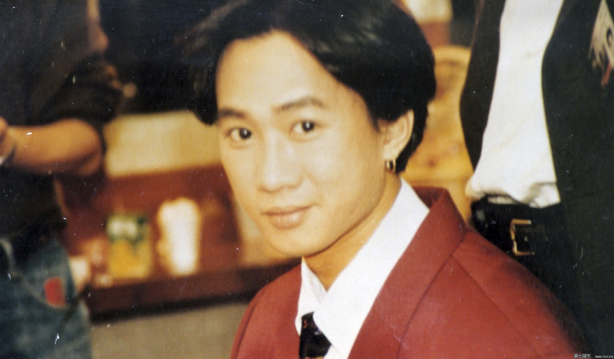
（資料圖片）

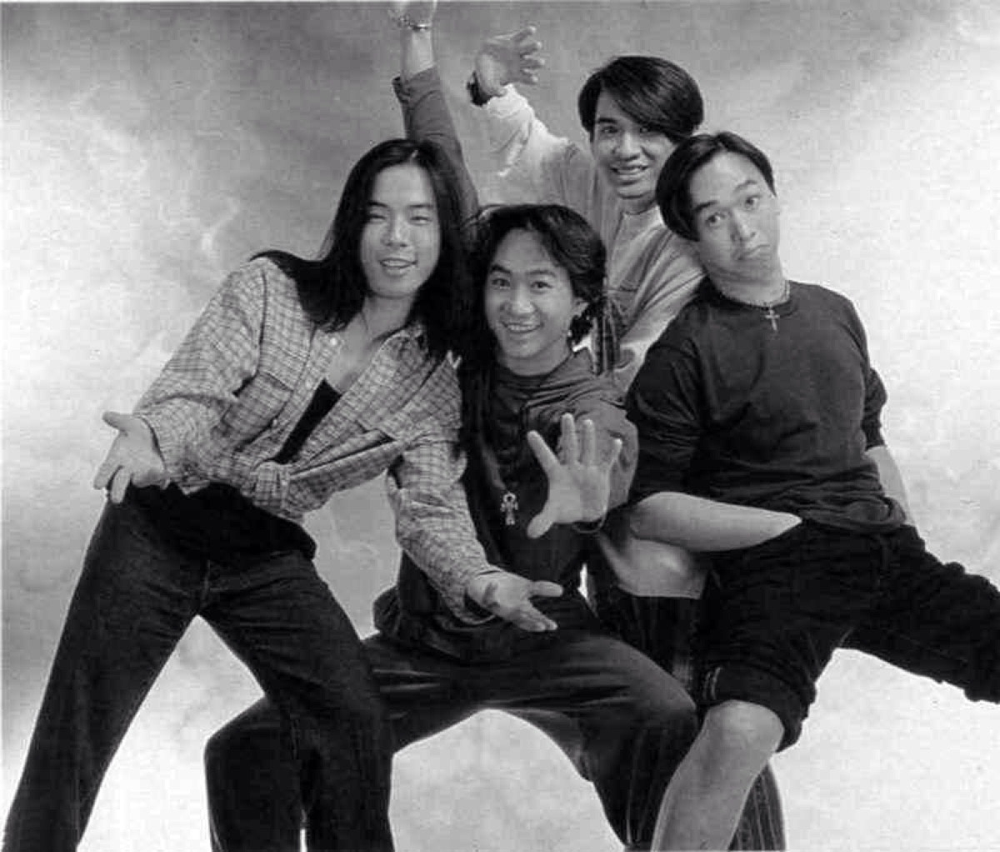
（資料圖片）

（資料圖片）

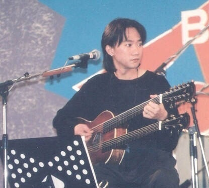
（資料圖片）
