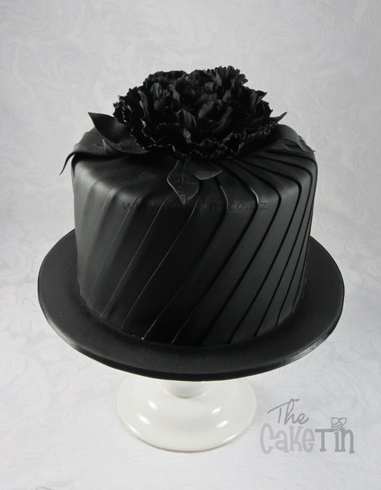
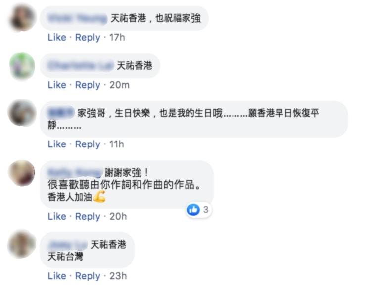
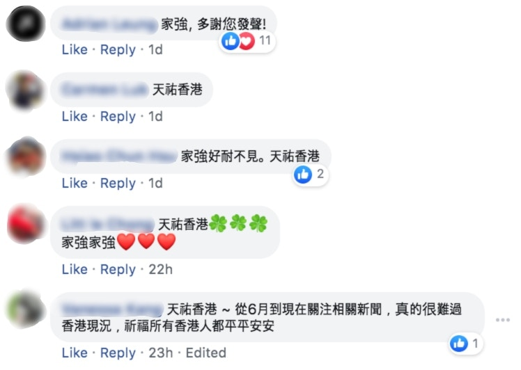
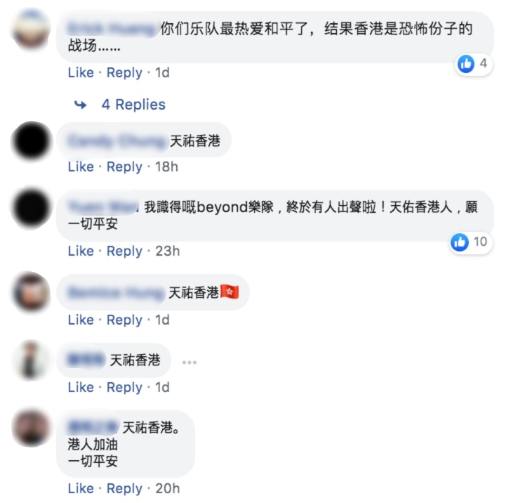
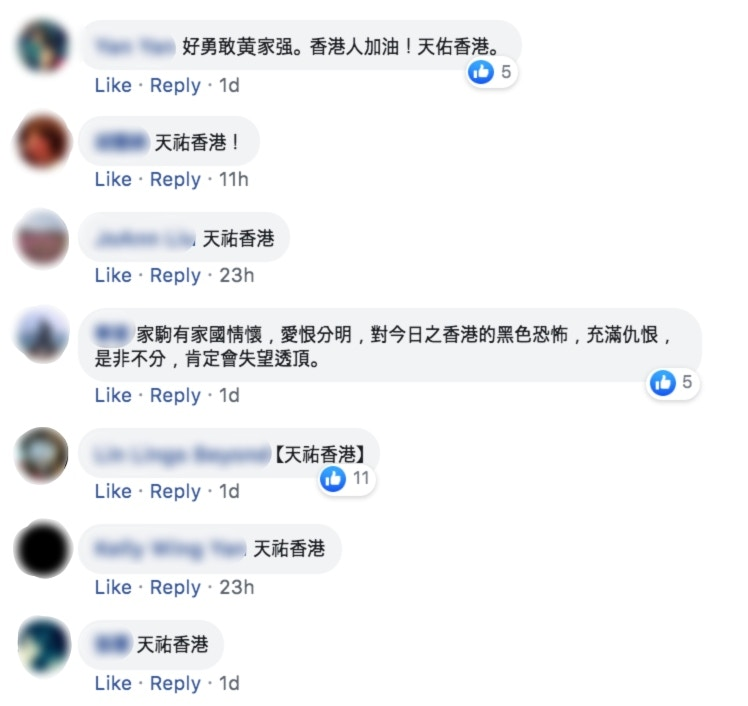
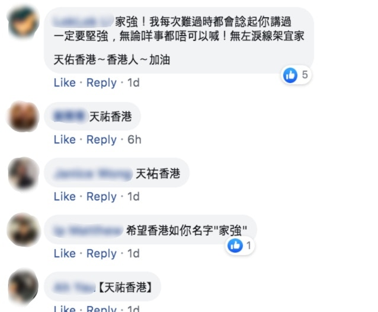
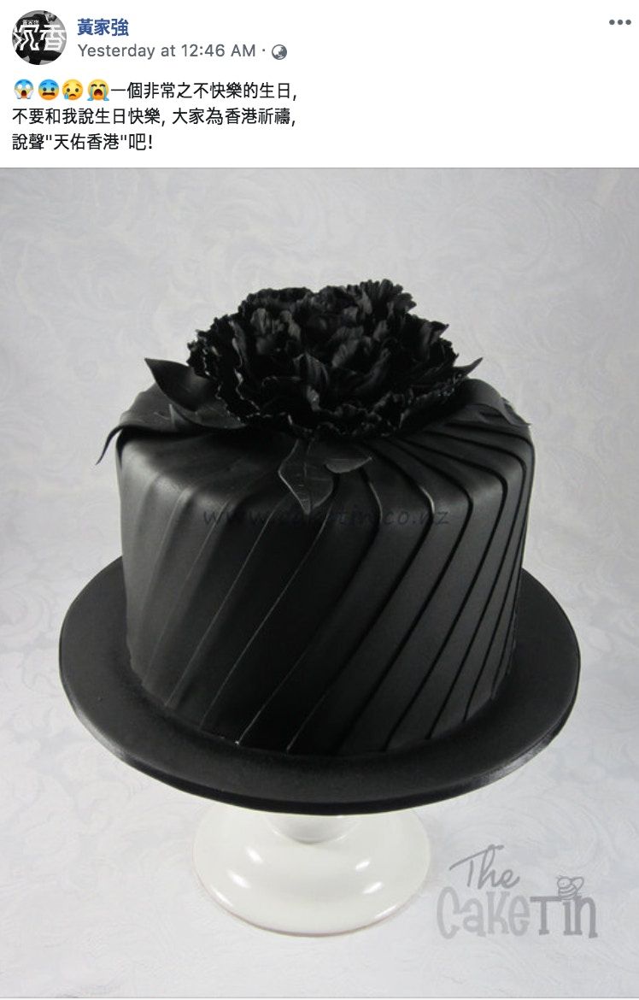
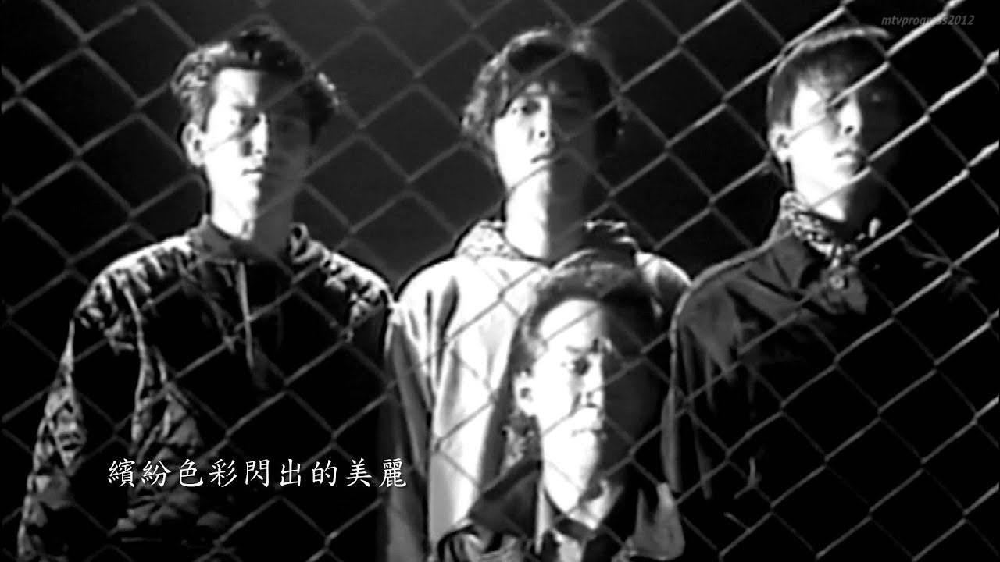

黃家強昨日（13日）過55歲生日，一直甚少在個人Facebook發文的他趁着生日抒發感受：「一個非常之不快樂的生日，不要和我說生日快樂，大家為香港祈禱，說聲『天佑香港』吧！」配上一張黑色蛋糕圖，相信受到近日社會事件所影響，難掩沉重心情。 樂迷亦如家強所願在留言寫上「天佑香港」的祝福，亦有網民趁機表達不同意見：「我識得嘅Beyond樂隊，終於有人出聲啦！天佑香港人，願一切平安！」、「希望香港能早點海闊天空！」、「希望香港如你名字『家強』」、「爭取自由，也不是這樣，現在的香港學生，像個暴民。」、「好多香港人都是支持恐怖分子的！」，而家強對於留言則一概未有回覆。

家強在生日當天貼上黑色蛋糕圖，並指今年生日非常不開心，希望歌迷以「天佑香港」代替「生日快樂」向他送祝福。（Facebook@黃家強）

> 點擊大圖睇網民留言

有網民應家強要求留言「天佑香港」，同時亦為家強送上生日祝福。（黃家強Facebook截圖）

亦有網民感謝家強對事件表達關心：「家強，多謝您發聲！」（黃家強Facebook截圖）

有網民感嘆香港情況與樂隊宗旨相違背：「你們樂隊最熱愛和平了，結果香港是恐怖份子的戰場……」（黃家強Facebook截圖）

有網民想起家駒：「家駒有家國情情懷，愛恨分明，對今日之香港的黑色恐怖，充滿仇恨，是非不分，肯定會失望透頂。（黃家強Facebook截圖）

有網民指自己常以家強的說話鼓勵自己：「一定要堅強，無論咩事都唔可以喊！無咗淚腺㗎依家。」（黃家強Facebook截圖）

黃家強在昨日生日難得在Facebook發文。（黃家強Facebook截圖）

除此之外，亦不少樂迷想起家駒，並感嘆若果家駒尚在生，應能給學生有用的建議。家駒生時常以音樂帶出自由、人權、和平等議題，如紀念90年南非總統曼德拉結束28年刑期出獄的《光輝歲月》，便是家駒對曼德拉在種族隔離時期為黑人付出努力的敬意。而當時家駒在作品推出後，曾接受媒體訪問談及歌詞：「我很佩服曼德拉，20多年的牢獄，不知他怎樣耐過這段孤獨歲月，但我知道一定有堅強的信念支撐他。」

Beyond是香港的傳奇樂隊，大家印象最深刻是4人陣容。(資料圖片)
