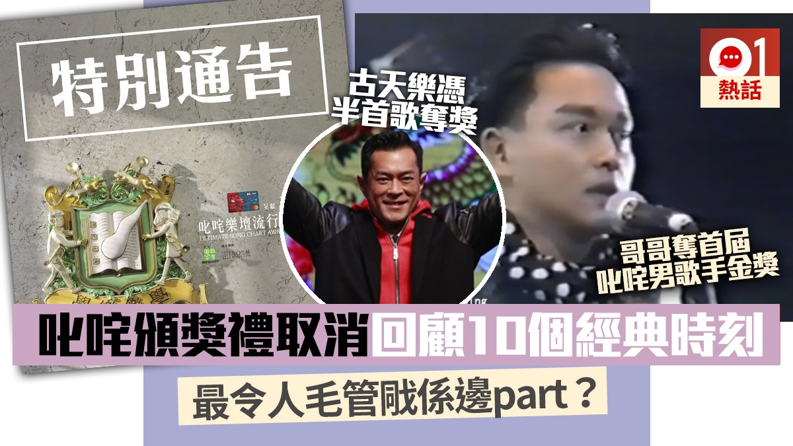
商台今日宣布取消明年1月1日元旦日的《叱咤樂壇流行榜頒獎典禮2019》，改以其他形式頒發全數43個獎項。《叱咤》過往曾造就多個經典場面，但今年社會動盪，冇得睇《叱咤》不要緊，一同回顧《叱咤》9個經典時刻，跟商台「齊上齊落」！（01製圖）

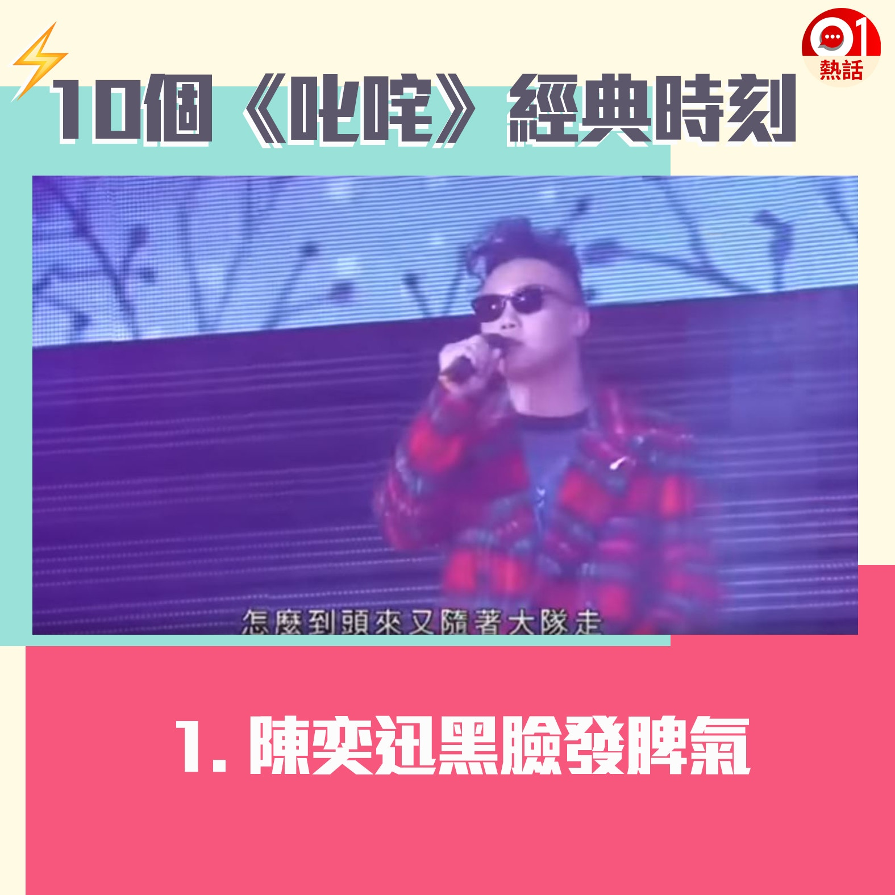
【叱咤頒獎禮難忘時刻】1.陳奕迅（Eason）在《2013叱咤樂壇流行榜頒獎典禮》中連奪5獎，但他在台上演唱《任我行》時連番忘記歌詞，其後更走音失準，最後自嘲「當之有愧，Sorry！」，並黑臉走下台，而他將手上的咪向上拋，惟未有接住，惹來發脾氣掉咪疑雲。（01製圖）

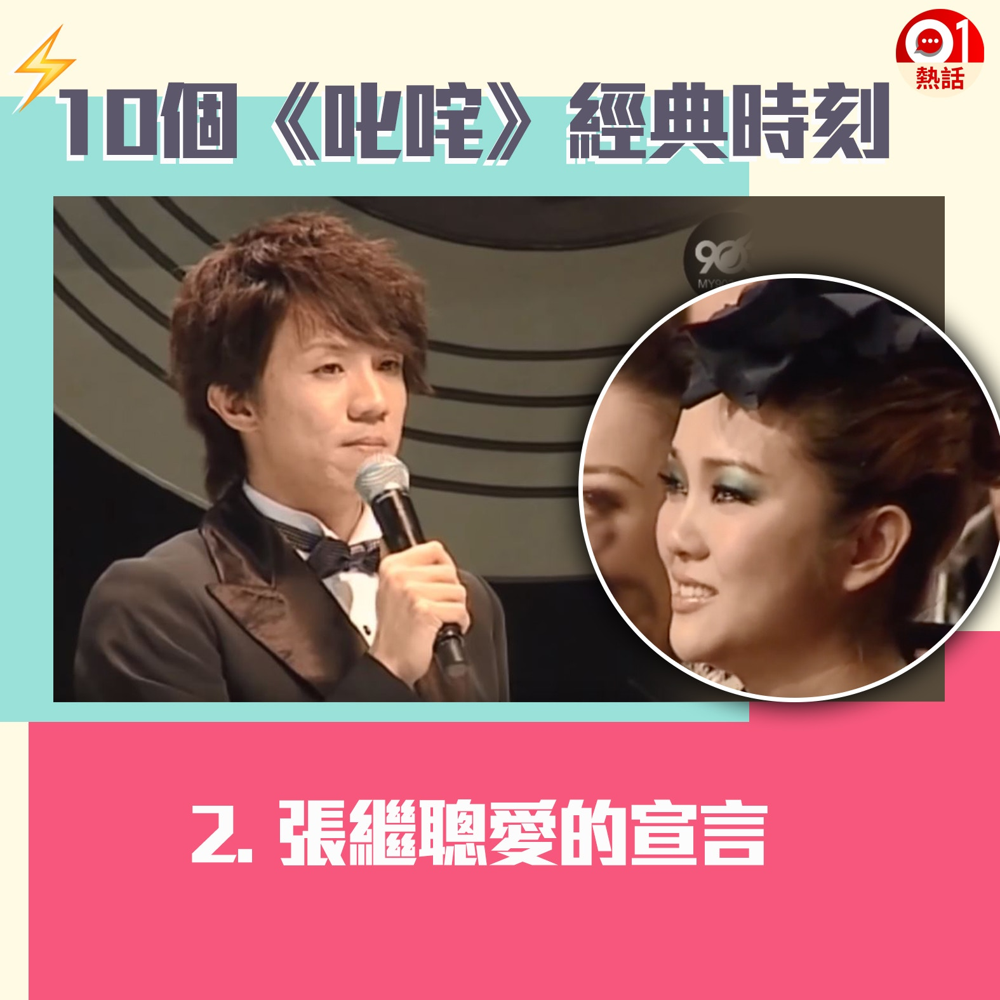
【叱咤頒獎禮難忘時刻】2.張繼聰以歌手身份勇奪2007年《叱咤樂壇》作曲人大獎，他上台時透露曾患抑鬱，幸得太太謝安琪（Kay）互相扶持，更冧爆表示就算時光倒流多少次，「我都會娶你做老婆，我愛你，Kay」，令台下的太太感動爆喊。（01製圖）

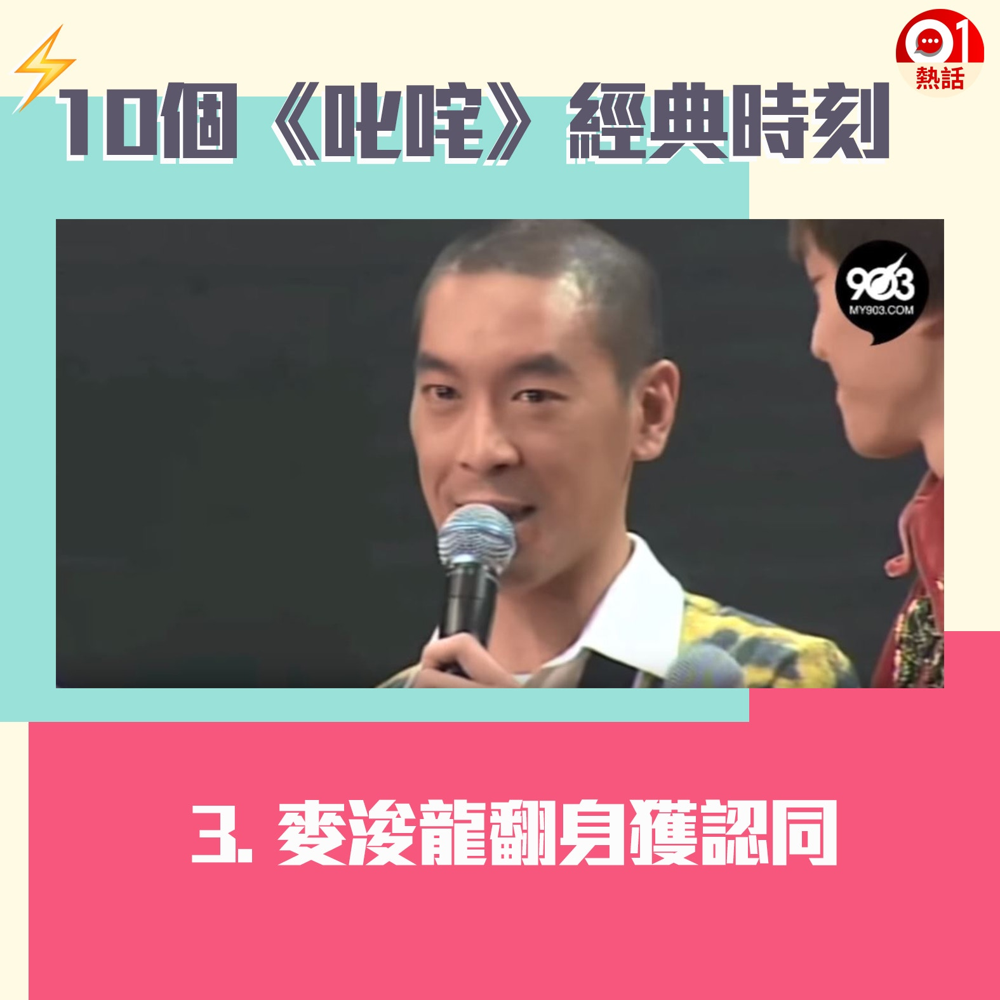
【叱咤頒獎禮難忘時刻】3.出道初期曾被質疑沒實力、用錢買fans的麥浚龍（Juno），2009年憑《弱水三千》大翻身終獲認同，他在台上爆喊表示「從來沒想過自己會放棄音樂」。（01製圖）

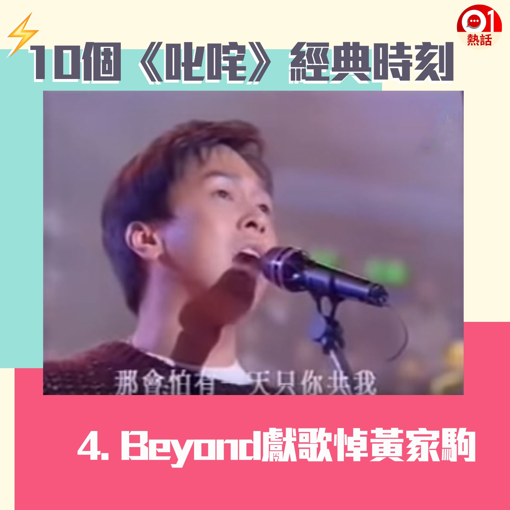
【叱咤頒獎禮難忘時刻】4.香港樂壇組合經典Beyond，在1993年成員黃家駒不幸意外離世，其後Beyond在1993年度《叱咤樂壇》中，由黃家強唱出《海闊天空》悼念哥哥，全場氣氛傷感，家強亦難忍淚水邊哭邊唱。（01製圖）

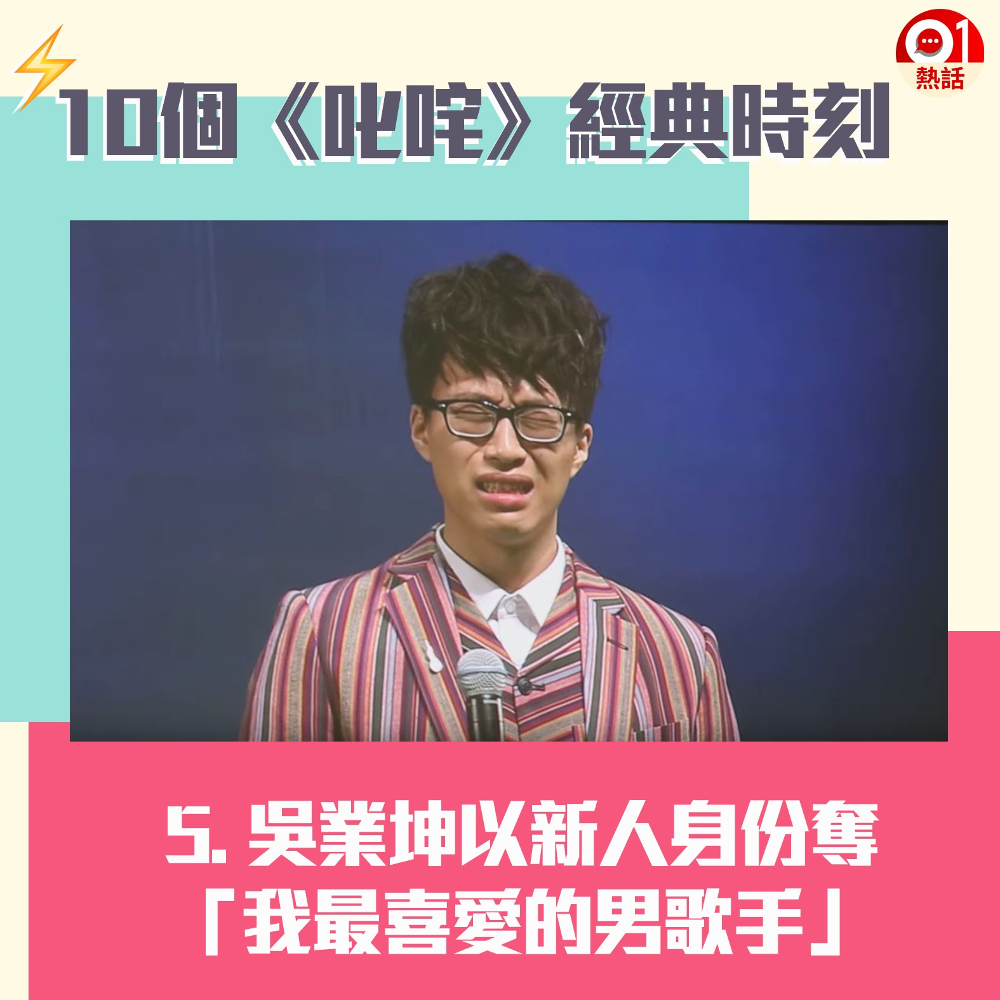
【叱咤頒獎禮難忘時刻】5.參加電視台歌唱比賽出道的吳業坤，2015年推出第一首派台歌《原來她不夠愛我》後爆紅，更是首名以新力軍身份奪得「我最喜愛的男歌手」，他在台上爆喊畫面亦不停被網民「翻loop」。（01製圖）

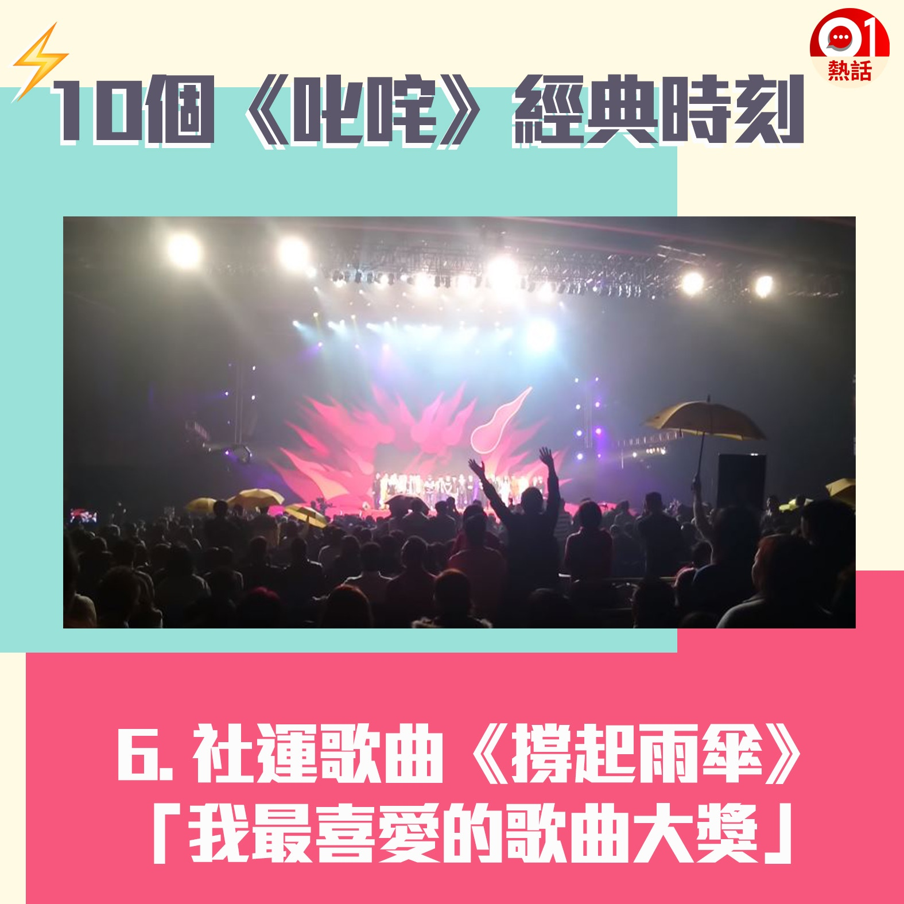
【叱咤頒獎禮難忘時刻】6.2014年雨傘運動歌曲《撐起雨傘》以大比數拋離其他候選歌曲，勇奪「我最喜愛的歌曲」大獎，成為香港史上第一首社運歌曲打入主流樂壇，當時頒獎禮現場不少人撐起黃傘支持。（01製圖）

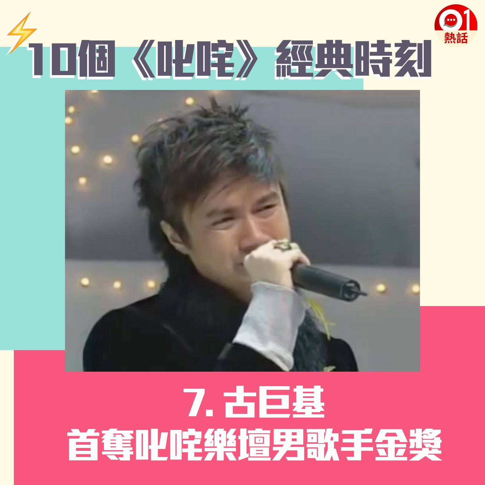
【叱咤頒獎禮難忘時刻】7.入行廿多年的古巨基曾暫別樂壇，其後於2003年回歸後，翌年憑歌曲《愛與誠》登上事業高峰，更首奪叱咤樂壇男歌手金獎。他上台致謝詞時，激動地聲淚俱下感激經理人黃柏高「執」他回樂壇。（01製圖）

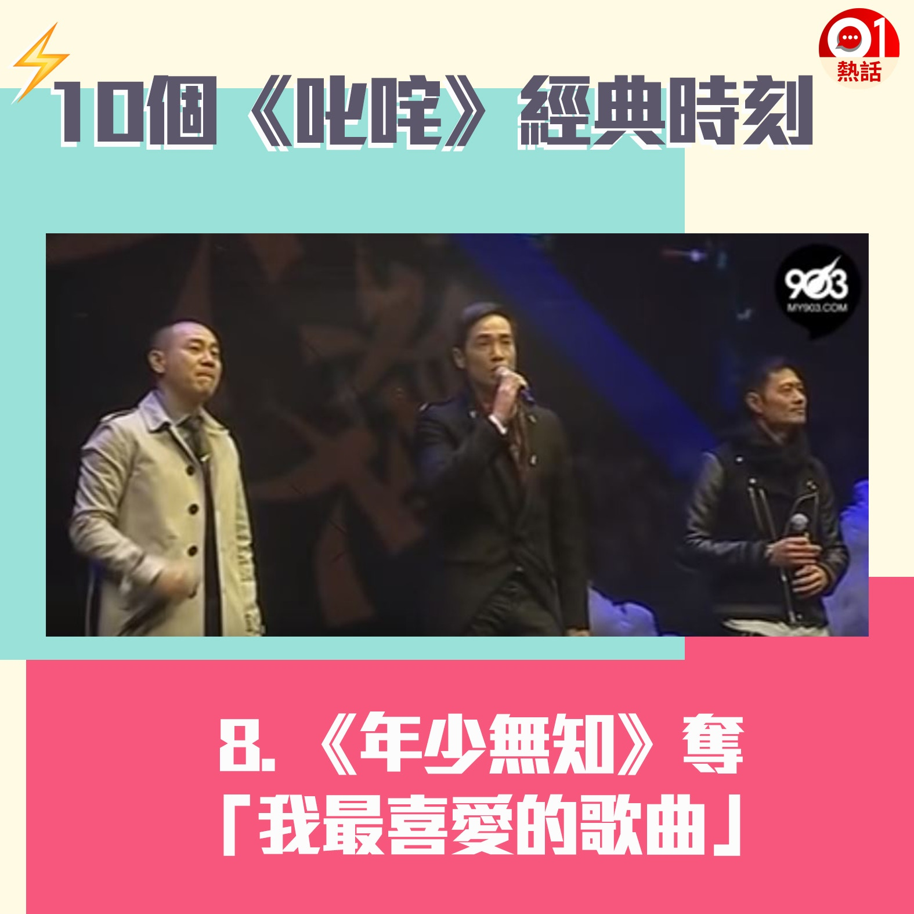
【叱咤頒獎禮難忘時刻】8.「如果命運能選擇……」經典劇集《天與地》主題曲《年少無知》，在2012年以大熱姿態成為「我最喜愛的歌曲」，歌詞句句唱入心坎，3名主唱林保怡、陳豪及黃德斌的佬味演出，不少網民至今仍津津樂道。（01製圖）

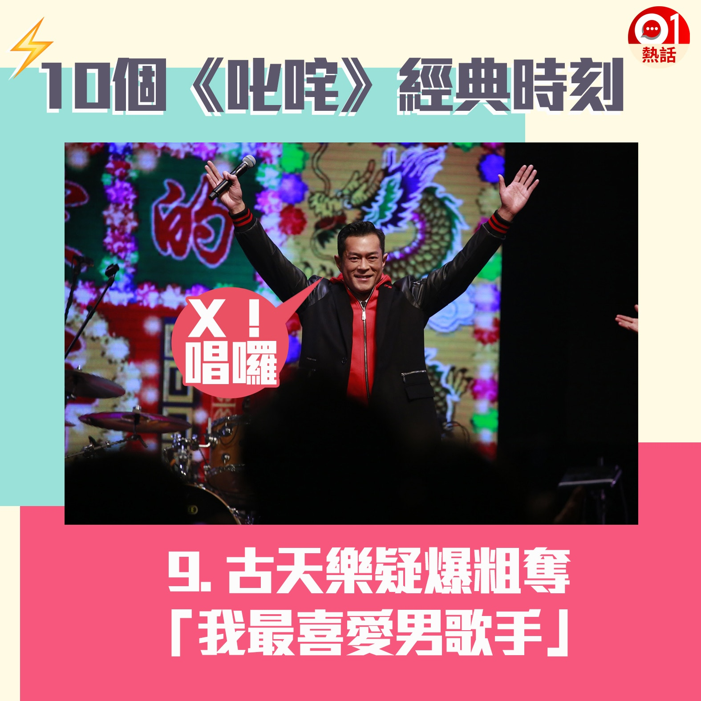
【叱咤頒獎禮難忘時刻】9.闊別樂壇15年的古天樂，去年跟謝安琪合唱《（一個男人）一個女人和浴室》，最終憑半曲歌被網民推到奪獎，以大熱姿態奪得「我最喜愛的男歌手」，震撼樂壇。古仔致詞時聲稱「我真係好鍾意唱歌」，其後現場起哄叫他即場演唱時，他竟疑似爆粗說：「X！嚟，唱囉！」最後拉埋容祖兒、張敬軒等人陪唱首本名曲《男朋友》。（01製圖）

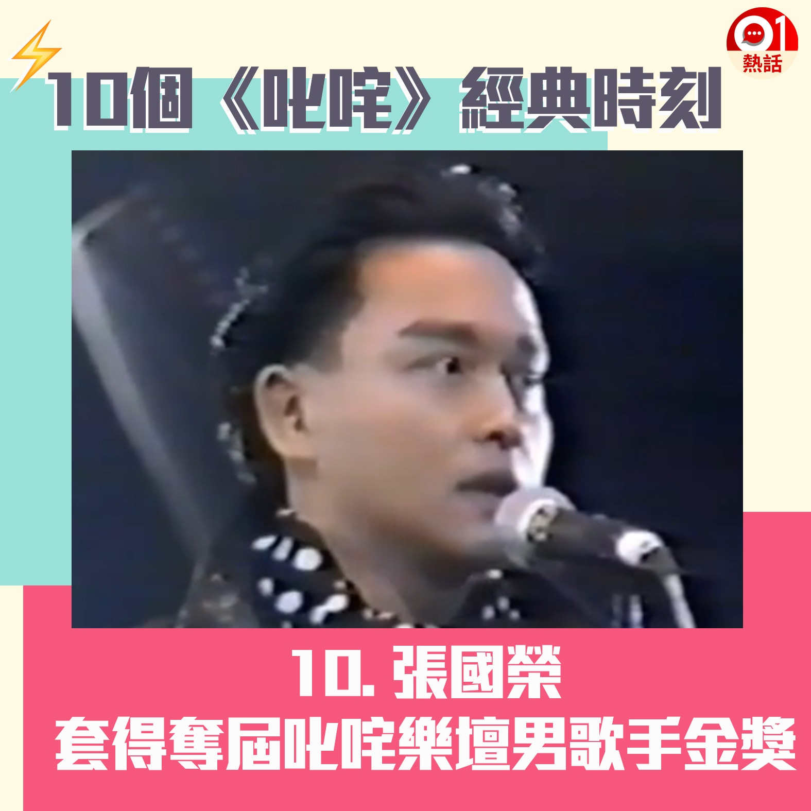
【叱咤頒獎禮難忘時刻】10.首屆「1988年度叱咤樂壇流行榜頒獎典禮」在1989年1月16日舉行，最觸目的「叱咤樂壇男歌手」金獎由哥哥張國榮奪得，銀獎及銅獎得主分別是譚詠麟和陳百強。哥哥在台上明言：「我好憎有比賽，因為一有比賽，我同我好朋友遠拉就愈遠，但我覺得係良性競爭。」其後哥哥與阿倫先後宣布退出頒獎禮，造就後來「四大天王」盛世。（01製圖）
