黃明志近日推出新歌《我們的海闊天空》，向Beyond經典作品致敬，更找來聲音神似黃家駒，專門翻唱Beyond作品的內地歌手富九合唱。歌曲推出之初本獲得大眾一致讚賞，認為歌曲不但改編了Beyond的經典，亦傳承了Beyond的精神，而歌曲亦得到黃貫中親身加持給予意見。不過早前《我們的海闊天空》在網上推出MV後，卻突然分裂成兩派不同意見，因為MV中刻劃了身穿黑衣示威者的場面，似是為去年香港發生的「逃犯條例」一事而表明自己立場。

> 《我們的海闊天空》MV加入不少香港元素，似是刻劃去年示威場面

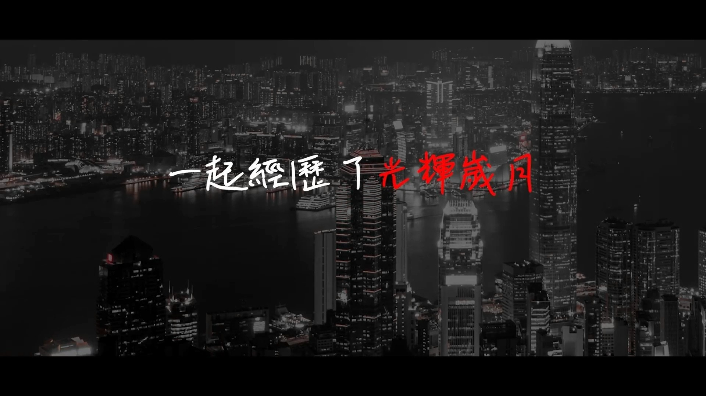
黃明志在MV一開始利用Beyond經典歌名帶出新曲信息。（《我們的海闊天空》MV截圖）

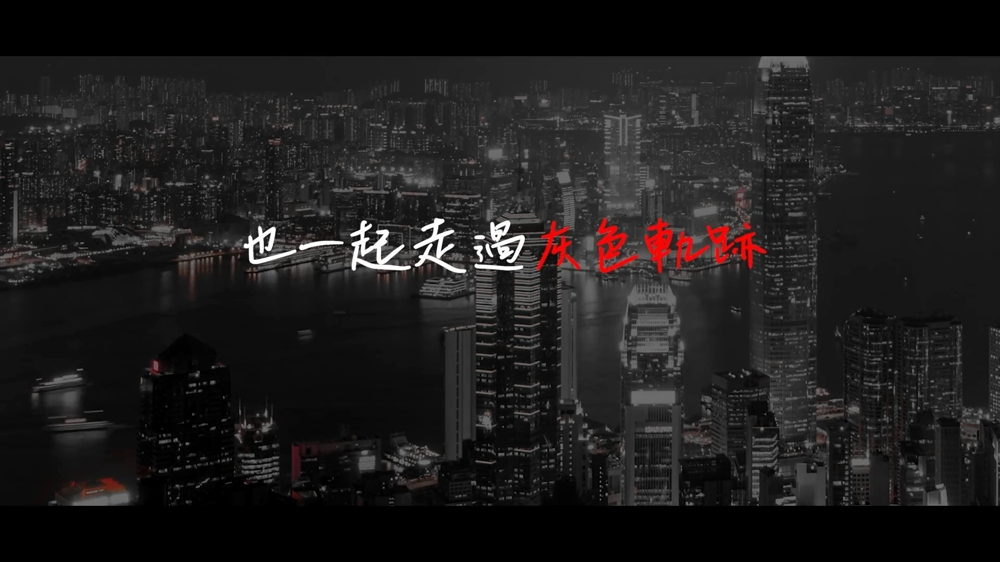
黃明志在MV一開始利用Beyond經典歌名帶出新曲信息。（《我們的海闊天空》MV截圖）

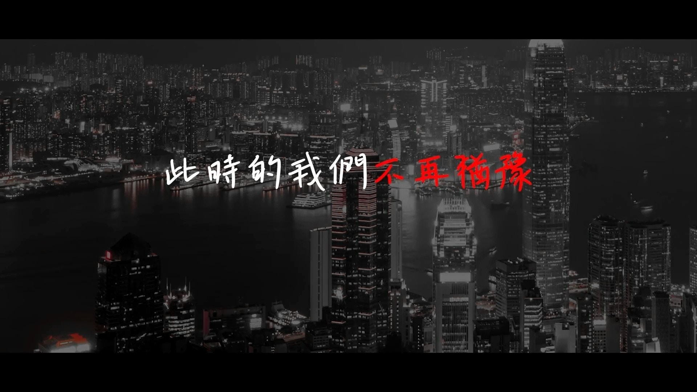
黃明志在MV一開始利用Beyond經典歌名帶出新曲信息。（《我們的海闊天空》MV截圖）

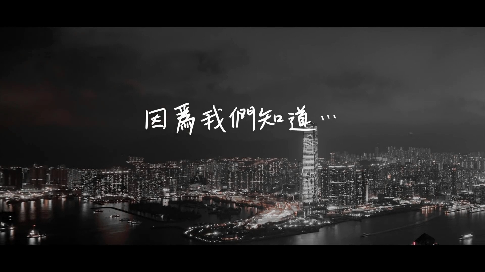
黃明志在MV一開始利用Beyond經典歌名帶出新曲信息。（《我們的海闊天空》MV截圖）

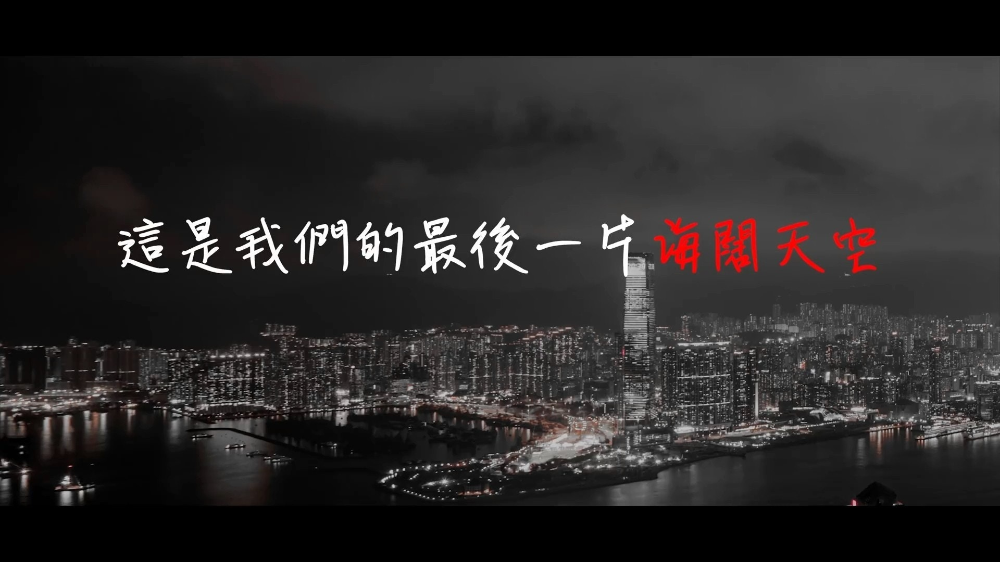
黃明志在MV一開始利用Beyond經典歌名帶出新曲信息。（《我們的海闊天空》MV截圖）

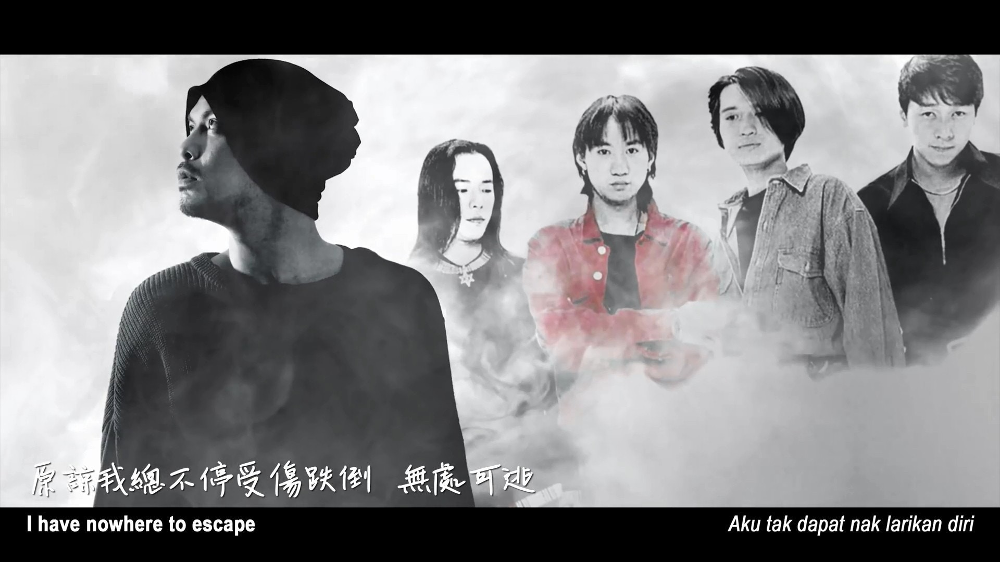
黃明志透過歌曲及MV向偶像Beyond致敬。（《我們的海闊天空》MV截圖）

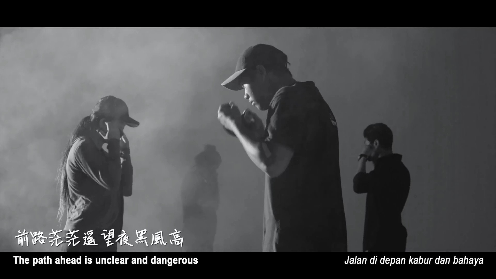
MV中包括示威者戴口罩的畫面。（《我們的海闊天空》MV截圖）

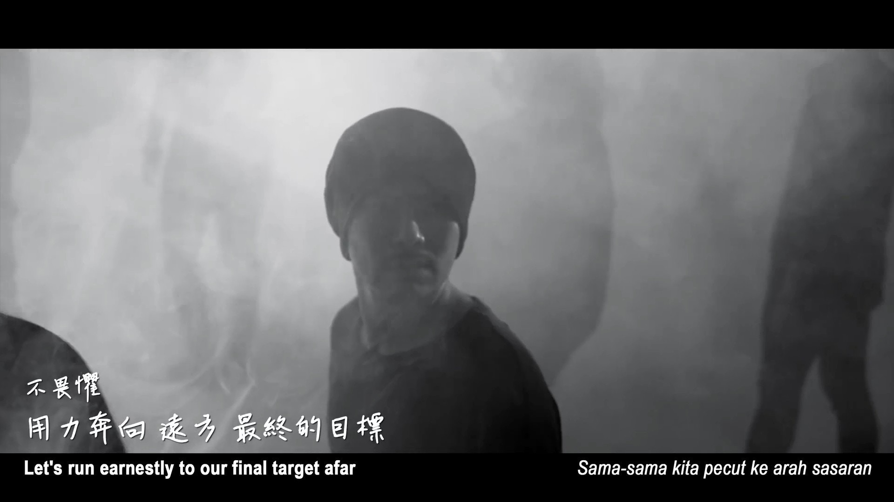
MV中利用煙幕模擬警方發射催淚彈的畫面。（《我們的海闊天空》MV截圖）

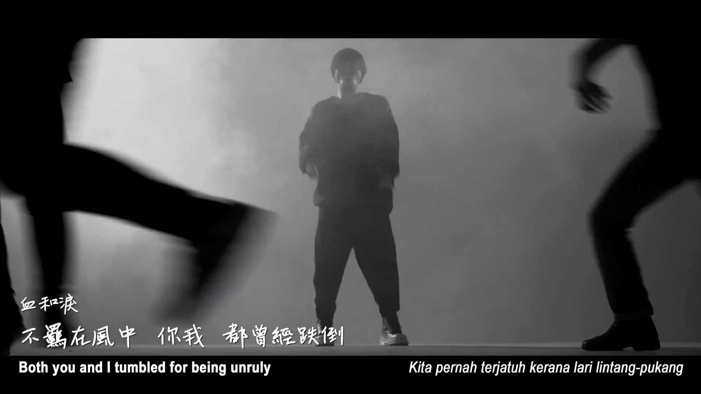
MV中包含示威者逃跑的畫面。（《我們的海闊天空》MV截圖）

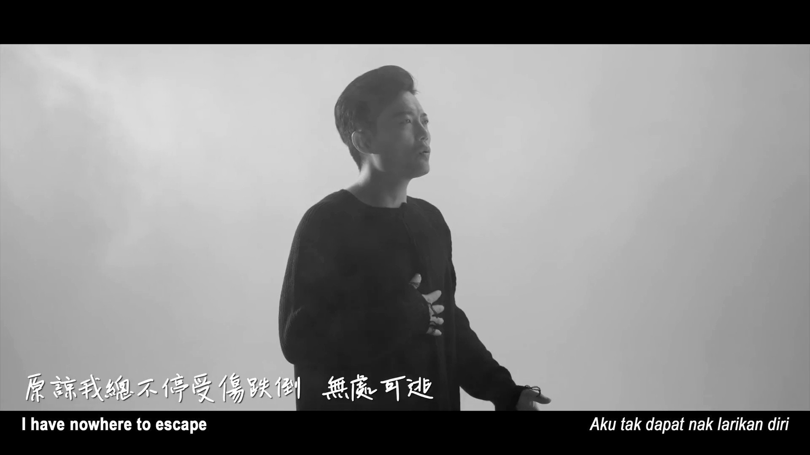
內地歌手富九同樣有份參與MV拍攝。（《我們的海闊天空》MV截圖）

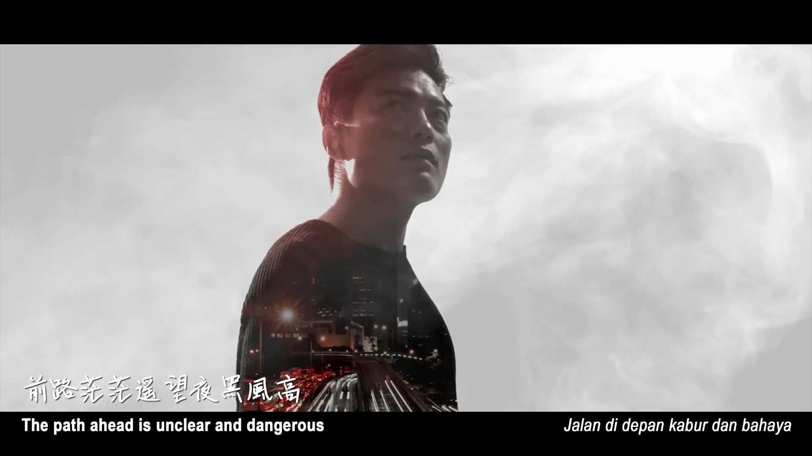
畫面中利用人的身影襯托香港美景，製作相當用心。（《我們的海闊天空》MV截圖）

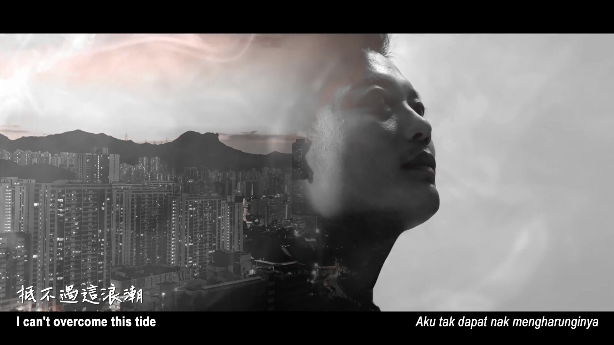
畫面中利用人的身影襯托香港美景，製作相當用心。（《我們的海闊天空》MV截圖）

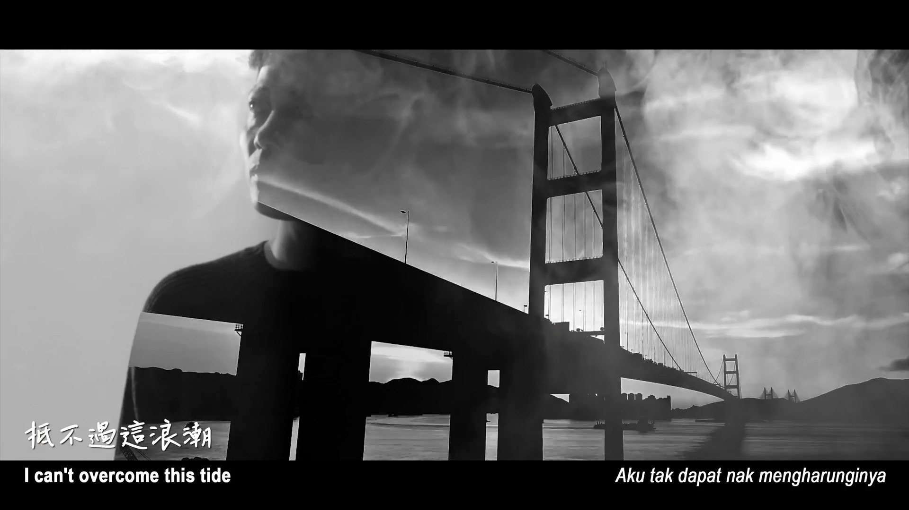
畫面中利用人的身影襯托香港美景，製作相當用心。（《我們的海闊天空》MV截圖）

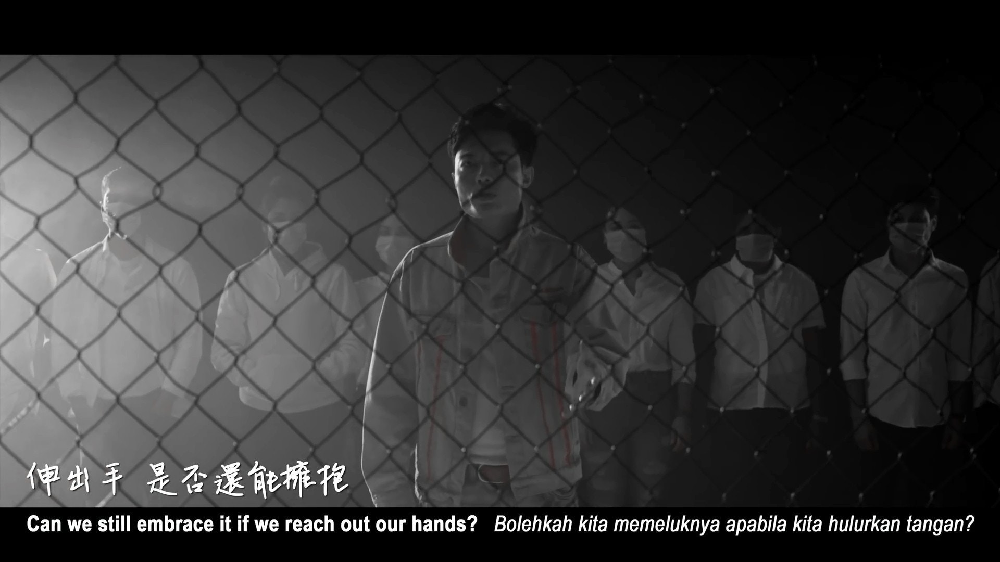
富九及身後的演員穿著白衣示人。（《我們的海闊天空》MV截圖）

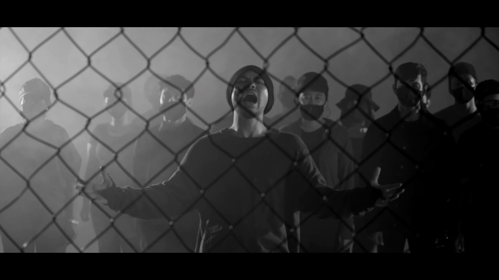
而黃明志及身後的演員則穿著黑衣示人。（《我們的海闊天空》MV截圖）

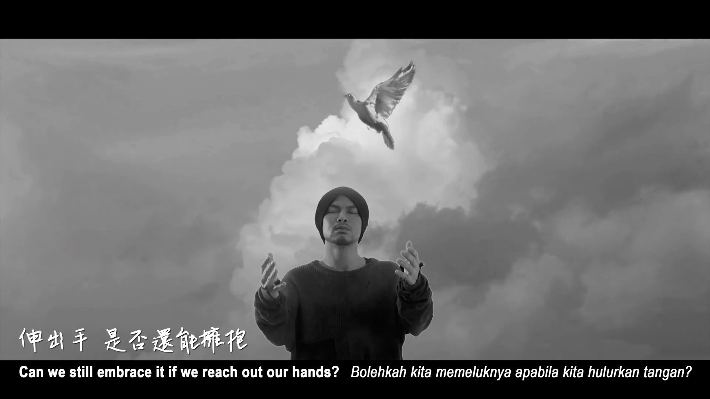
最後畫面出現白鴿，寓意和平。（《我們的海闊天空》MV截圖）

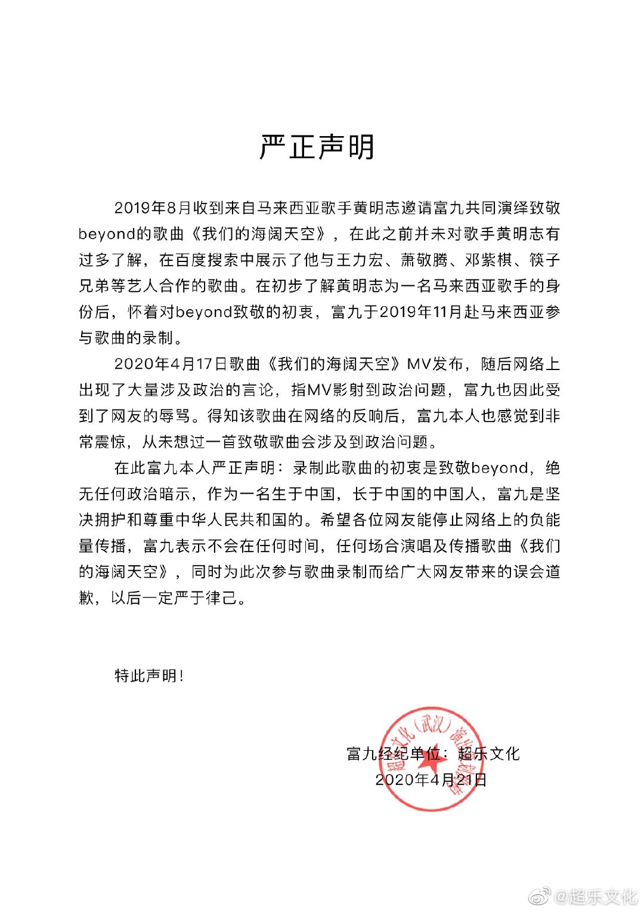
MV在微博上遭禁播後，內地歌手富九透過微博及經理人公司發聲明，向內地網民致歉。 (微博圖片)

黃明志亦有將《我們的海闊天空》MV分享到微博上，不過迅速被禁，而跟他合唱的內地歌手富九在MV推出後，也秒速與黃明志割席，昨日富九在微博上表示：「自我反省，深刻致歉。」而他的經理人公司也發表聲明，表示去年8月收到黃明志的邀請合唱《我們的海闊天空》，富九懷著向Beyond致敬的初衷，才答應參與歌曲錄製，而並非任何政治暗示。聲明中又提到，富九作為生長於中國的中國人，他堅決擁護及尊重中華人民共和國，亦不會在於任何時間、任何場合演唱或傳播《我們的海闊天空》，並向廣大網民道歉。

事件發生後，黃明志再於自己的Facebook上表示：「這首歌已經在微博被禁了。富九的經紀公司也寫了聲明稿。所以不要再說我“不敢”或“不要”分享到中國的網站去了，我經常有作品都會一字不漏地放到微博去。目的就是為了跟更多人分享我的作品，只是某些作品該國無法接受而已。歌曲內容就是在傳達著追求自由和理想的決心和面對問題時候矛盾的心情寫照，觀眾要怎樣去解讀和判斷是作者無法控制的。或許你會說藝人歌手不該牽扯到政治，但問題是政治一直跑來牽扯藝人歌手，這才是事實。音樂是自由的，是不分立場、種族、語言的，但政治永遠做不到。」

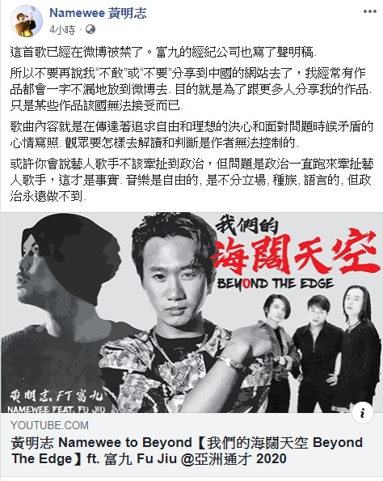
其實黃明志的作品並非首次牽涉到政治風波，多年的作品中亦富有諷刺意味，故此備受爭議。 (網絡擷圖)
