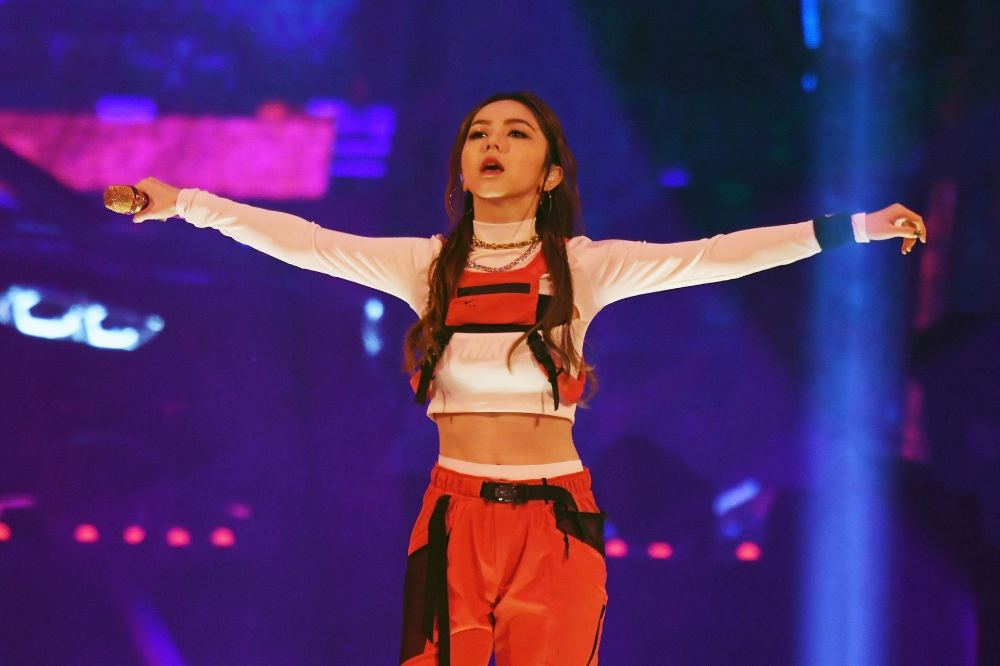
由於歌曲MV《倒數》在6月初突破一億點擊率，阿G.E.M.鄧紫棋擁3首破億點擊的MV，成為華語唯一一個3首破億點擊的女歌手，平周杰倫記錄。（VCG）

她的三首歌曲分別是《光年之外》、《再見》、《倒數》。（VCG）

《光年之外》更加以2.17億點擊次數高據華語榜首。（VCG）

而周杰倫亦有三首破億歌MV，其《告白氣球》有2.1億點擊次數排第二。（資料圖片）

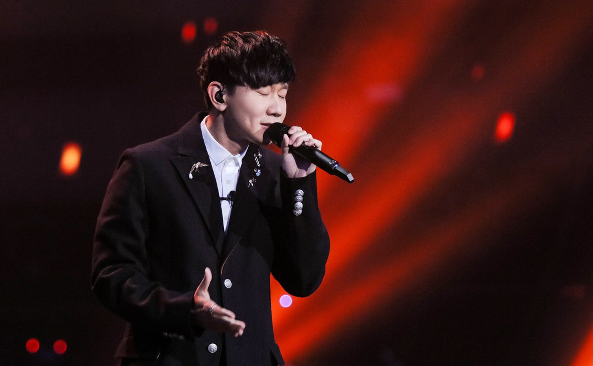
林俊傑亦有兩首破億歌曲。（資料圖片）

2014年才出道的周興哲也有兩首破億作品。（資料圖片）現在就看看正式排行榜。

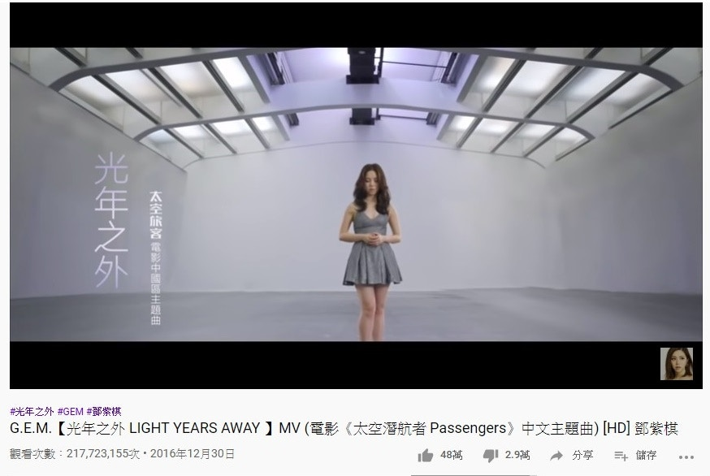
第一位是阿G.E.M.的《光年之外》，2.17億點擊次數。（YouTube截圖）

第一位是周杰倫的《告白氣球》，2.1億點擊次數。（YouTube截圖）

第三位是田馥甄的《小幸運》，1.8億點擊次數。（YouTube截圖）

第四位是阿胡夏的《那些年》，1.68億點擊次數。（YouTube截圖）

第五位是阿薛之謙的《演員》，1.68億點擊次數。（YouTube截圖）

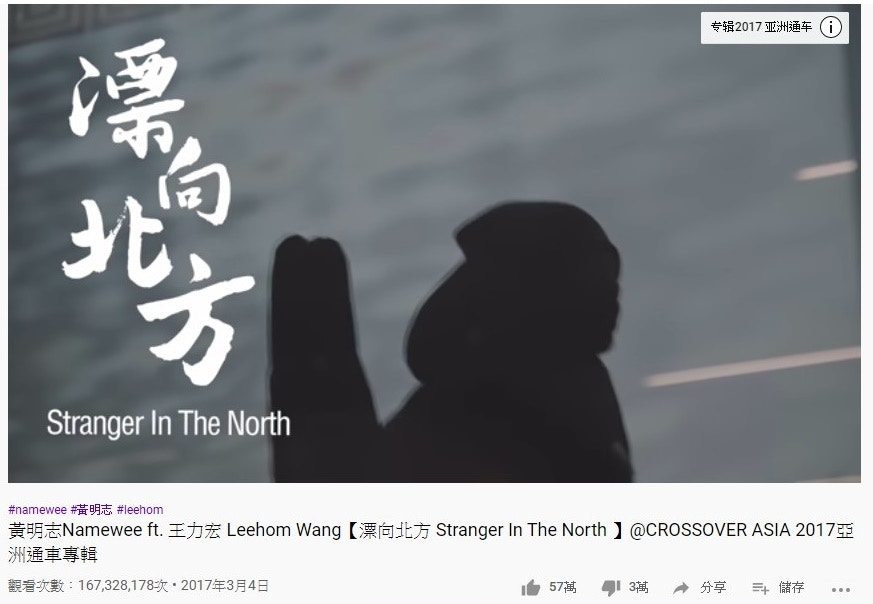
第六位是黃明志和黃力宏的《漂向北方》，1.7億點擊次數。（YouTube截圖）

第七位是Under Lover ft. 玖壹壹.春風的《癡情玫瑰花》，1.65億點擊次數。（YouTube截圖）

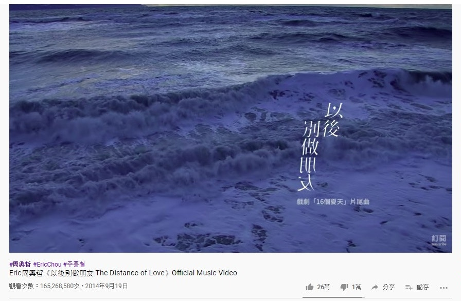
第八位是周興哲的《以後別做朋友》，1.65億點擊次數。（YouTube截圖）

第九位是曲婉婷的《我的歌聲裡》，1.6億點擊次數。（YouTube截圖）

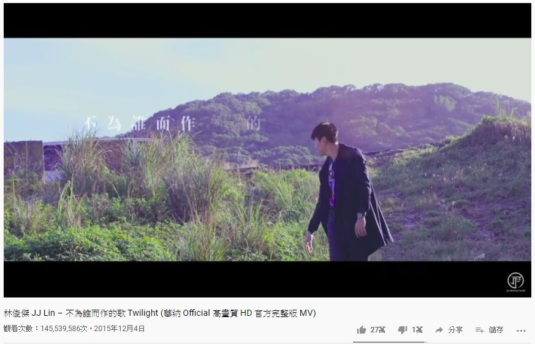
第十位是林俊傑的《不為誰而作的歌》，1.45億點擊次數。（YouTube截圖）

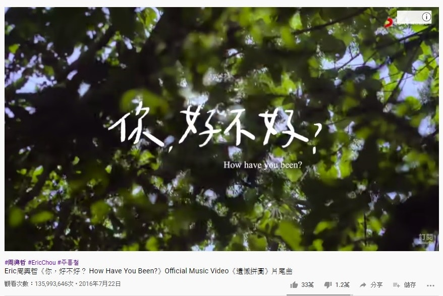
第十一位是周興哲的《你，好不好？》，1.35億點擊次數。（YouTube截圖）

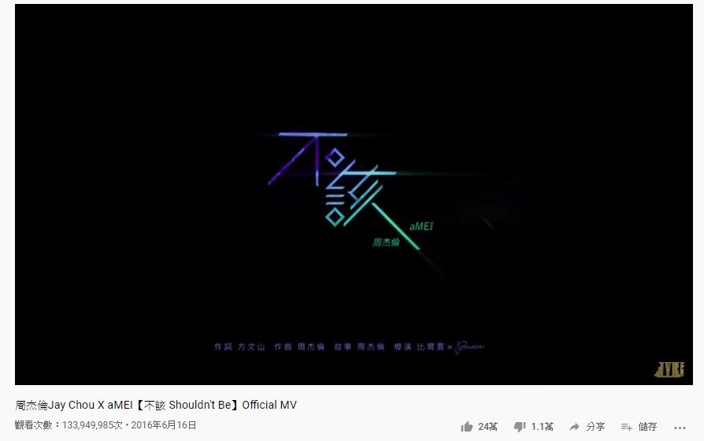
第12位是周杰倫和張惠妹的《不該》，1.33億點擊次數。（YouTube截圖）

第十三位是大壯的《我們不一樣》，1.28億點擊次數，不過原片已被官移除。（YouTube截圖）

第十四位是林俊傑的《修煉愛情》，1.17億點擊次數。（YouTube截圖）

第十五位是汪蘇瀧 ft. By2合唱的《有點甜》，1.16億點擊次數。（YouTube截圖）

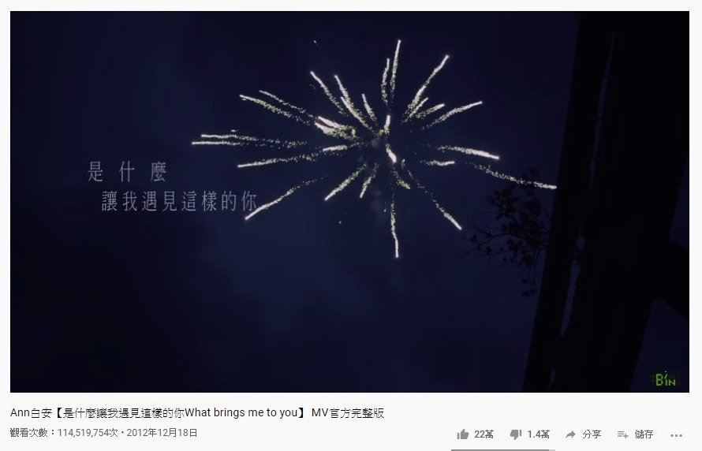
第十六位是白安的《是什麼讓我遇見這樣的你》，1.14億點擊次數。（YouTube截圖）

第十七位是香港歌手陳泳彤的《說散就散》，1.14億點擊次數，不過此歌也是普通話。（YouTube截圖）

第十八位是周杰倫的《等你下課》，1.13億點擊次數。（YouTube截圖）

第十九位是廋澄慶的《缺口》，1.13億點擊次數。（YouTube截圖）

第二十位是丁噹的《手掌心》，1.11億點擊次數。（YouTube截圖）

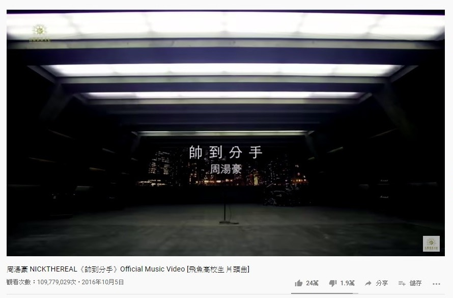
第二十一位是周湯豪的《帥到分手》，1.09億點擊次數。（YouTube截圖）

第二十二位是阿G.E.M.的《再見》，1.08億點擊次數。（YouTube截圖）

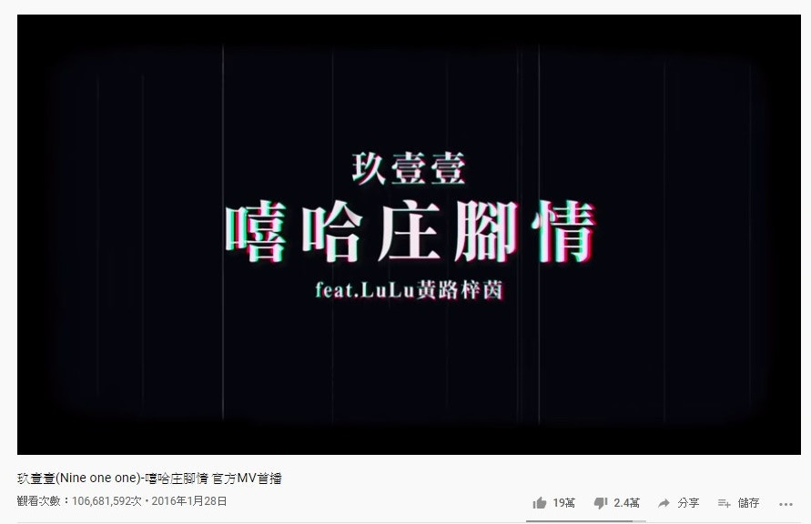
第二十三位是玖壹壹的《嘻哈莊腳情》，1.06億點擊次數。（YouTube截圖）

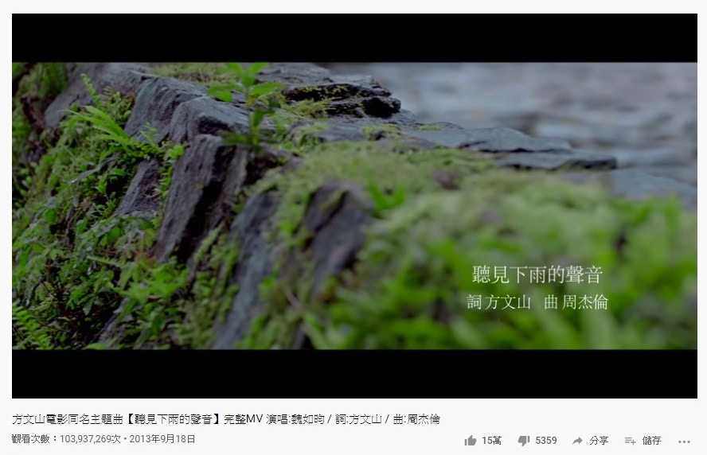
第二十四位是魏如昀的《聽見下雨的聲音》，1.03億點擊次數。（YouTube截圖）

第二十五位是陳芳語的《愛你》，1.02億點擊次數。（YouTube截圖）

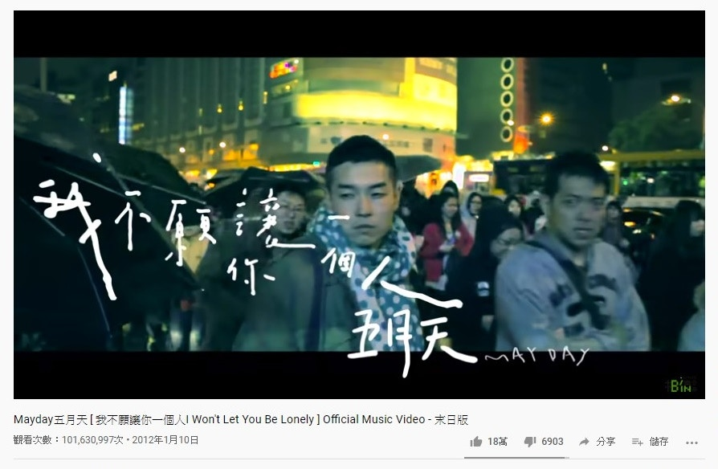
第二十六位是五月天的《我不願讓你一人》，1.01億點擊次數。（YouTube截圖）

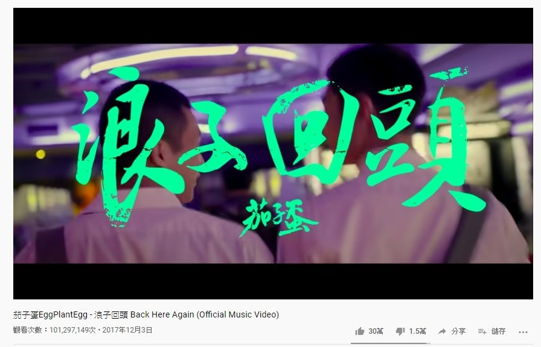
第二十七位是茄子蛋的《浪子回頭》，1億點擊次數。（YouTube截圖）

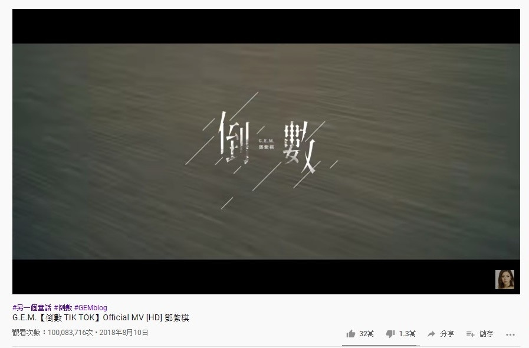
第二十八位是G.E.M的《倒數》，剛剛好突破1億點擊次數。（YouTube截圖）

而廣東歌中，在YouTube中最高點擊次數的是來自Beyond的歌曲。（資料圖片）

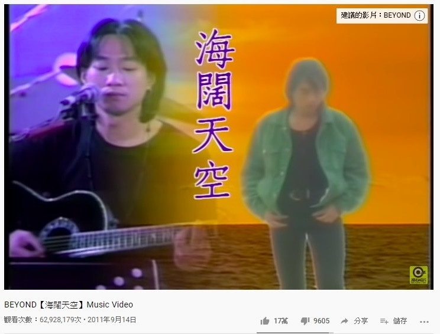
它就是《海闊天空》，點擊次數超過6千萬。（資料圖片）
