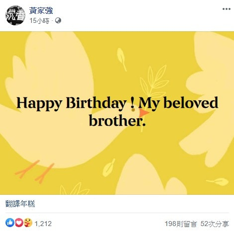

今日（10/6）是香港殿堂級樂隊Beyond主音黃家駒58歲生忌，昔日隊友一如慣例，紛紛在社交網站貼文與家駒「慶生」，表達對這位Beyond靈魂人物的思念。鼓手葉世榮率先於今日0時0分在微博準時貼文，隨後胞弟黃家強更分別在Facebook及微博貼文紀念哥哥，而結他手黃貫中今早亦在微博表達敬意。

今日是家駒58歲生忌。（黃家強Facebook圖片）

葉世榮準時在0時0分與家駒「慶生」。（葉世榮微博截圖）

弟弟家強在Facebook表達對二歌的思念。（黃家強Facebook截圖）

相比Facebook的貼文，家強在微博則以較輕鬆的手法，呼籲樂迷一同表達對二哥的懷念。（黃家強微博截圖）

黃貫中在微博表達思念。（黃貫中微博截圖）

> 點擊大圖重溫當年Beyond台上表演。

Beyond三子每年都會在社交平台紀念家駒生忌。（視覺中國）

家駒離世後，Beyond改以3人樂隊發展。（視覺中國）

家駒離世後，Beyond改以3人樂隊發展。（視覺中國）

家駒離世後，Beyond改以3人樂隊發展。（視覺中國）

家駒離世後，Beyond改以3人樂隊發展。（視覺中國）

過往有支持者在Beyond演唱會現場表達對家駒的思念。（視覺中國）

過往有支持者在Beyond演唱會現場表達對家駒的思念。（視覺中國）

Beyond在「The Story Live 2005」世界告別巡迴演唱會後正式解散。（視覺中國）

Beyond在「The Story Live 2005」世界告別巡迴演唱會後正式解散。（視覺中國）

Beyond在「The Story Live 2005」世界告別巡迴演唱會後正式解散。（視覺中國）

Beyond在「The Story Live 2005」世界告別巡迴演唱會後正式解散。（視覺中國）

Beyond在「The Story Live 2005」世界告別巡迴演唱會後正式解散。（視覺中國）

樂迷希望他日Beyond能夠重組，但家強認為機會微乎其微。（視覺中國）
