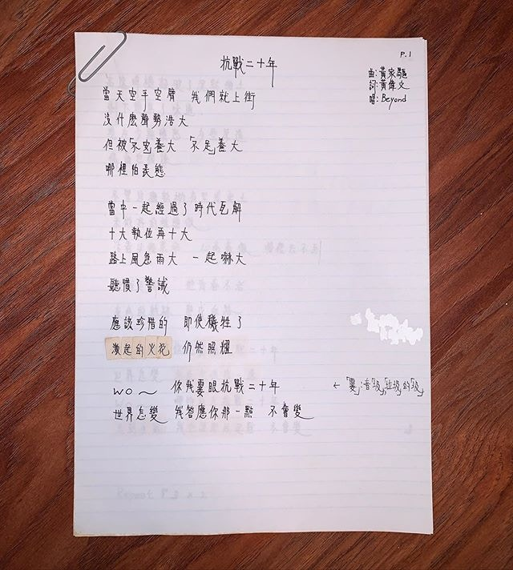
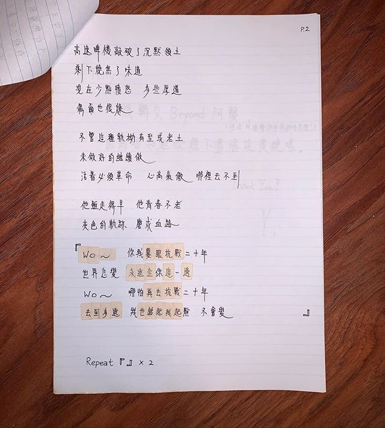

Wyman近日分享《抗戰二十年》手稿。（黃偉文Instagram圖片）

Wyman近日分享《抗戰二十年》手稿。（黃偉文Instagram圖片）

**「高速啤機」80年代活躍地下樂壇　Wyman錯指為Beyond前身**

即使《抗戰二十年》要到Beyond三人時期才有機會灌錄，但Wyman仍對能為前主音黃家駒所作的旋律填詞感到榮幸。他比較初稿與出街版歌詞的不同，其中初稿上「高速啤機敲破了沉默領土」，如今改成「幾響槍火敲破了沉默領土」。當時黃貫中（Paul）剛看到歌詞後不明白「高速啤機」的意思，Wyman卻指：「乜唔係Beyond以前嘅隊名咩？我～我～我好似之前喺唔知《年青人週報》定《音樂一週》有篇稿睇過嘅，乜⋯乜⋯乜唔係咩？仲等特登懶叻咁嵌埋佢入去份詞度𠻹！」

翻查資料，「高速啤機」是80年代中期活躍於香港地下音樂圈的重金屬樂隊，1984年成立，被視為Beyond的分支樂隊，除Paul外，成員包括主音馬永基及另外兩位Beyond創隊成員葉世榮、鄧煒謙。

據指高速啤機的名字源自家駒，因音樂在Band房外像一部運作中的快速啤機而命名。Wyman回想這段經歷後慨歎：「生於這個『一上網就可以做曬所有 research』的年代的填詞人，真的比我這九十年代出道的幸福好多，那時趕交詞寫到半夜先發現有樣嘢唔係好 sure都唔知可以問邊個？」

黃偉文在初稿第二段寫上「高速啤機敲破了沉默領土」，以為「高速啤機」是Beyond前身，及後在黃貫中提醒下改成「幾響槍火」。 (網絡圖片)

**作曲欄寫錯家駒名字沒改正　Wyman：我不是竄改歷史的人**

《抗戰二十年》是2003年Beyond對成軍20年的總結，同時表達對家駒的緬懷。為求Beyond能趕及錄音，以順利配合同年《超越Beyond演唱會》，Wyman決定連續花兩日三夜完成歌詞，但在手抄初稿時卻把作曲欄中「黃家駒」的名字寫錯成「黃家驅」。雖然事後Beyond從未怪責Wyman，但他卻久久不能原諒自己。至於為何至今仍不改回正確寫法，Wyman解釋：「我不是做得出竄改歷史那種人，於是就忠實呈現出來，以後就當罰我，和每個看到這手稿的人都解釋一次道歉一次。」

過往有支持者在Beyond演唱會現場表達對家駒的思念。（視覺中國）

Paul曾經在一個訪問說過，希望將來有人對他說，「我係聽BEYOND嘅歌長大㗎」，所以這句話亦是Fans想和Beyond說的話。（視覺中國）

家駒離世後，Beyond改以3人樂隊發展。（視覺中國）

家駒離世後，Beyond改以3人樂隊發展。（視覺中國）

家駒離世後，Beyond改以3人樂隊發展。（視覺中國）

Beyond三子每年都會在社交平台紀念家駒生忌。（視覺中國）

家駒離世後，Beyond改以3人樂隊發展。（視覺中國）

Beyond在「The Story Live 2005」世界告別巡迴演唱會後正式解散。（視覺中國）

Beyond在「The Story Live 2005」世界告別巡迴演唱會後正式解散。（視覺中國）

Beyond在「The Story Live 2005」世界告別巡迴演唱會後正式解散。（視覺中國）

Beyond在「The Story Live 2005」世界告別巡迴演唱會後正式解散。（視覺中國）

Beyond在「The Story Live 2005」世界告別巡迴演唱會後正式解散。（視覺中國）

樂迷希望他日Beyond能夠重組，但家強認為機會微乎其微。（視覺中國）
