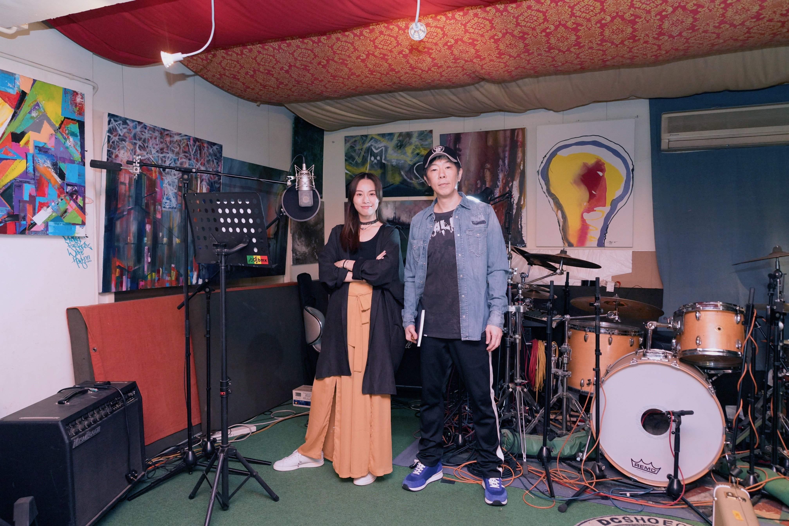
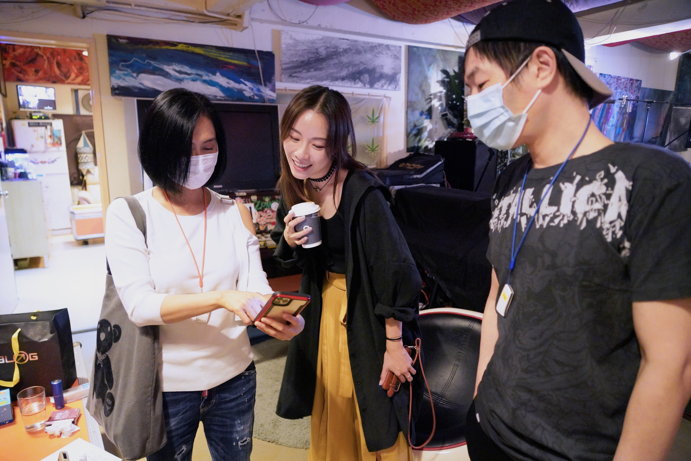
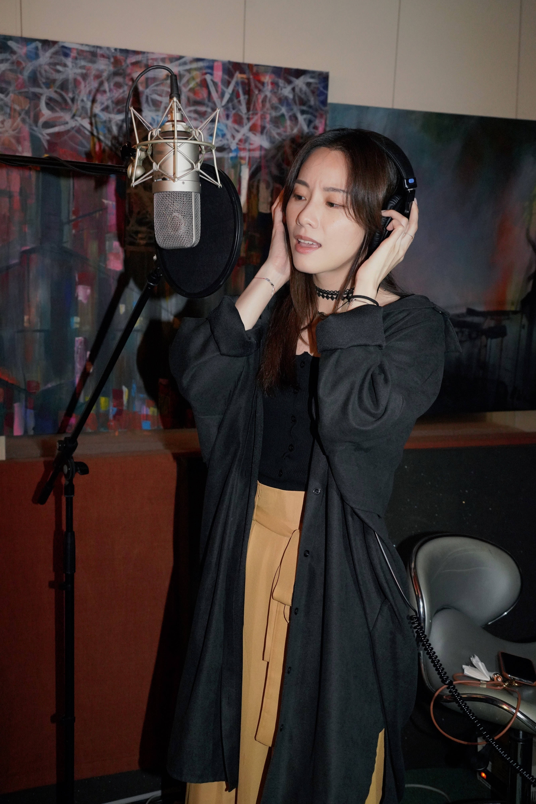
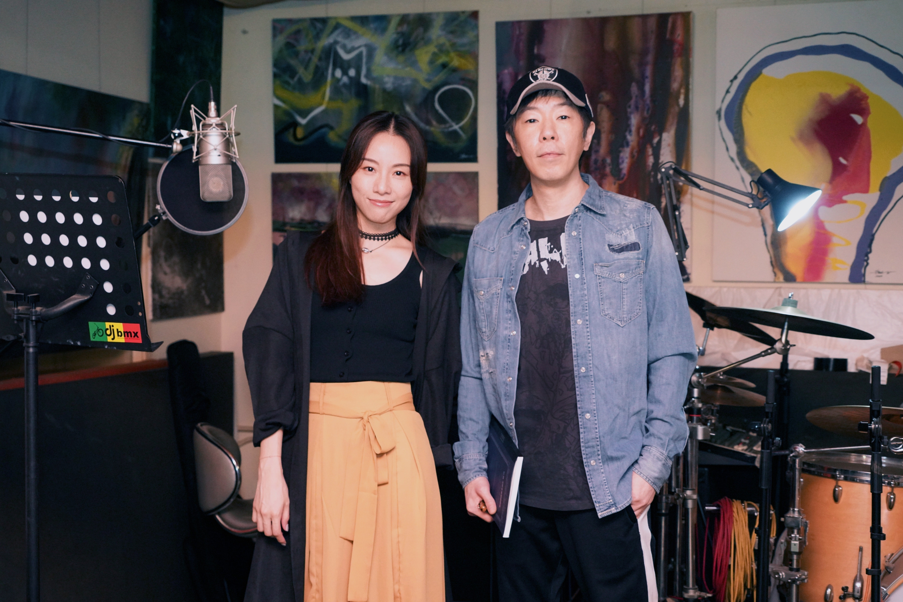

由鄧麗欣（Stephy）主演的電視劇《男排女將》即將在 ViuTV 播映，今次Stephy 親自為劇集主題曲《著地》主唱及填詞，更破天荒邀請到大師級音樂人黃貫中（Paul）作曲及擔任歌曲監製，阿Paul向來甚少為港劇創作主題曲，當中較多人認識的，已是2011年的《天與地》。Stephy 表示《著地》是一首很陽光的勵志歌：「劇集主題係講排球，排球成日有一句說話係『球不著地，永不放棄』，所以副歌都有講到千祈唔好畀個波跌落地，就算跌咗都唔緊要，喺邊到跌低就喺邊個企返起身。」

Stephy早前到Paul的錄音室為歌曲進行錄音。

對於今次首次合作，Stephy 坦言事前十分緊張：「第一日知道要同Paul合作已經好緊張，仲要我自己寫詞，好驚畀佢Ban我啲詞。中間我哋都有溝通過首歌要點唱，過程中我都好驚自己用詞不當，唔識用音樂語言同佢溝通。」怎料Paul大唱反調笑言：「唔好講到我好惡咁喎，哈哈。我記得我有問過Stephy『呢兩個字係咪差少少音？』，點知佢話『冇呀，我唔覺喎』。佢一啲都唔驚我，有時會同我爭論吓，有交流先好呀，唔係我話乜就乜。」

Paul 亦不忘大讚 Stephy 專業。

Paul亦不忘大讚Stephy專業，錄音進度比原定預計時間更快完成：「證明掂先會早收工，Stephy比我想像中好好多，我冇必要擦鞋，真說話嚟，佢好舒服地錄晒成首歌，冇需要逐句逐句錄。」已有7年未有填詞的Stephy，今次為新歌《著地》再度「出山」，她說：「其實都有考慮過好唔好自己寫詞，最後因為自己係套電視劇嘅主角，冇人比我更了解個角色，尤其係排球題材，我覺得自己寫返份詞最合適。同埋主要係因為冇錢搵填詞人，幫公司慳返筆錢，哈哈。」

提到受疫情影響，Stephy經常「Work from Home」在家中有更多時間創作音樂。

提到受疫情影響，Stephy經常「Work from Home」在家中有更多時間創作音樂。

提到受疫情影響，Stephy經常「Work from Home」在家中有更多時間創作音樂。

提到受疫情影響，Stephy經常「Work from Home」在家中有更多時間創作音樂，她說：「因為疫情多咗時間喺屋企，睇多咗書，靈感都會多啲，好似呢首歌詞只係用咗一晚時間就寫到。另外自己都開始練返好耐冇彈嘅鋼琴，都試緊作曲，但只係有節奏喺個心到，未將佢哋拼接埋一齊。」在錄音工作接近尾聲時，Paul的愛妻朱茵親臨現場探班，大讚Stephy唱功了得，在旁的Paul霸氣撒嬌笑說：「我呢？讚埋我啦！」

Stephy 親自為劇集主題曲《著地》主唱及填詞，更破天荒邀請到大師級音樂人黃貫中（Paul）作曲及擔任歌曲監製。
