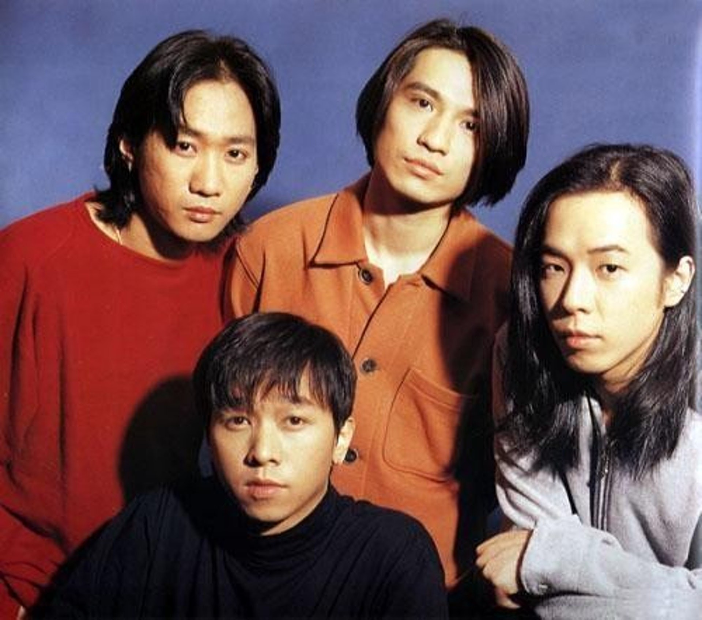
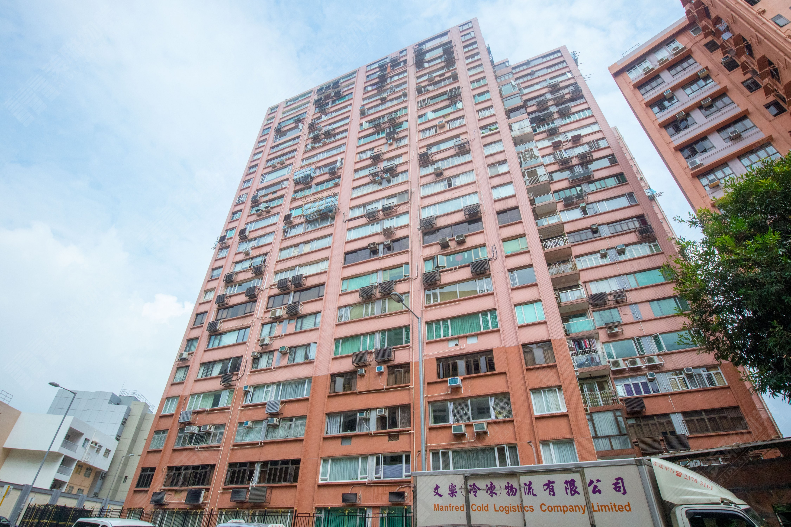
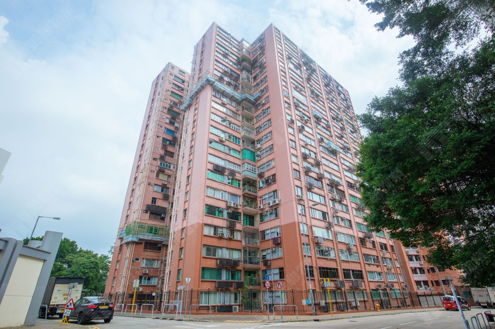

著名本地樂隊Beyond成員之一黃家強持有的何文田常康園一伙逾千呎單位，據知新近以2,720萬元沽出。

市場消息透露，上述單位為常康園中層D室，實用面積1,615平方呎，四房間隔，新近連同一個車位易手，成交價約2,720萬元，成交呎價約16,842元。

黃家強為本地樂隊Beyond成員之一。 (網絡圖片)

黃家強與兄長黃家駒及黃貫中等人組成Beyond，於九十年代風靡一時。(資料圖片)

黃家強（下排、左一）新近沽出何文田單位。(資料圖片)

Beyond是香港的傳奇樂隊。(資料圖片)

據了解，黃家強等人於2006年透過公司名義以1,165萬元購入上述單位，是次易手帳面獲利1,555萬元，單位升值約1.3倍。黃家強為本地樂隊Beyond成員之一，亦是Beyond已故主音歌手及結他手黃家駒的胞弟。

**2006年斥1165萬購入**

翻查資料，常康園位於何文田常康街1號，於1972年入伙，只有一座，合共提供161伙，以大單位為主，實用面積介乎1,371至3,154平方呎，過往二手交投不多。

何文田常康園。（代理提供相片）

何文田常康園。（代理提供相片）
