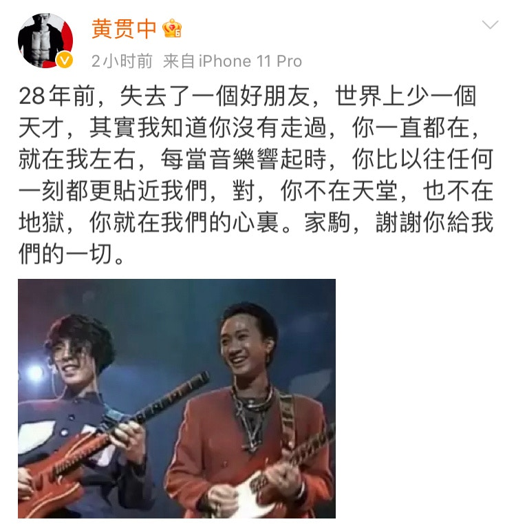
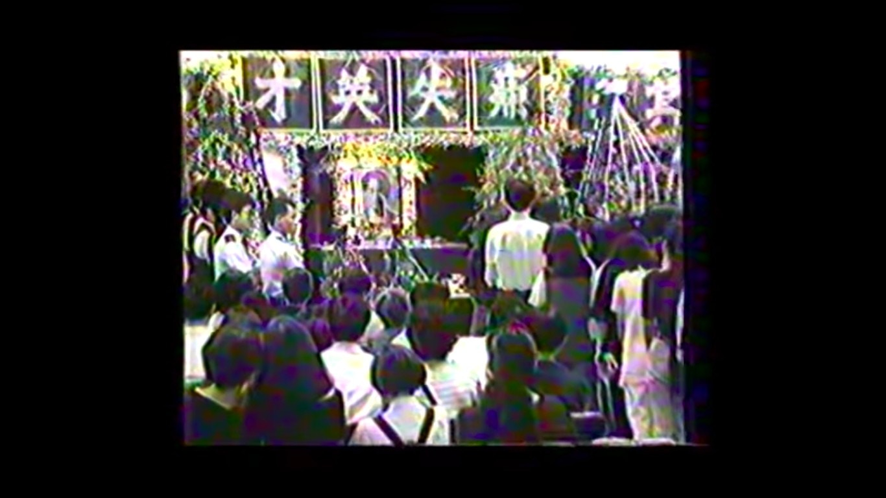
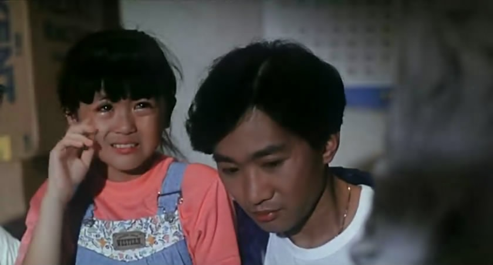
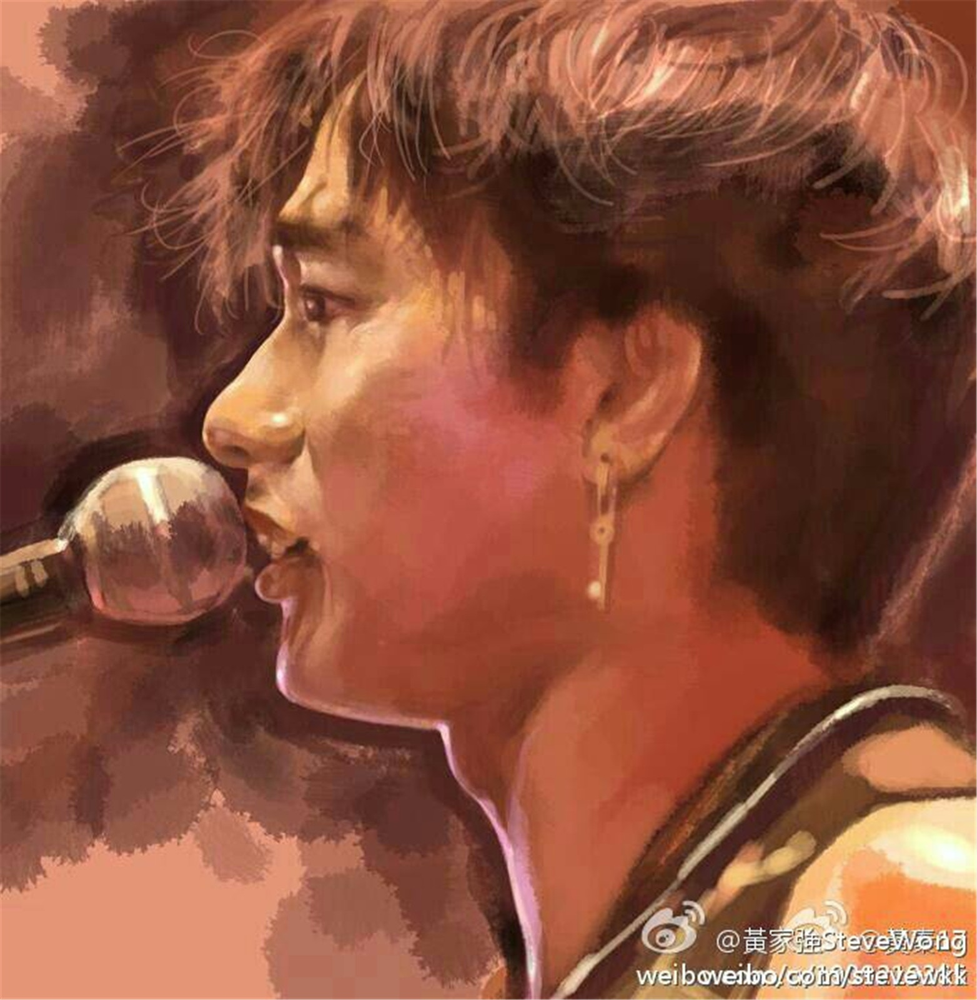
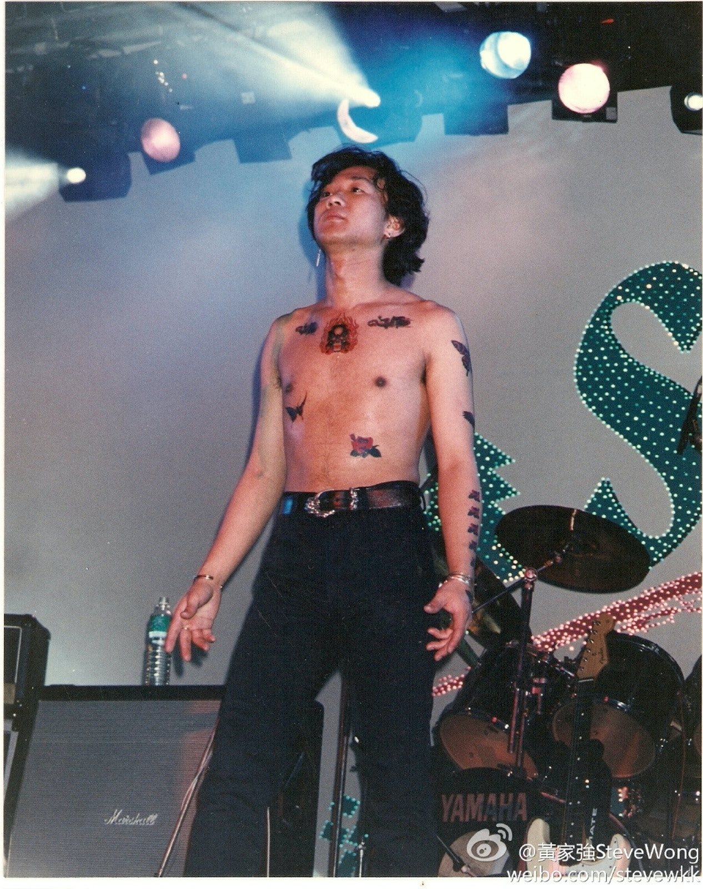
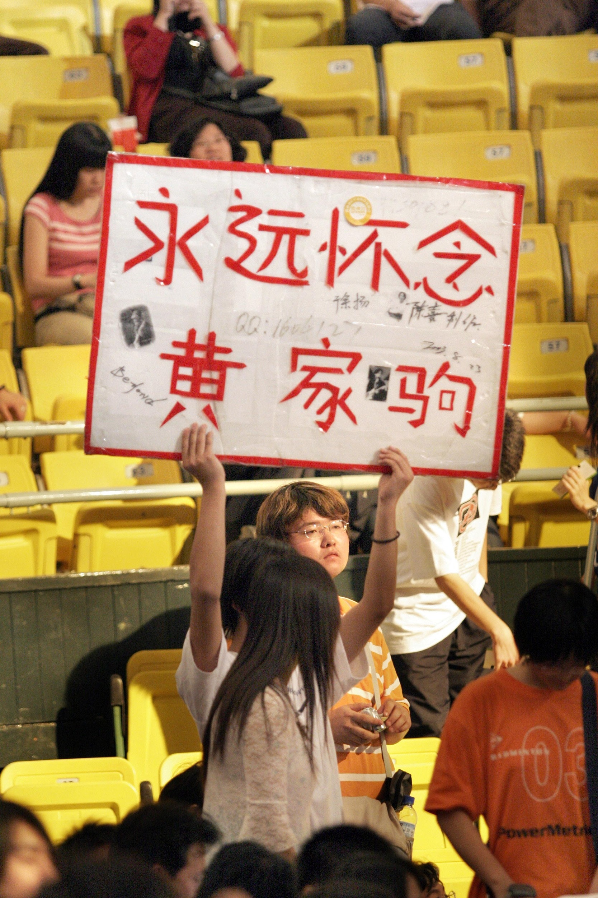
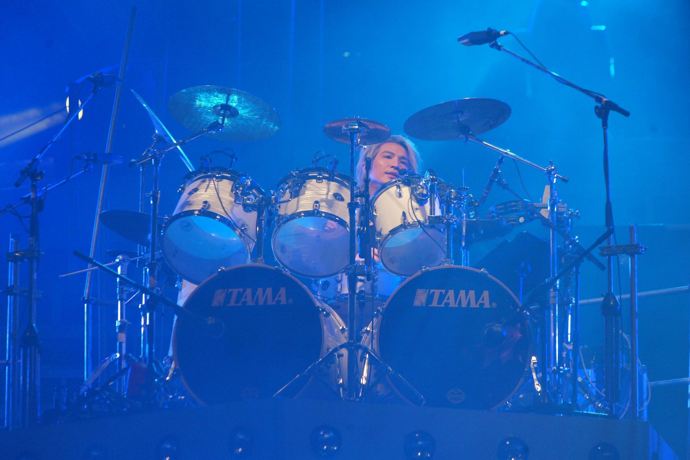
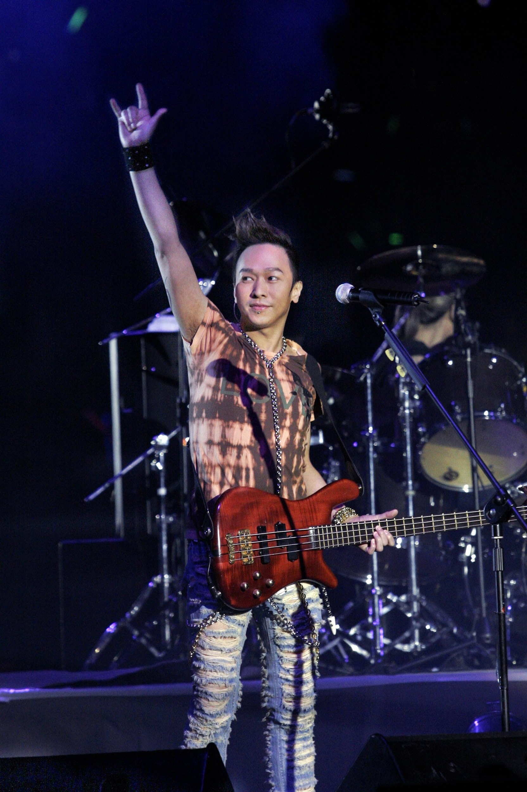
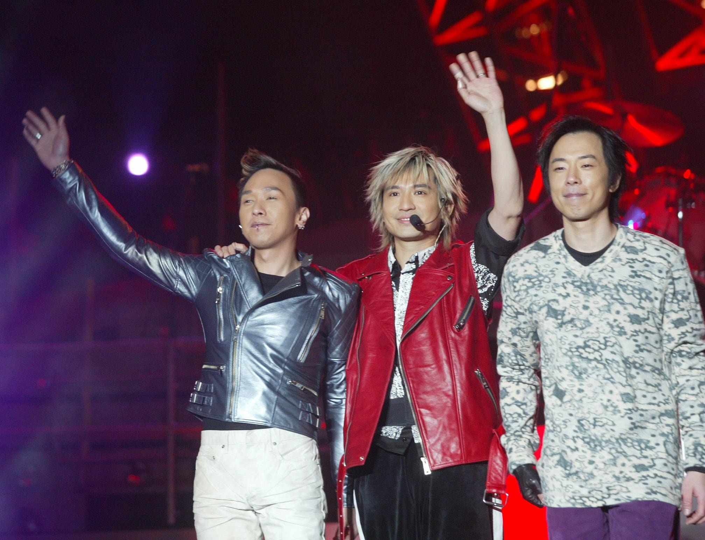

今日是黃家駒逝世28周年。（黃家強Facebook圖片）

6月30日是Beyond主唱黃家駒逝世28周年，當年他在東京富士電視台錄製節目時不慎從舞臺跌落，重傷昏迷不醒，至6月30於日本東京去世，終年31歲。雖然離開大家多年，但仍長留在大家心中。與早前紀念家駒生忌一樣，隊友葉世榮準時在今日0時0分於微博發文：「懷念你家駒」而黃貫中亦發微博表示：「28年前，失去了一個好朋友，世界上少一個天才，其實我知道你沒有走過，你一直都在，就在我左右，每當音樂響起時，你比以往任何一刻都更貼近我們，對，你不在天堂，也不在地獄，你就在我們的心裡。家駒，謝謝你給我們的一切。」

黃家駒至今逝世二十八週年，其作品依然被人翻唱無數次。(黃國立攝)

已故Beyond樂隊主音歌手黃家駒及其弟黃家強也曾在蘇屋邨長大的知名兄弟班樂隊。(kwkpbeyond@IG)

唐寧1991年參演電影《Beyond日記之莫欺少年窮》，與黃家駒飾演兄妹。（電影劇照）

黃貫中指黃家駒一直在大家心中。（黃貫中微博）

葉世榮零時零分發微博悼念黃家駒。（葉世榮微博）

Beyond主音黃家駒在日本拍攝節目時因意外離世，享年31歲。遺體運回香港後，於北角香港殯儀館設靈。同日晚上香港商業電台舉行「永遠懷念家駒」悼念音樂會，全場坐滿2600人外，大部分參與者情緒激動。翌日，靈車駛出殯儀館時，行人路上數千名樂迷衝出馬路圍着靈車，情況一度混亂。（影片截圖）

唐寧上載合照悼念黃家駒。（IG：leilakong1205）

唐寧1991年參演電影《Beyond日記之莫欺少年窮》，與黃家駒飾演兄妹。（電影劇照）

唐寧說合作過的巨星中跟黃家駒最親近。（電影截圖）

黃家駒（網上圖片）

2013年6月30日，黄家强上傳微博懷念黃家駒。（黃家強微博）

黃家駒永遠留在大家心中。（黃家強微博）

過往有支持者在Beyond演唱會現場表達對家駒的思念。（視覺中國）

過往有支持者在Beyond演唱會現場表達對家駒的思念。（視覺中國）

家駒離世後，Beyond改以3人樂隊發展。（視覺中國）

家駒離世後，Beyond改以3人樂隊發展。（視覺中國）

家駒離世後，Beyond改以3人樂隊發展。（視覺中國）

Beyond三子每年都會在社交平台紀念家駒生忌。（視覺中國）

家駒離世後，Beyond改以3人樂隊發展。（視覺中國）

Beyond在「The Story Live 2005」世界告別巡迴演唱會後正式解散。（視覺中國）

Beyond在「The Story Live 2005」世界告別巡迴演唱會後正式解散。（視覺中國）

Beyond在「The Story Live 2005」世界告別巡迴演唱會後正式解散。（視覺中國）

Beyond在「The Story Live 2005」世界告別巡迴演唱會後正式解散。（視覺中國）

Beyond在「The Story Live 2005」世界告別巡迴演唱會後正式解散。（視覺中國）

樂迷希望他日Beyond能夠重組，但家強認為機會微乎其微。（視覺中國）
