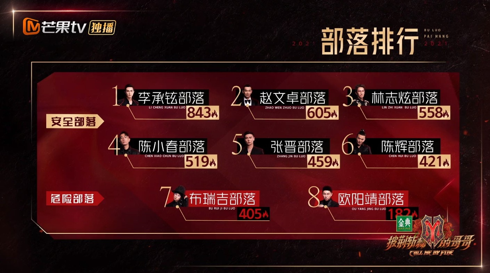
首次公演排名。（視頻截圖）

今次要進行的是「二十五小時演唱會」，旨讓大家發揮想象力，如果一日多處1小時，要做些什麼。比賽採用同盟協作的方式，即部落之間兩兩合作。

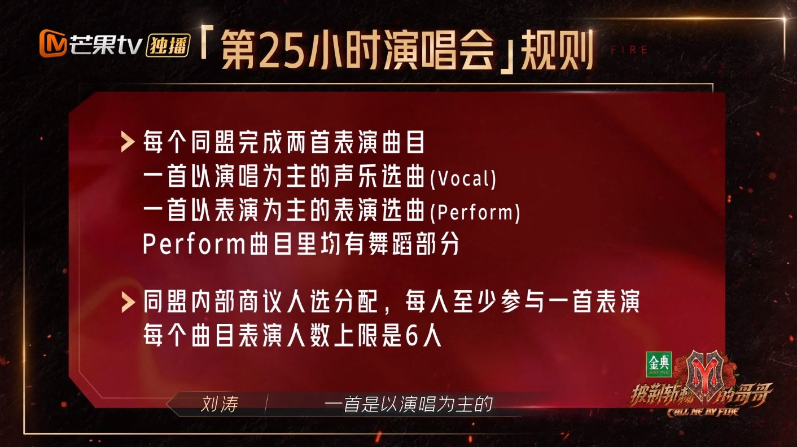
「二十五小時演唱會」規則明細。（視頻截圖）

在選擇部落聯盟期間，「大灣區五人組」再次大放笑彈。原本陳小春同Chilam友誼選擇黃貫中（Paul）所在的陳輝部落聯盟，奈何兩隊加上共11人，太過龐大，陳小春忍不住笑言：「我們十一個走在一起太沒規矩，就會變成欺負人家了。」於是Edmond提議找Rapper GAI同Bridge，但陳小春又有些猶豫，因為早在第一集他就透露想同Paul合作，玩一些搖滾音樂，陷入兩難困境，且Paul坐在離GAI不遠的地方，想不到陳小春竟然害羞，假裝經過，但很快便折返，更用雙手掩面說：「呢啲嘢冇玩。」還同隊友講「冇望冇望，阿Paul睇緊」，似乎覺得有點不尊重，又有點尷尬。幾經波折後，最終陳小春、Edmond、林曉峰將Bridge和GAI帶到外面，還打趣道：「仲唔係收𡃁！」

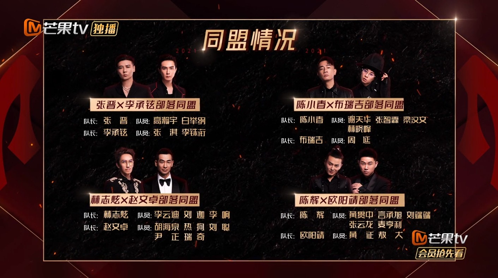
部落靚靚同盟情況。（視頻截圖）

陳小春非常糾結選GAI還是Paul。（視頻截圖）

非常相同Paul合作。（視頻截圖）

曾同Paul表示之後一起重組。（視頻截圖）

陳小春去找GAI必經阿Paul面前。（視頻截圖）

假裝走來走去，不好意思去找GAI。（視頻截圖）

陳小春突然害羞。（視頻截圖）

阿Paul似乎見到陳小春走來走去。（視頻截圖）

陳小春還同隊友講阿Paul在看著他們。（視頻截圖）

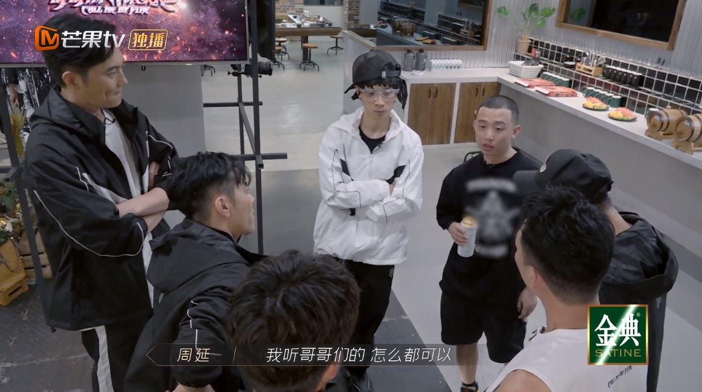
最終陳小春電話找來GAI。（視頻截圖）

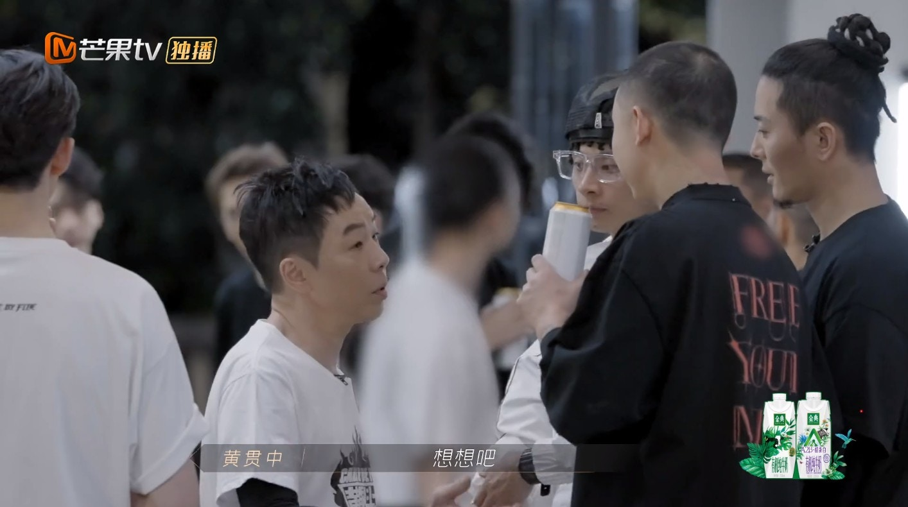
碰巧Paul也有意找GAI聯盟。（視頻截圖）

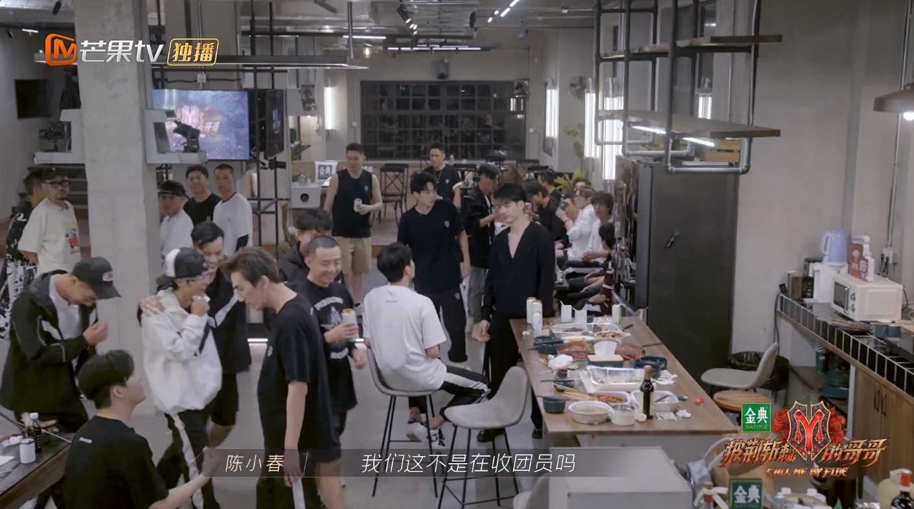
陳小春又忍不住說自己收𡃁。（視頻截圖）

「二十五小時演唱會」每個部落共表演兩首歌，一首以演唱為主，一首以表演為主，後者曲目均有舞蹈部分，同樣以火力值盲選與競拍的方式選擇歌曲。陳小春x Bridge部落選擇了《往事只能回味》以及《你要如何，我們就如何》。經過商議，他們決定兩首歌都由六人表演，Bridge與GAI只用了四十分鐘便完成Rap詞創作，包含粵語、重慶話、普通話，獲得一致讚好，Chilam更感歎：「大中國的感覺」，大家都歡呼聲一片。

各部落聯盟選歌情況。（視頻截圖）

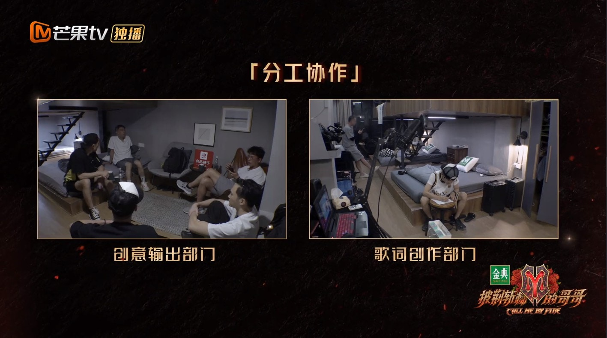
兩部落分工協作。（視頻截圖）

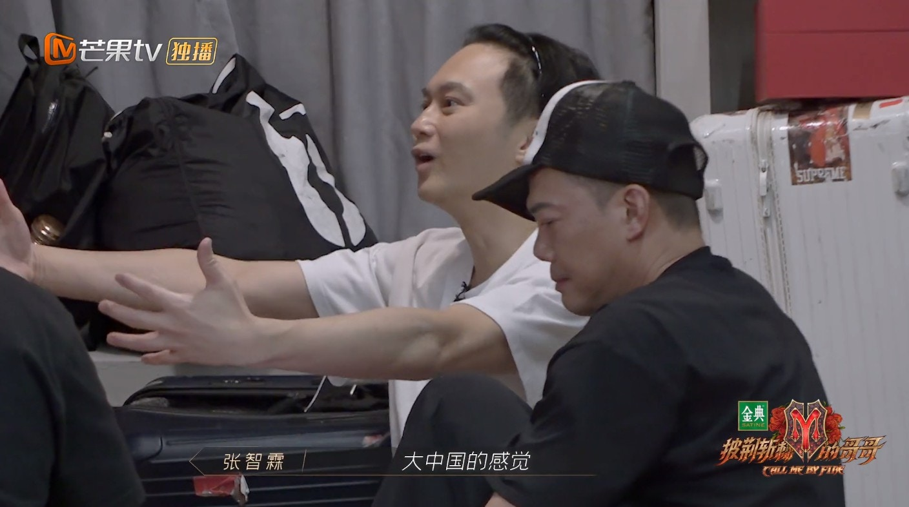
方言大融合。（視頻截圖）

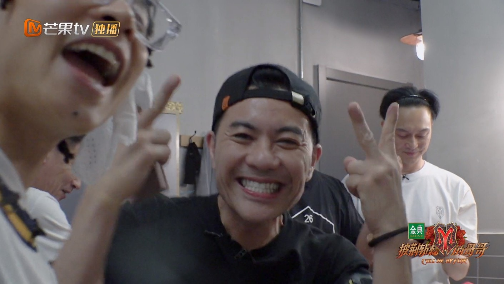
大家都好開心。（視頻截圖）

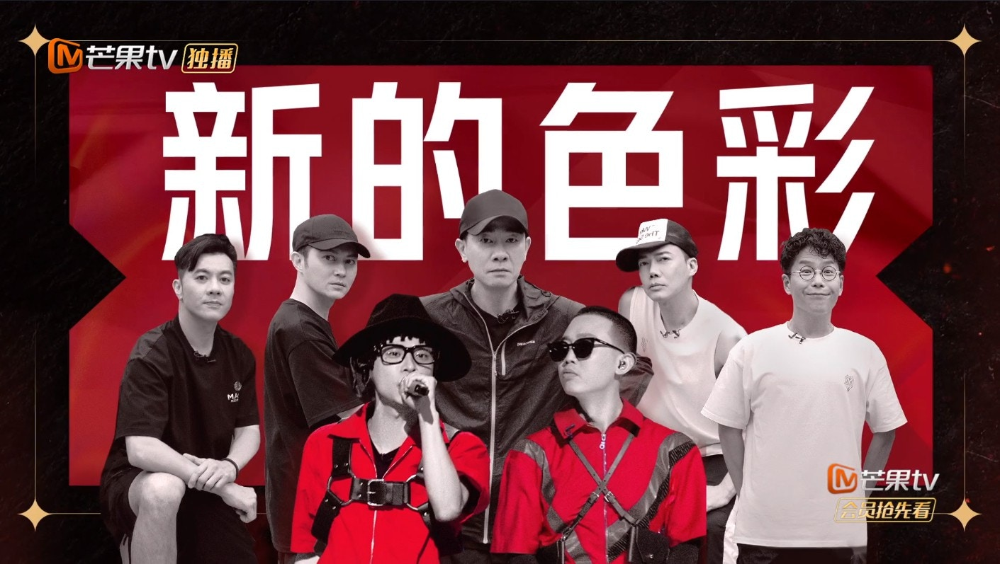
與Bridge部落聯盟大灣區五人組非常安心。（視頻截圖）

在排練過程中，七人也一拍即合，信心滿滿，很快便開始休息，非常放鬆。但在音樂總監陳偉倫聽了他們合作的《往事只能回味》之後，陳小春x Bridge部落慘被派發「加油小紅牌」，即代表他們的表現相對落後，陳偉倫解釋道：「《往事只能回味》這個秀，它的設計感和舞台的包裝是很高級的，也是很複雜的，從某種意義上來講，其實對大家的vocal是很有壓力的一點，他們上來就是三個人的rap，但是這個rap對於他們來說可能是第一次，也是一個難點，所以說他們三個人接下來可能要更多去把他們的節奏，把他們的編排，以及用說唱的方式，把他們的vocal展現出來。」不知道正式演出會否有逆轉。

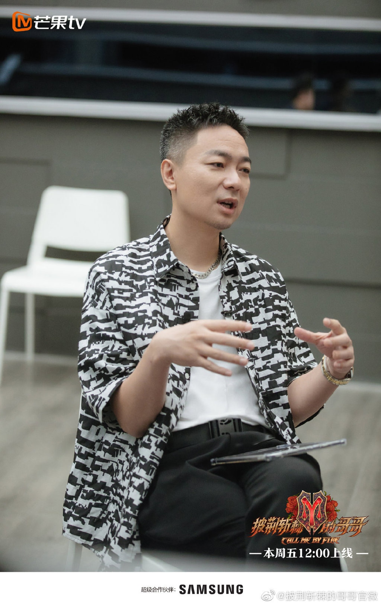
音樂總監陳偉倫。（微博@披荊斬棘的哥哥）

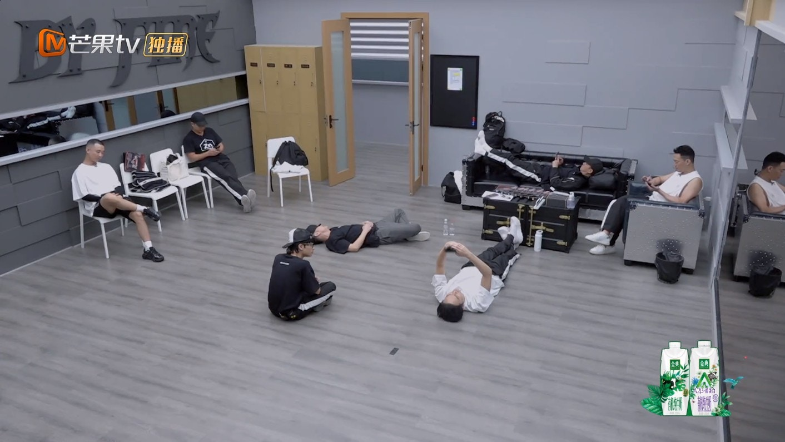
幾人早早練完便開始休息。（視頻截圖）

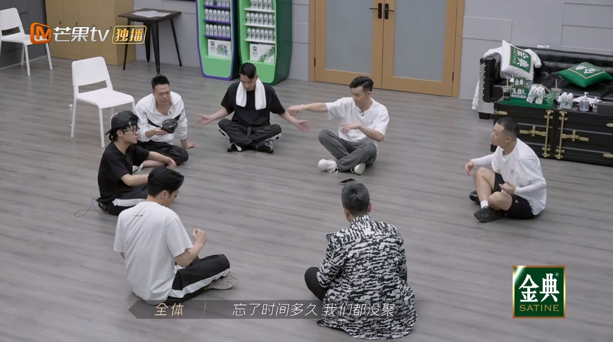
在音樂總監面前表演。（視頻截圖）

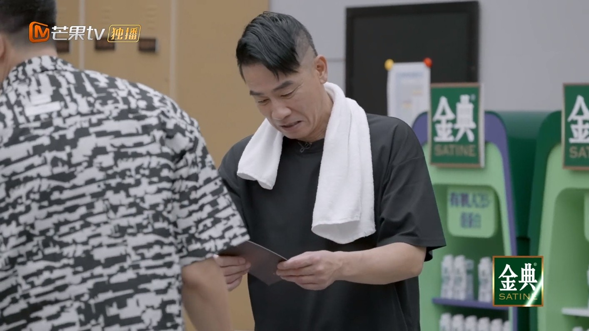
慘被派紅牌。（視頻截圖）
