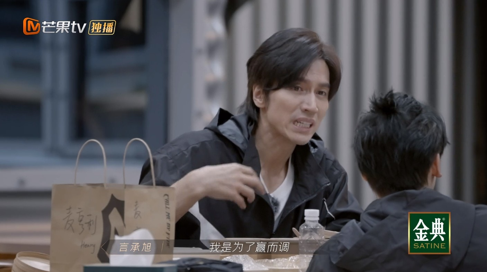
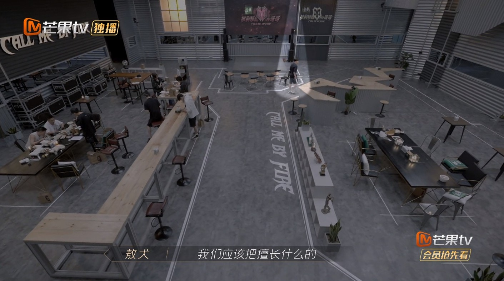
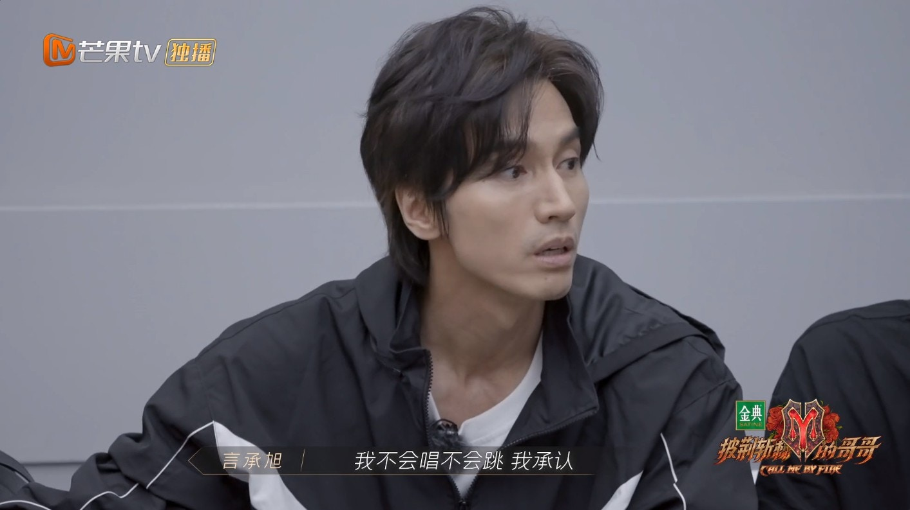
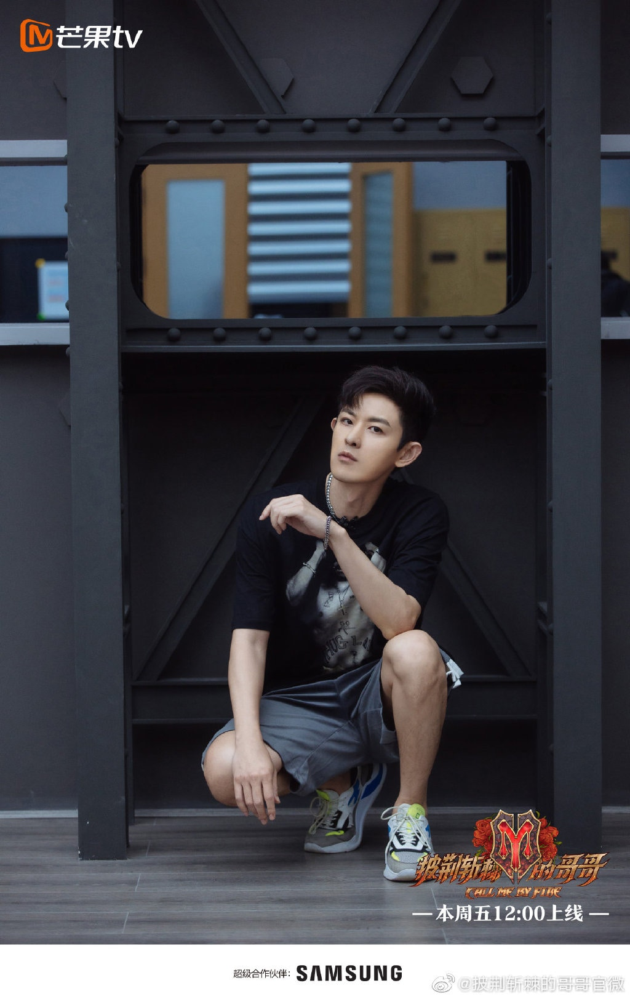
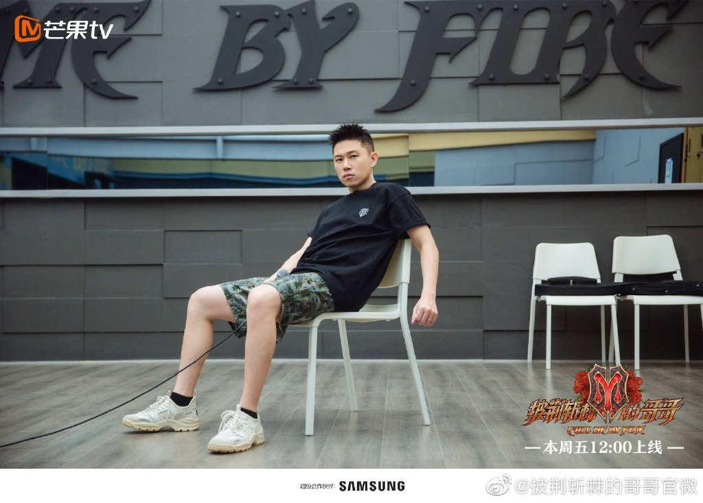

各部落同盟選歌情況。（視頻截圖）

獒犬所在的歐陽靖部落與言承旭所在的陳輝部落聯盟，唱歌更為突出的黃貫中（Paul）、陳輝、歐陽靖（MC Jin）以及黃征負責vocal曲目，獒犬、言承旭、麥亨利等則負責表演曲目《被馴服的象》，結果首先在分詞上就消耗了大部分時間。於是言承旭主動向聲樂老師詢問分詞意見，提議以個人能力分part，發揮優勢。

言承旭主動向聲樂老師詢問歌詞事宜。（視頻截圖）

然而，聲樂老師根據個人情況分詞後，獒犬對自己的段落沒有太大把握，於是想同張雲龍互調，卻遭到一旁的言承旭反對：「發音老師畢竟她有她豐富的經驗，畢竟我們沒有那麼有經驗。」獒犬繼續問劉端端唱的部分，這時言承旭繼續講道：「我還是要提醒你們，先想一下我們最終目標是什麼，因為我覺得你們現在是不是為了調而調，可是對我來講是，我是為了贏而調。」這番說話令獒犬難以讚同，他反駁說：「如果為了贏而調的話，幾乎都是他們唱了，那我可以這樣說嗎，就是最會唱的兩個人，把這首歌全部唱掉，太好聽了。」氣氛一度尷尬，獒犬隨即更獨自離開。

言承旭不讚同獒犬調換歌詞part。（視頻截圖）

獒犬心急講氣話。（視頻截圖）

之後獨自離開。（視頻截圖）

其後兩隊隊長陳輝和MC Jin發現了大家出現分歧，於是召齊大家大吐心中不快。言承旭情緒有些激動地說：「如果不是跟大家真的一起在做一件我們想要贏的事情，我在這邊到底在幹嘛？我覺得我們來參加這節目，我們就是想要贏。不管我們程度在哪裡，我不會唱不會跳，我承認，但我也沒有覺得我有把這件事真做到我覺得我努力了。我希望我第二次公演下來，我就算不是最高分的，但我覺得如果我們有很努力，那我走下來我沒有遺憾，我會覺得我有對我自己負責。」他續指道：「我寧願我輸，但是我們很熱血，那我輸了我都覺得我會好開心，我覺得這件事對我們現在，至少這九個人，我們每一個人就是很重要。」

言承旭講的過程情緒激動。（視頻截圖）

事後，獒犬獨自找到言承旭，坦承之前自己的態度不是太好，因為唱不好的段落，自己也害怕拖大家後腿，影響成績，所以有些心急，而對方也表示理解，大家都直話直說，沒有什麼隱藏，反而是好事。

獒犬主動找言承旭把話說開。（視頻截圖）

**點擊下圖睇陳輝x歐陽靖部落所有成員：**

Paul。（微博@披荊斬棘的哥哥官微）

獒犬。（微博@披荊斬棘的哥哥官微）

MC Jin。（微博@披荊斬棘的哥哥官微）

陳輝。（微博@披荊斬棘的哥哥官微）

言承旭。（微博@披荊斬棘的哥哥官微）

劉端端。（微博@披荊斬棘的哥哥官微）

張雲龍。（微博@披荊斬棘的哥哥官微）

麥亨利。（微博@披荊斬棘的哥哥官微）

黃征。（微博@披荊斬棘的哥哥官微）
