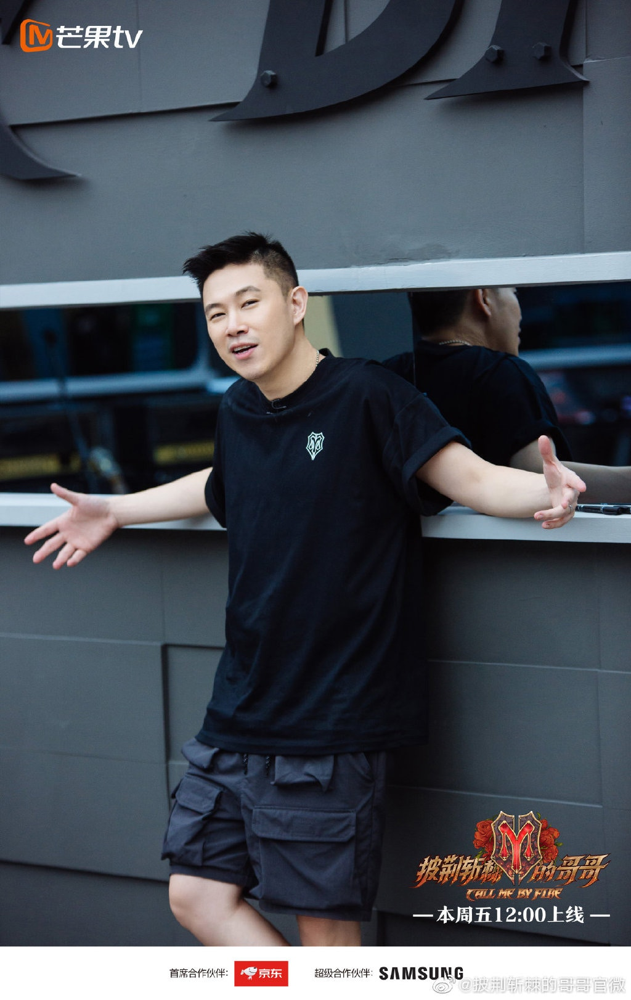
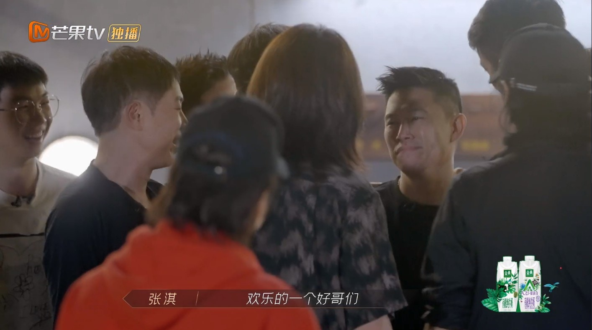
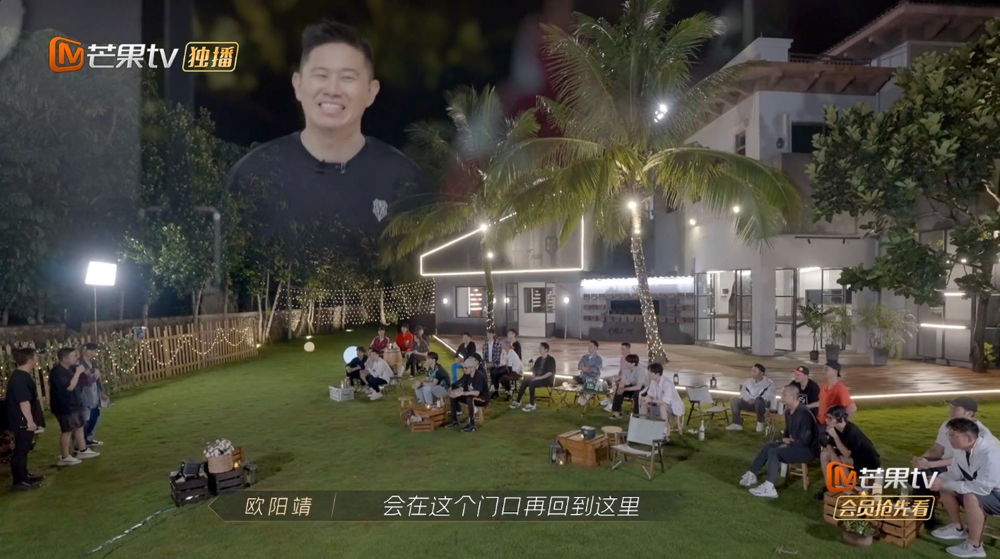
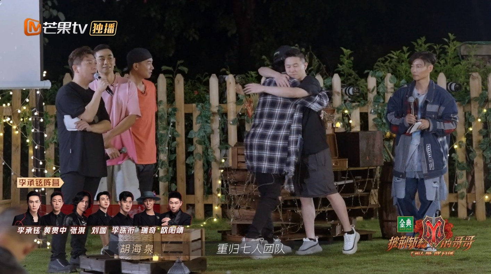

MC JIN以補位身份回歸節目。（微博@披荊斬棘的哥哥官微）

其實MC JIN不止大受網友歡迎，在哥哥中的人緣與口碑也非常好，見到他回來，哥哥們都立即上前迎接，MC JIN本人也非常激動，忍不住眼紅紅，同哥哥們相擁。

MC JIN人緣超好。（視頻截圖）

同一班哥哥寒暄一陣後，MC JIN感性地講道：「不是很久以前，可能有沒有兩個星期前，我記得我進去這個房裡，我真的沒有想到，就是會離開的那個，真的沒有。到現在這個晚上，我也沒有想到，沒有預計到，會在這個門口在回到這裡，所以我真的相信，如果你樂觀、堅持，真的老天會有安排，也是最好的。所以到這一刻我真的無限感謝你們，有大量其實都是我們在這裡剛認識，時間也不是特別長，但是我總覺得，真的，時間長短不時重點，重點是當時發生什麼，那個友情，那個鼓勵，所以非常非常感謝你們，所以一起披荊斬棘。」

MC JIN講道眼濕濕。（視頻截圖）

由於霍尊是李承鉉團隊，因此他擁有優先選擇權，即使其他三位隊長都想邀他加入隊伍，不過MC JIN最終還是加入了李承鉉部落。

四位隊長都想邀請MC JIN加入。（視頻截圖）
