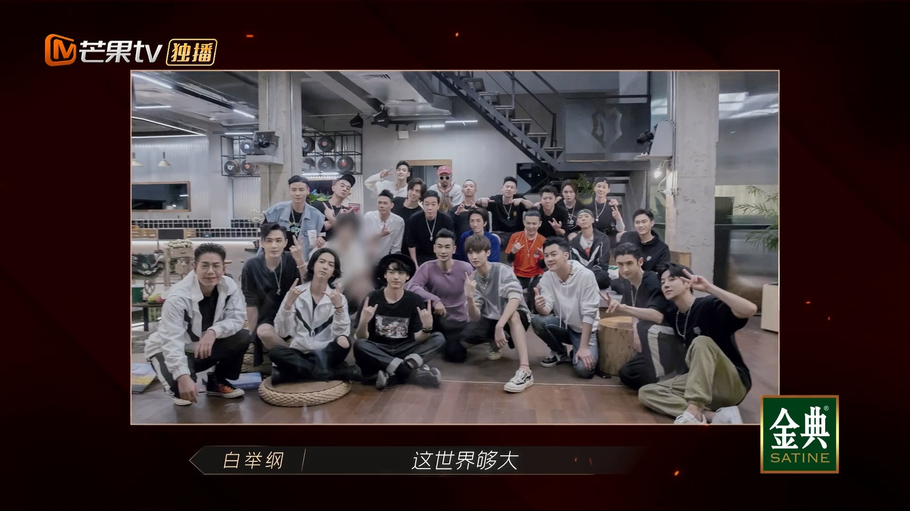
哥哥們在別墅中的最後一晚。（視頻截圖）

早在節目一開始，陳小春就表示想同黃貫中（Paul）合作，奈何到五次公演完結都未有機會，他直言這是最大的遺憾。Paul聽到之後，馬上邀對方合唱，想不到平時大搖大擺的陳小春，這時竟也變得有些羞澀，一句「今天我，寒夜裡看雪飄過」即刻帶動氣氛，所有哥哥都跟著一起合唱《海闊天空》，大家的眼中都泛著淚光與不捨，場面溫馨感人。

陳小春直言未能與Paul合作是節目中最大的遺憾。（視頻截圖）

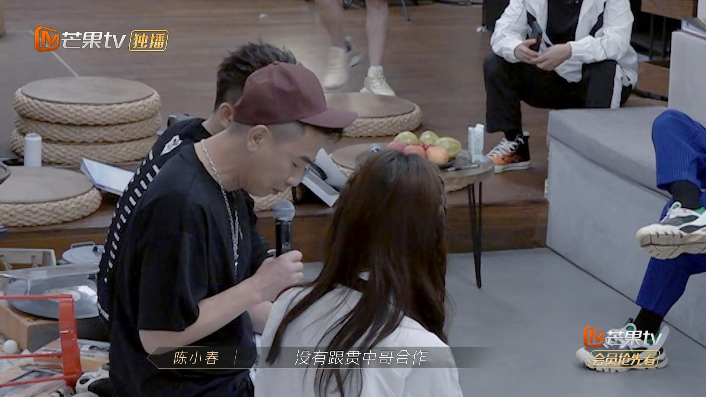
陳小春直言未能與Paul合作是節目中最大的遺憾。（視頻截圖）

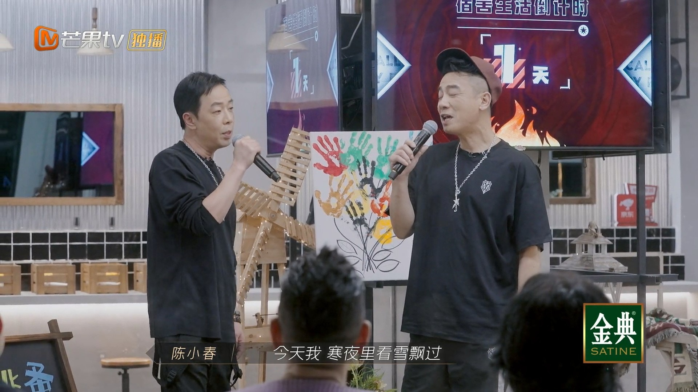
陳小春立即高歌《海闊天空》。（視頻截圖）

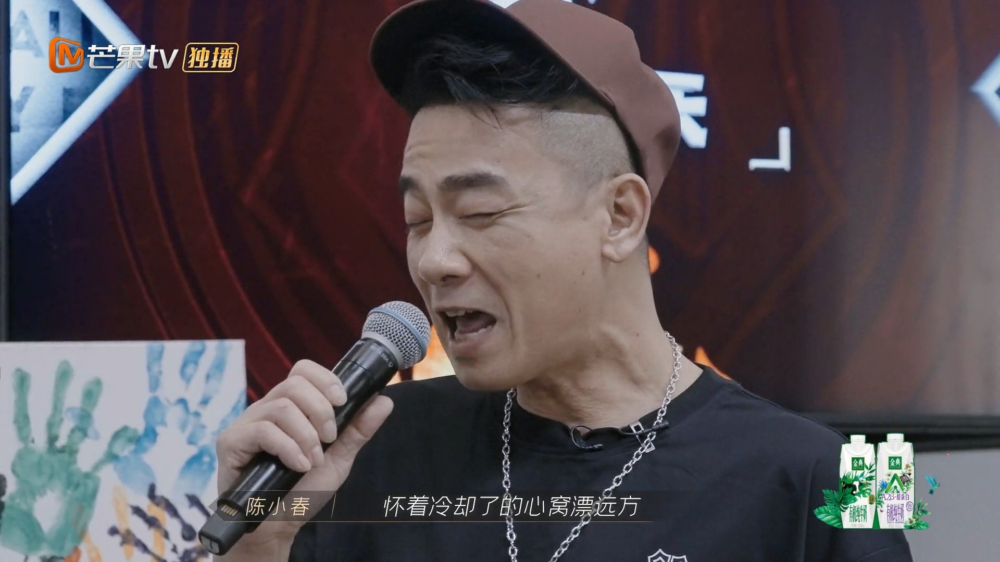
還不小心將音調起得太過。（視頻截圖）

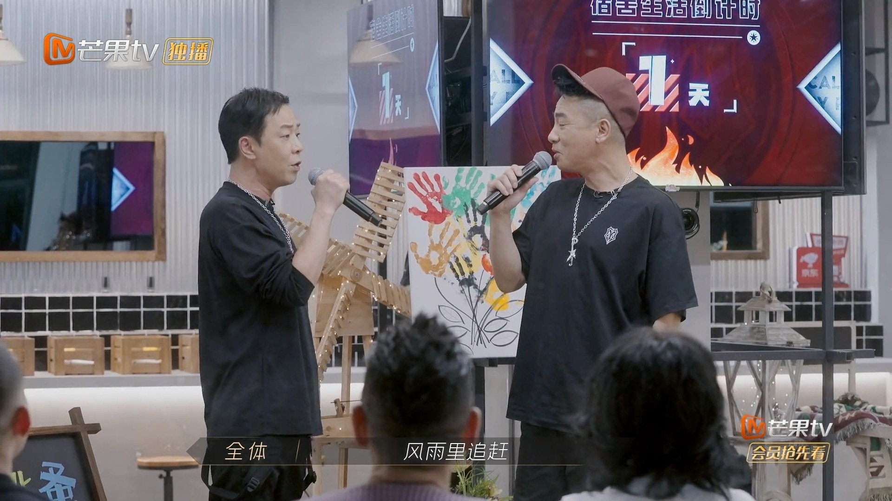
兩人對視合唱。（視頻截圖）

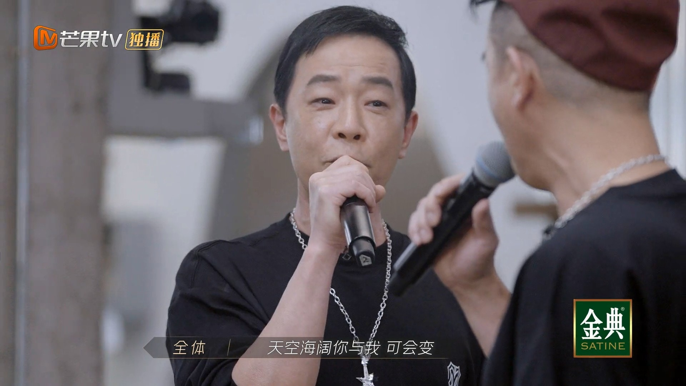
兩人對視合唱。（視頻截圖）

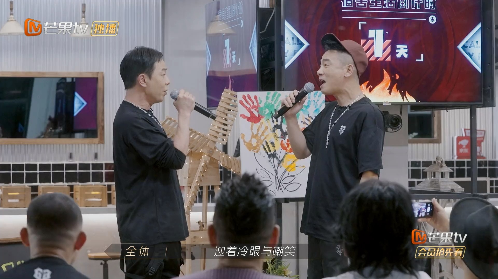
兩人對視合唱。（視頻截圖）

帶動全場氣氛，大家一起合唱。（視頻截圖）

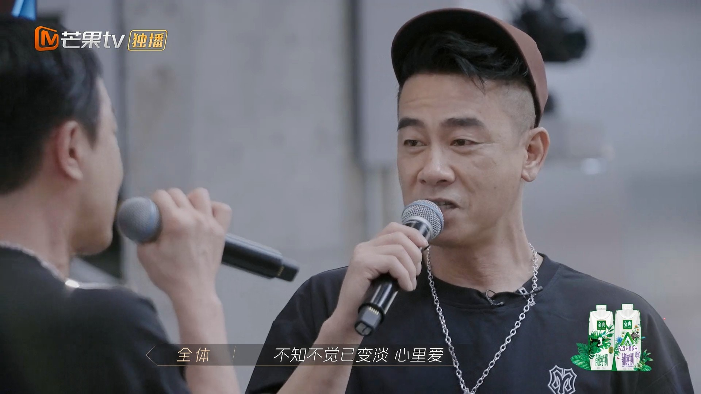
帶動全場氣氛，大家一起合唱。（視頻截圖）

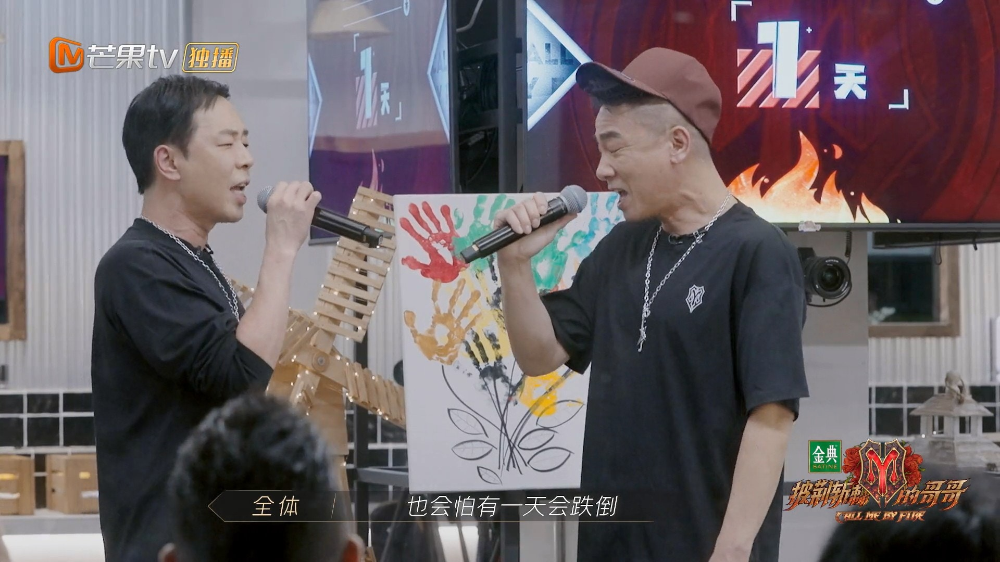
帶動全場氣氛，大家一起合唱。（視頻截圖）

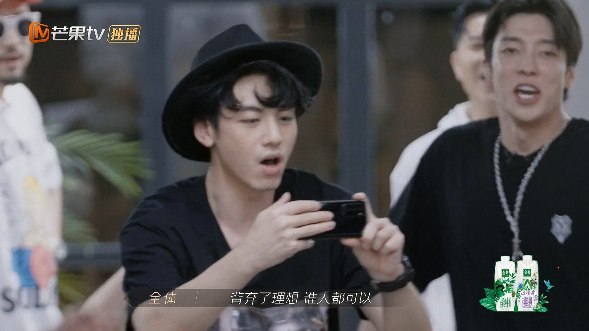
帶動全場氣氛，大家一起合唱。（視頻截圖）

陳小春一時羞澀。（視頻截圖）

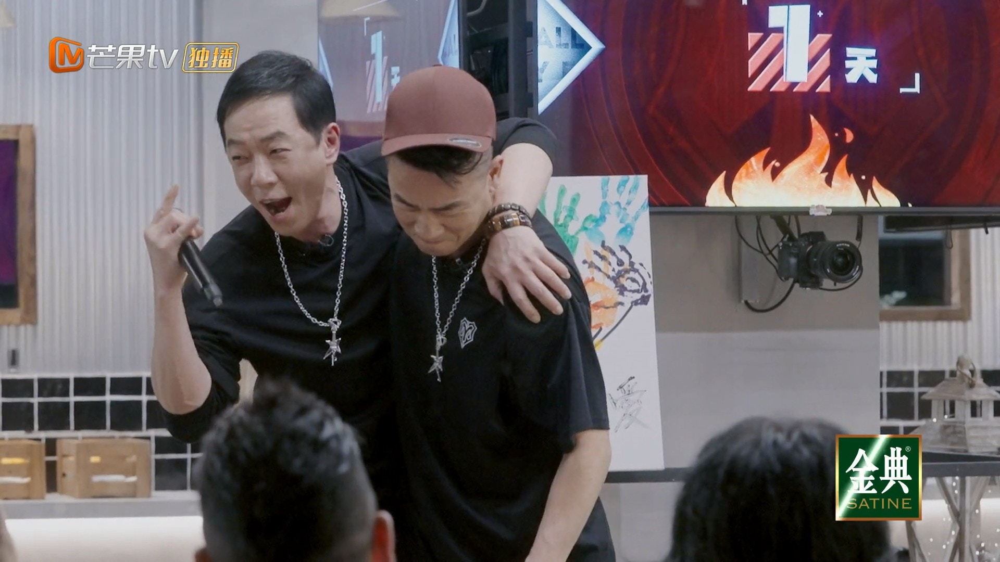
陳小春一時羞澀。（視頻截圖）

對此，不少網友都相當感動，紛紛留言道：「許多人的青春裡，都有一段海闊天空」、「淚目了，真是時代的眼淚」、「一開口我的眼眶就濕潤了，歌詞句句戳中內心，畫面太美好了」等。
