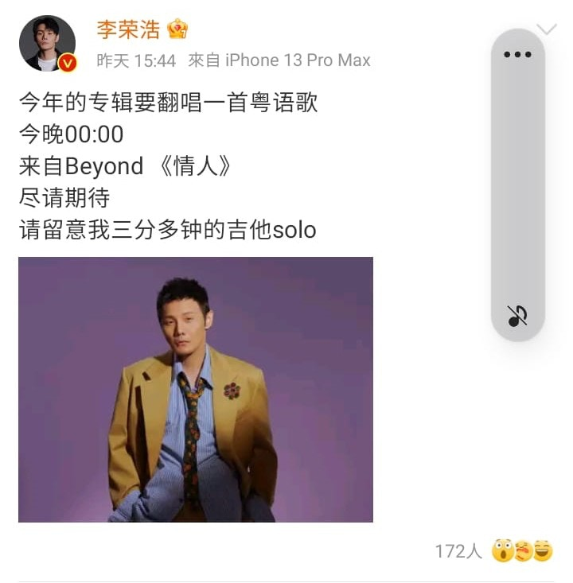
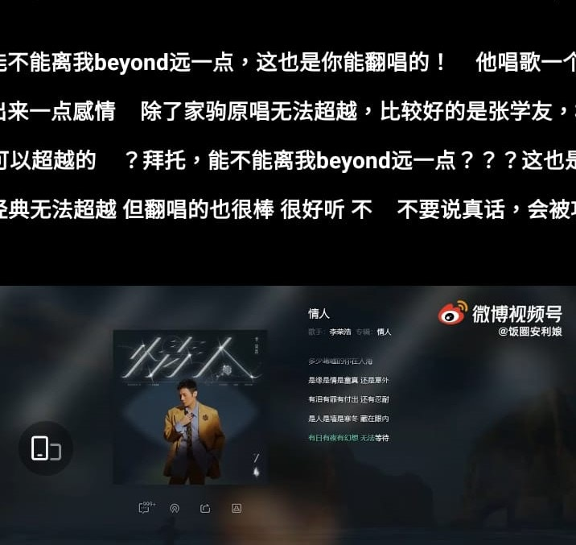
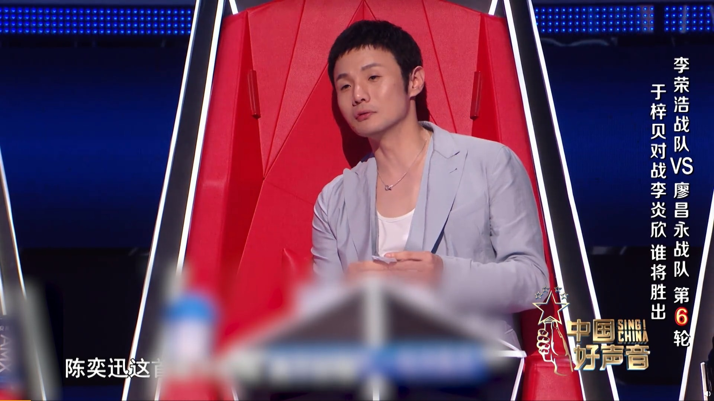
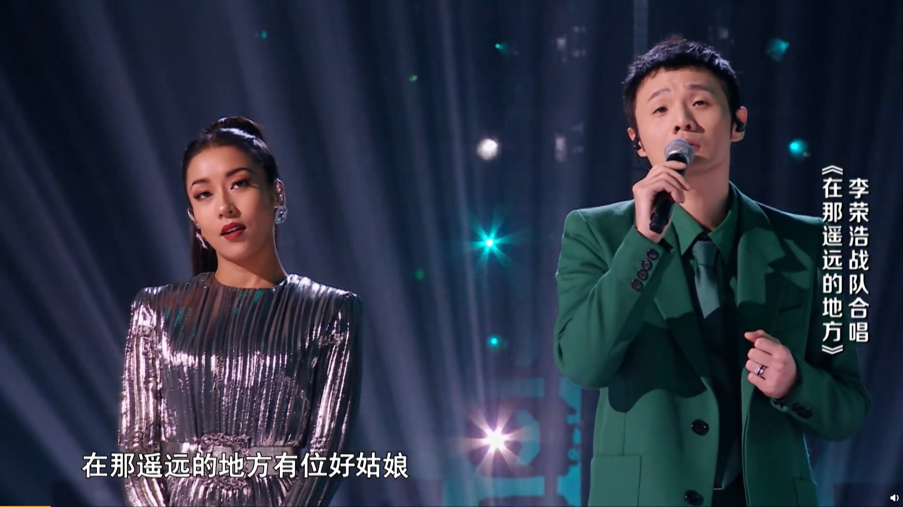
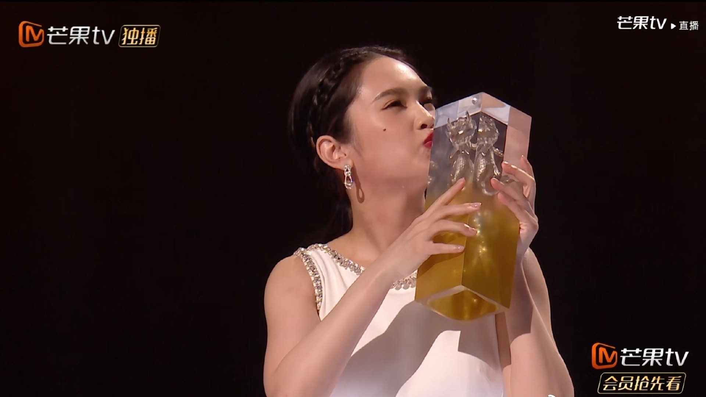

內地歌手李榮浩，繼早前擔任《中國好聲音2021》導師後，近日又有新搞作，推出了第7張專輯，最特別是翻唱了Beyond的粵語版《情人》，內裡加入了不少新的編曲，不過網民對於李榮浩的嘗試卻不賣帳，更指他唱不出家駒的氣勢，甚至叫他不要再抽水，情況尷尬。

李榮浩翻唱Beyond《情人》，只有結他Solo最厲害。（微博圖片）

李榮浩是內地著名音樂人，唱功亦無容置疑，但他要挑戰家駒的神級作品，卻不容易，尤其是要唱廣東話，李榮浩每每將「心」唱成「生」，「日」唱成了「入」，咬字不正外，重新編曲也讓先入為主的歌迷不賣帳，說還是喜歡Beyond的原版，除此之外，歌神張學友也曾翻唱《情人》，有比較難免有傷害，而網民批評李榮浩「唱歌只有一個調」、「拜託，能不能離Beyond遠一點」、「沒聽出一點感情，除了家駒原唱無法超越，比較好的是張學友」。不過整首歌最精彩還是最後的結他Solo，全首歌長7分鐘，結他Solo就佔了3分多鐘，確是相當破格的創作。

李榮浩翻唱《情人》，加入了重新編曲。（微博圖片）

張學友也曾翻唱《情人》。（影片截圖）

李榮浩叫大家留意他的結他Solo。（微博圖片）

網民指李榮浩唱不出家駒的氣勢。（微博圖片）

李榮浩擔任《中國好聲音2021》導師。（影片截圖）

李榮浩擔任《中國好聲音2021》導師。（影片截圖）

李榮浩本身也是唱得之人。（影片截圖）

**下圖有楊丞琳靚相：**

楊丞琳踢館成功過關斬將殺入總決賽。（楊丞琳微博圖片）

最後成功以第三名出道。（楊丞琳微博圖片）

（楊丞琳微博圖片）

楊丞琳組團成功秒回台。（《乘風破浪的姐姐2》微博圖片）

腹肌好明顯。（楊丞琳微博圖片）

側面看身材更好。（楊丞琳微博圖片）

身材好到找不到缺點。（楊丞琳微博圖片）
