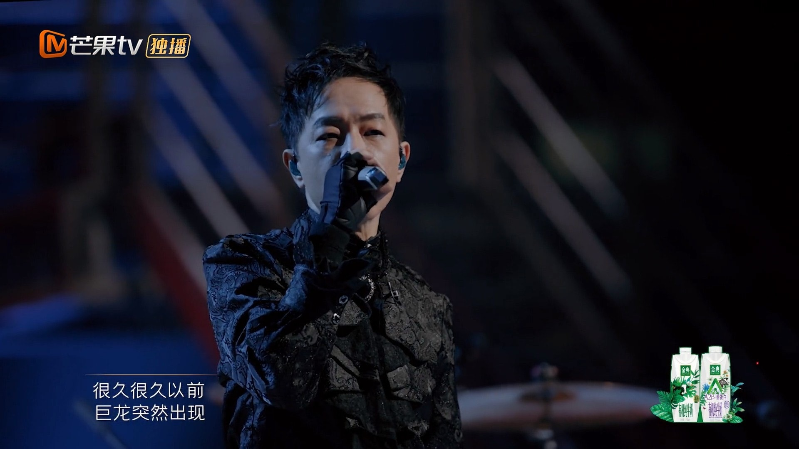

內地綜藝節目《披荊斬棘的哥哥》大受歡迎，其中令歌手黃貫中（Paul）人氣急升再度走紅。在節目過程中，Paul不時演唱Beyond的經典名曲《海闊天空》，又不時談及舊隊友黃家駒，讓部份網友覺得他總在消費黃家駒似的。

近日，他接受內地媒體訪問時再談起Beyond，表示《海闊天空》這首歌他是唱不厭的，因為歌曲承載了情懷同熱血，同時又強調自己沒辦法同黃家駒作出比較，因為對方猶如神一樣存在。

Paul因為《披荊斬棘的哥哥》再度走紅。（《披荊斬棘的哥哥》微博圖片）

《海闊天空》絕對是華語金曲之一，無論歌詞﹑曲風都非常動情，在不同的綜藝節目中都不時聽到這首金曲。而在《披荊斬棘的哥哥》中，Paul亦演唱多次掀起不少高潮。而近日在內地接受媒體訪問的他，談起這首歌的時候，表示自己起碼唱過一千次《海闊天空》，他是唱不厭的，亦相信聽的人亦不會厭煩，在他角度上認為這首歌可以同觀眾連在一起，當中承載了一種情懷同熱血感。

在節目中Paul不時演繹《海闊天空》。（影片截圖）

另外，對於外界有人指他的台風﹑聲音同黃家駒越來越相似，Paul則強調自己的聲音同對方不同，演繹的方法亦有所不同，覺得自己沒辦法同對方比較，因為他就像神一樣存在，強調大家對音樂的心是相同的，他亦相信每當Beyond的歌曲響起時，黃家駒都非常貼近我們，皆因他一直在大家心中。

Paul自認沒辦法同黃家駒比較。（影片截圖）

Paul因為《披荊斬棘的哥哥》人氣急升。（黃貫中微博圖片）

不時在節目上演唱Beyond的經典名曲。（黃貫中微博圖片）

在節目中成功組團出道。（《披荊斬棘的哥哥》微博圖片）

Paul表示《海闊天空》這首歌不會唱厭。（《披荊斬棘的哥哥》微博圖片）

同陳小春一起唱。（影片截圖）

在節目中Paul不時演繹《海闊天空》。（影片截圖）

Paul因為《披荊斬棘的哥哥》再度走紅。（《披荊斬棘的哥哥》微博圖片）

（《披荊斬棘的哥哥》微博圖片）

（微博圖片）
