要深究流行文化的時代意義，最容易的參考指標當然是看最多人留意的叱咤樂壇頒獎典禮，一翻查1997年，Beyond取得組合金獎，MIRROR在2021年只取得銀獎，還差一步，所以下年再比過！

【作者其他文章｜達明REPLAY：我愛你嗎我願能知道】

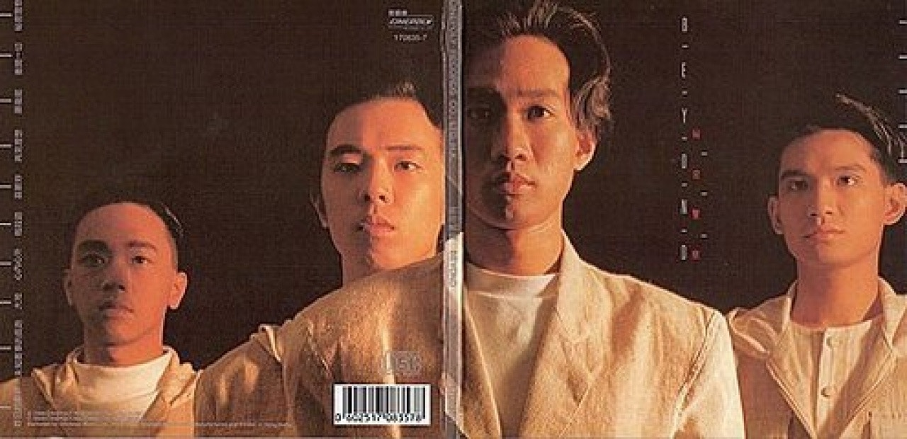
Beyond（資料圖片）

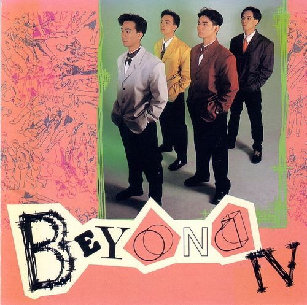
Beyond（資料圖片）

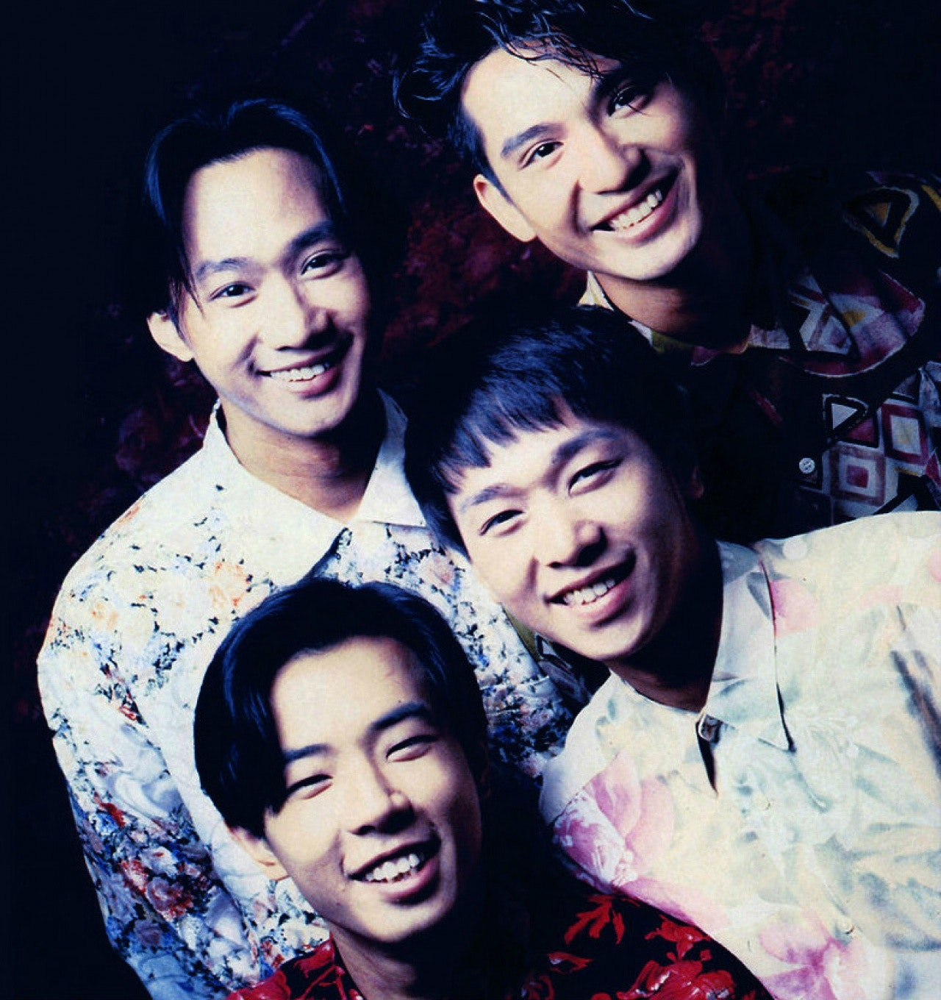
Beyond（資料圖片）

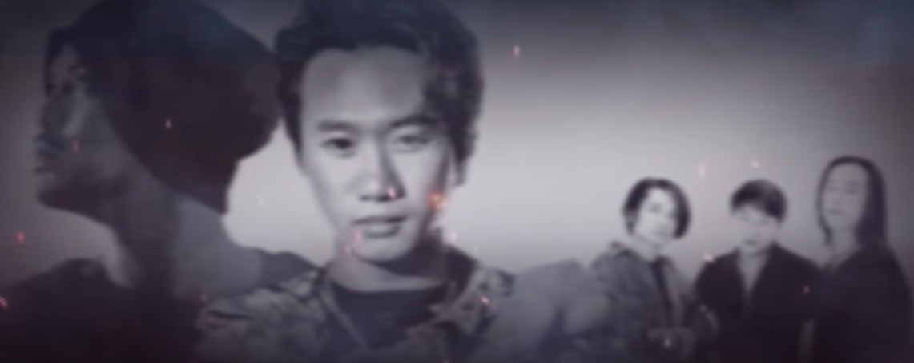
Beyond（資料圖片）

Beyond（資料圖片）

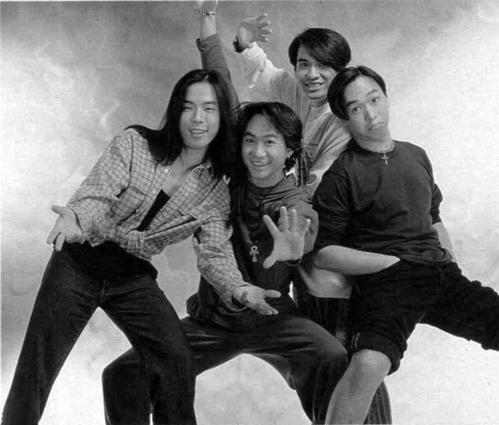
Beyond（資料圖片）

Beyond（資料圖片）

Beyond（資料圖片）

認真，MIRROR還有大把未來（當中《Warrior》很適合2021年），而叱咤當然不是唯一指標，但有其代表性。去年獲得金奬的C AllStar寫出不少代表香港人絕望但重拾希望的歌曲（《集合吧！地球保衞隊》、《留下來的人》、《沒明日的恐懼》）。

【作者其他文章｜叱咤頒獎禮以外有更值得留意的】

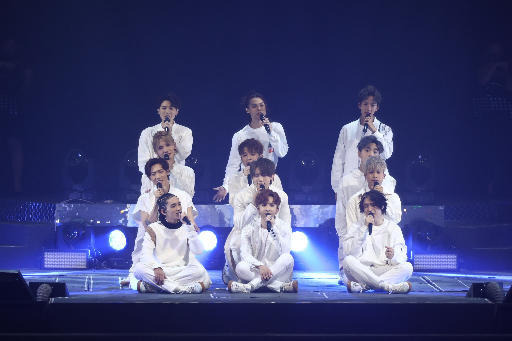
MIRROR（資料圖片）

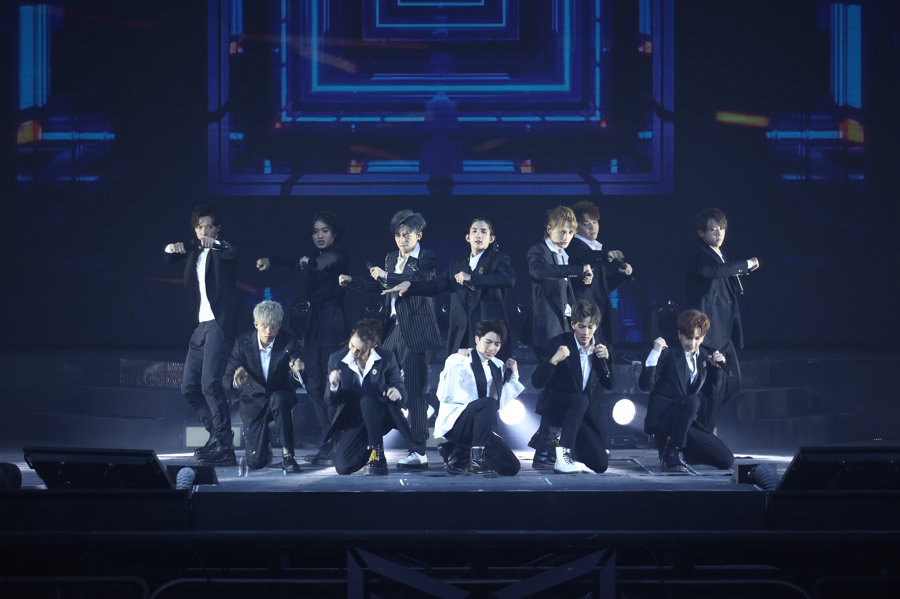
MIRROR（資料圖片）

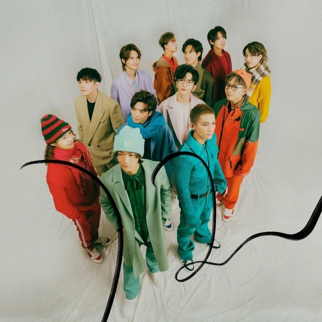
MIRROR（資料圖片）

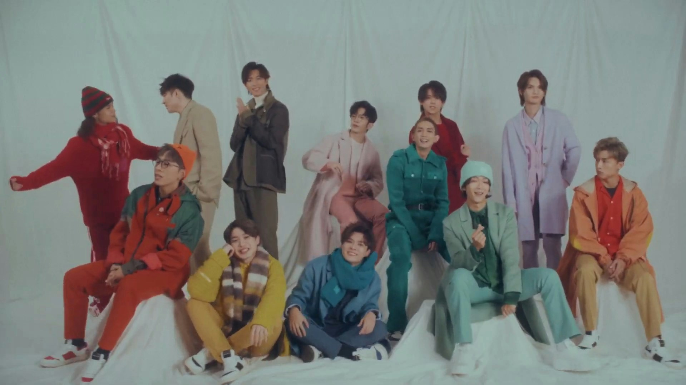
MIRROR（資料圖片）

MIRROR（資料圖片）

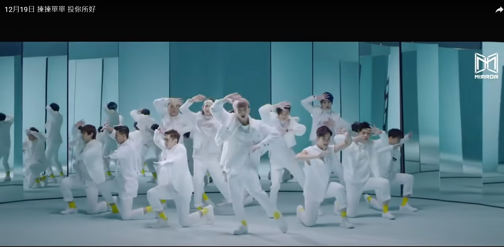
MIRROR（資料圖片）

MIRROR（資料圖片）

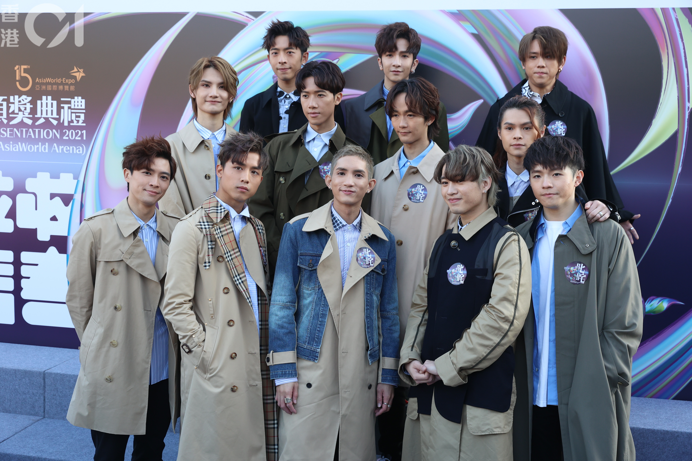
MIRROR（資料圖片）

MIRROR（資料圖片）

MIRROR（資料圖片）

MIRROR（資料圖片）

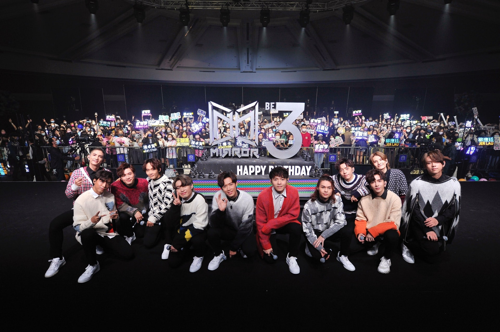
MIRROR（資料圖片）

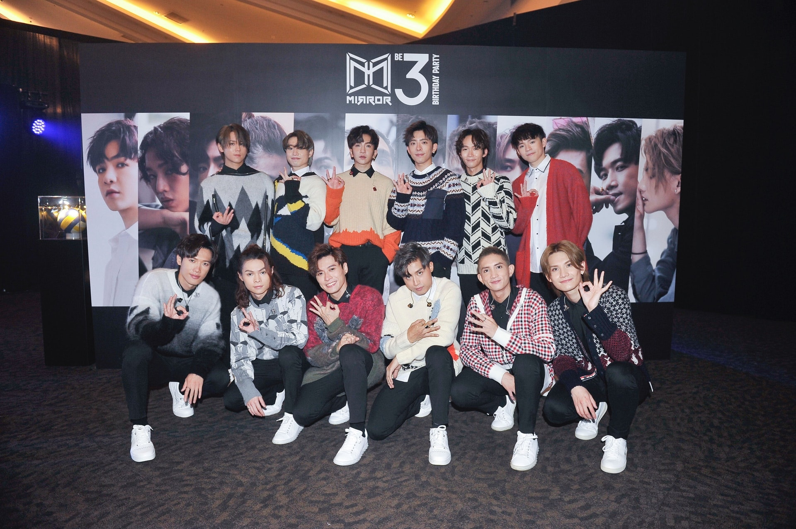
MIRROR（資料圖片）

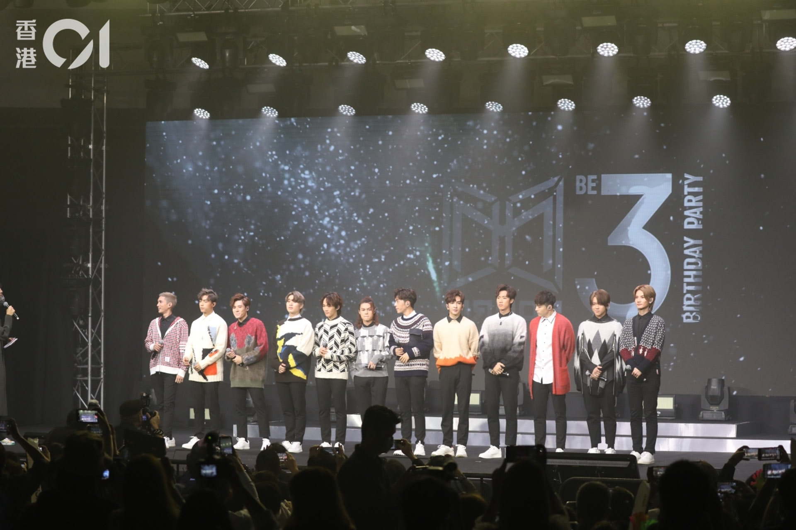
MIRROR（資料圖片）

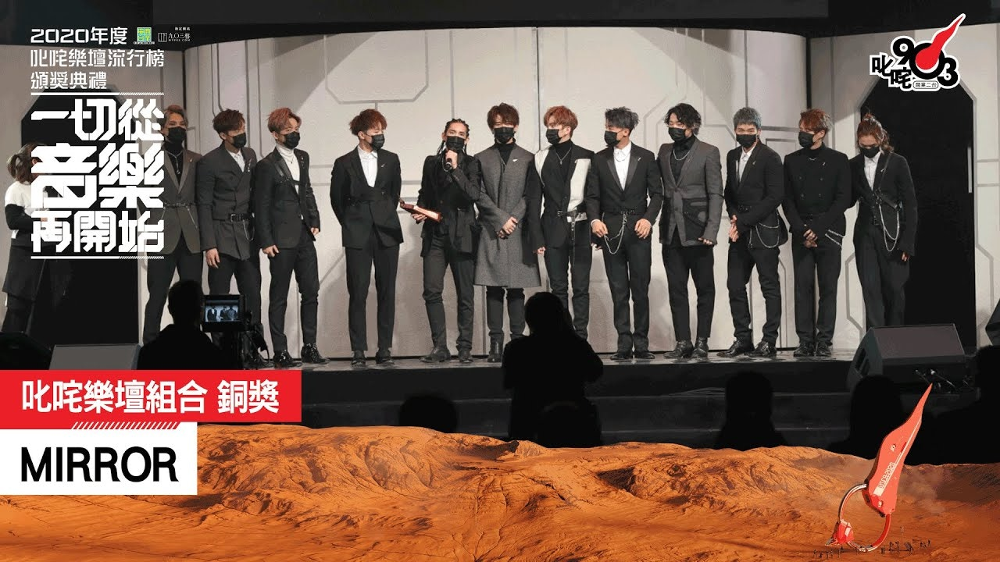
MIRROR（資料圖片）

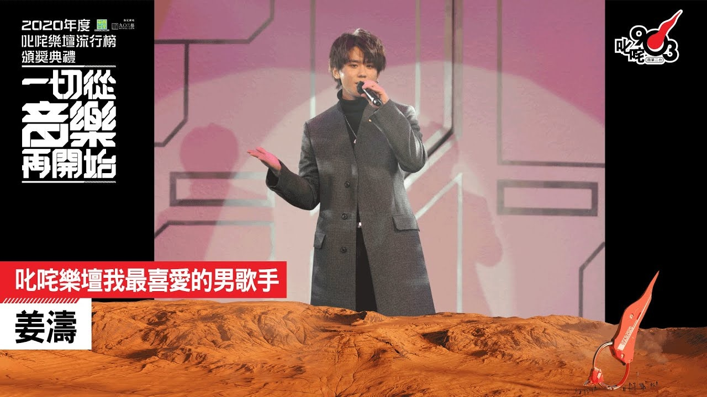
MIRROR（資料圖片）

流行曲若代言到集體意識，就有認受性了——這才是唯一指標。樂迷對組合比個人單位的群體性要求較高，單飛的人幫我在失戀時哭崩就好了，但組合還是要代我和社會上的他他他說宏大一點的事。組合往往是走出自己的路，看見自己之後，才能看見更多人，為社會發聲，為大氣氛畫龍點睛，為更多人抒發他們的情感。

今年的至尊歌曲大獎由RubberBand 的《Ciao》奪得，時代意義盡在歌詞字間裡，Ciao有再見的意思。

> 這刻我們在一起　笑喊悲喜
> 巨浪翻起　亦是在一起
> 聽朝散聚誰先飛　未及嘆氣
> 細緻收起　曾同行一起的美
> 懇請每天　好好地過安定還是冒險
> 好好掛牽　來日後見

歷史在重演，Beyond在97年的金曲為《回家》，真是命中命中。

> 翻起西北風他歸去在雨中
> 沾濕煙花好比褪色的落霞般
> 照遍了　東方的天空
> 當初的不懂始終也沒法懂
> 你共我又怎可抵擋得住潮湧
> 那憤慨一點點失縱
> 請你面對好嗎　別要掩蓋這傷疤
> 從今我便會跟你　但你不要停步

安定還是冒險，回家還是留下，保衛還是恐懼。不談受歡迎程度，因人人各有不同印象，就讓我們於歷史洪流沉澱，縰使有不同感想，仍離不開相同的事實。

（專欄「歌詞心頭好」隔周刊出，標題為編輯撰寫。本文不代表藝文格物立場）

【作者其他文章｜留下來的人唱留下來的人】

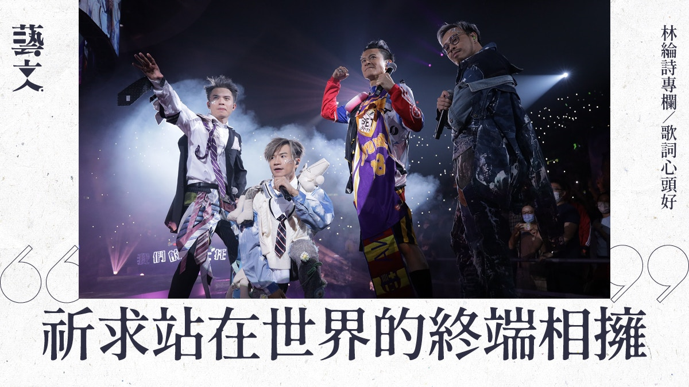

> 作者簡介｜林綸詩，80後中大人，鍾愛香港流行文化。寫過樂評、做過評審，最喜歡合唱歌。
