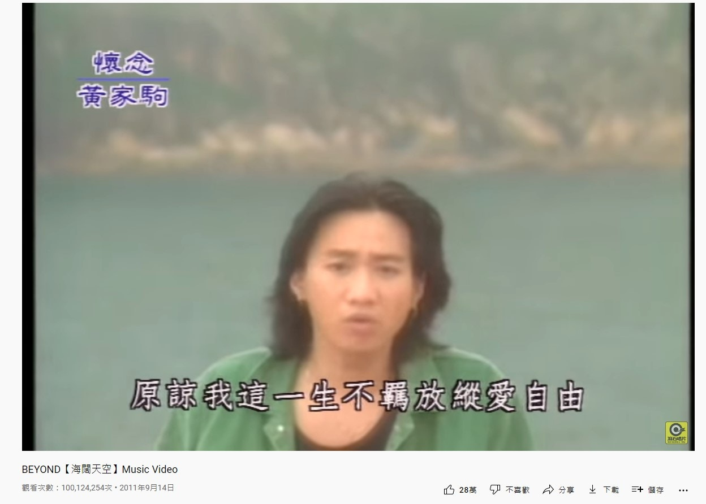
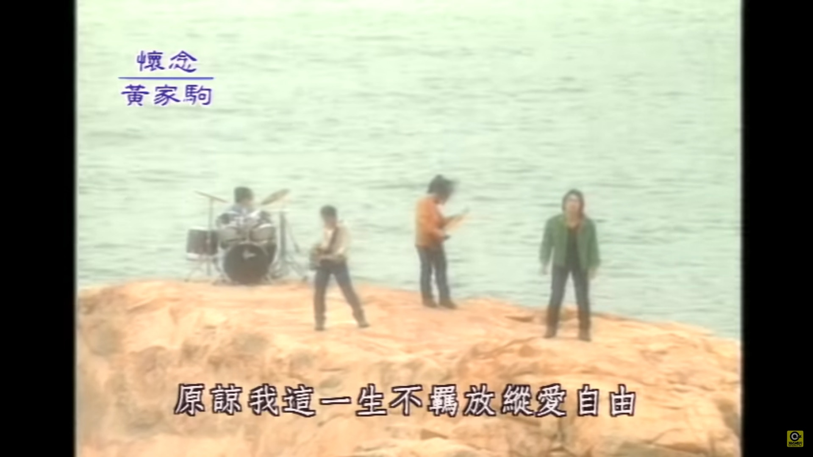
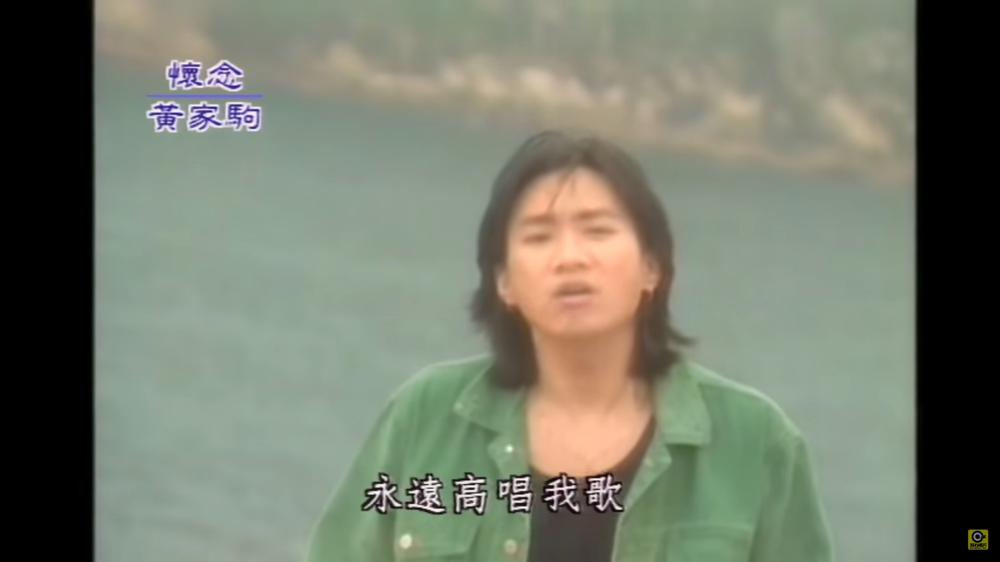
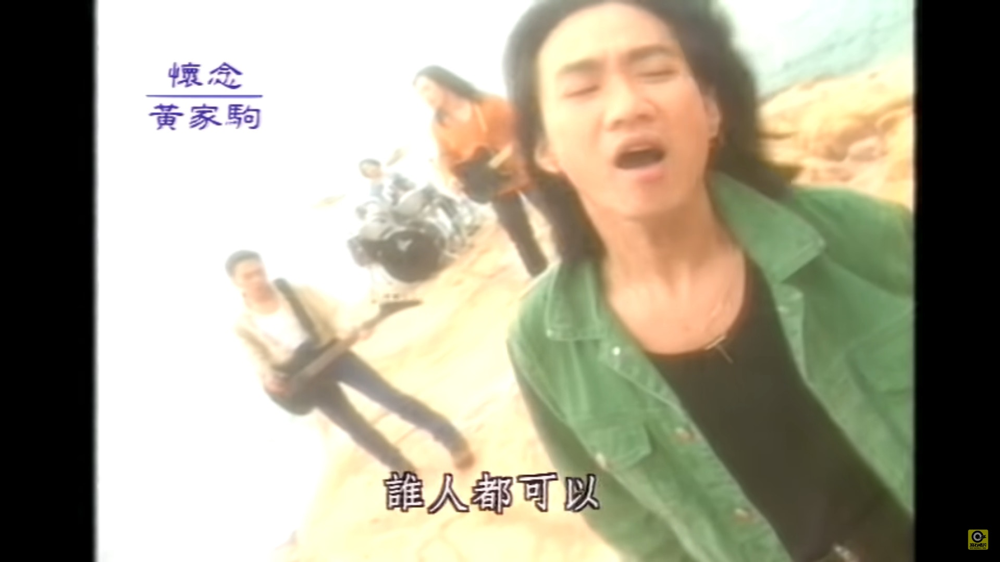

1993年面世的《海闊天空》，除了是傳奇樂隊Beyond的代表作，更成為華語樂壇的經典名曲。MV於2011年9月上架至滾石唱片的YouTube頻道，至今剛好已經是10年5個月，MV在YouTube的點擊次數衝破一億次，成為第一個達成里程碑的廣東歌MV。

《海闊天空》MV突破一億次點擊，是第一個廣東歌MV達成這個創舉。（網上截圖）

《海闊天空》收錄至1993年Beyond最後一張以4人樂隊姿態推出的專輯《樂與怒》，也是屬於Beyond最後一首由黃家駒主唱的派台作品。歌曲是家駒為Beyond成立十周年而創作，記錄著樂隊10年來的心路歷程，可惜他當年在日本拍攝電視節目時遇到意外，從2.7米高的舞台不慎墜下，最後重傷不治，終年31歲。

10年半前滾石唱片決定重推《海闊天空》MV向Beyond致敬，近日MV在YouTube的點擊率突破一億次。（MV截圖）

10年半前滾石唱片決定重推《海闊天空》MV向Beyond致敬，近日MV在YouTube的點擊率突破一億次。（MV截圖）

10年半前滾石唱片決定重推《海闊天空》MV向Beyond致敬，近日MV在YouTube的點擊率突破一億次。（MV截圖）

1993年推出的《樂與怒》是家駒離世前最後一張專輯，主打歌《海闊天空》更傳頌至今。（網上圖片）

Beyond的《海闊天空》以追求音樂夢想為主題，卻遭到唱片公司打擊才決定遠走日本發展。（作者提供）

《海闊天空》推出初期原來不受歡迎，連電台的播放率亦不算高。歌曲原名為《Piano Song》，正是Beyond在日本發展時完成。當中一句「也會怕有一天會跌倒 Oh No！」其實原本應為「Oh Yeah！」 (網絡圖片)

Beyond的作品中，不少也是跟「理想」有關，屈指一算，足足有32首作品也出現了「理想」一詞。當中包括：《海闊天空》、《真的愛你》、《喜歡你》、《大地》、《再見理想》、《誰伴我闖蕩》等等。 (網絡圖片)
