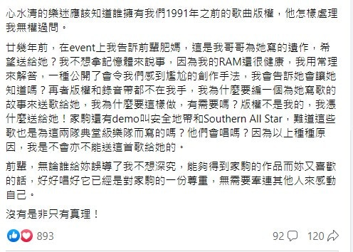

為了紀念BEYOND靈魂人物黃家駒逝世30年，周六晚（24日）無綫播出特備節目《永遠光輝 黃家駒》，記錄了不少Beyond與家駒生前的珍貴片段。節目中肥媽 (Maria Cordero) 透露黃家強曾找她，表示哥哥家駒生前寫過一首歌給自己，不過這番話卻惹來黃家強的不滿，更公開炮轟肥媽「都是謊話」。對此，肥媽即出post澄清，並貼出一張錄音帶盒的相片，盒上的字是肥媽所講當年家駒錄製好的歌曲名。肥媽說：「是家駒生前留下並寫上肥媽兩字，希望我可以完成這首歌。」

肥媽。

黃家駒。

肥媽曬出的錄音帶。

黃家強就肥媽的澄清post，於今日在FB發長文回應，直指：「與其羅生門不如用常理吧。首先我想大家了解一下我們寫歌的過程，怎樣形成demo，當中有很多方法，在這裡我不細說其他方法，因為與這事件無關，只想講述為什麼會以其他音樂人或樂隊的名字作題材。」

家強續說：「八十年代中，Beyond只是一隊熱愛音樂而且還在默默耕耘的樂隊，為了能夠在商業市場生存，我們會參考一些流行音樂做藍本，當時日本音樂在香港大行其道，例如：安全地帶、Southern All Star.. 他們的歌被多少香港歌手翻唱，大家都很清楚，而在香港也有我們欣賞與尊敬的前輩：擁有獨特黑人騷靈和R&B唱腔的前輩肥媽Maria Cordero和唱Blues不作他選的前輩夏紹聲Danny Summer。

以上我所提及的四個單位的名字在我印象中都曾經出現過在家駒的Demo上（我也有Demo叫U2，回想起來耳根都發熱），為什麼會用他們的名字作demo title? 原因很簡單，因為受了他們的音樂風格影響而創作出來的作品，而當時還未有確切的題材，最直接了當的方法記錄下來便是這樣，只要看到暫定的歌名，便可以在選歌時大概會知道這些歌的風格。」

黃家強同樣受到粉絲愛戴。（微博圖片）

家強又解釋其實這些事不應對外公開：「這些不應與外人知的創作小秘密，對我們來說，如果被公開了是頗尷尬的事情，話雖是受他們影響而得到靈感，但歌曲還是原創的，而且作品完成之後，會有真正的題材，所以我們會刪除這些創作紀錄，只會講述現有題材和曲風。好可惜亦好無奈，有些名字demo已經被擁有者在沒有理會我們感受之下在較早之前出版過了。心水清的樂迷應該知道誰擁有我們1991年之前的歌曲版權，他怎樣處理我無權過問。」

Beyond。（黃家強Facebook圖片）

家強再解說肥媽指當年家駒為她寫歌一事：「廿幾年前，在event上我告訴前輩肥媽，這是我哥哥為她寫的遺作，希望送給她？我不想拿記憶體來說事，因為我的RAM還很健康，我用常理來解答，一種公開了會令我們感到尷尬的創作手法，我會告訴她會讓她知道嗎？再者版權和錄音帶都不在我手，我為什麼要編一個為她寫歌的故事來送歌給她，我為什麼要這樣做，有需要嗎？版權不是我的，我憑什麼送給她！家駒還有demo叫安全地帶和Southern All Star，難道這些歌也是為這兩隊典堂級樂隊而寫的嗎？他們會唱嗎？因為以上種種原因，我是不會亦不能送這首歌給她的。

前輩，無論誰給妳誤導了我不想深究，能夠得到家駒的作品而妳又喜歡的話，好好唱好它已經是對家駒的一份尊重，無需要牽連其他人來感動自己。

沒有是非只有真理！」

黄家强。 （图片来源：新浪微博@黃家強SteveWong）

黃家強原post全文。(fb截圖)

黃家強原post全文。(fb截圖)
