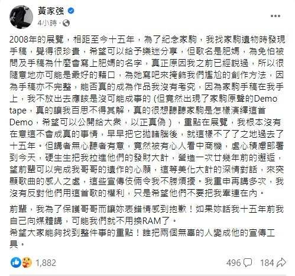

為了紀念BEYOND靈魂人物黃家駒逝世30年，周六晚（24日）無綫播出特備節目《永遠光輝 黃家駒》，記錄了不少Beyond與家駒生前的珍貴片段。節目中肥媽 (Maria Cordero) 透露黃家強曾找她，表示哥哥家駒生前寫過一首歌給自己，不過這番話卻惹來黃家強的不滿，更公開炮轟肥媽「都是謊話」。

肥媽。(資料圖片)

對此，肥媽即出post澄清，並貼出一張錄音帶盒的相片，盒上的字是肥媽所講當年家駒錄製好的歌曲名。肥媽說：「是家駒生前留下並寫上肥媽兩字，希望我可以完成這首歌。」之後家強再發長文回應指：「沒有是非只有真理」揭開當中真相，肥媽即反擊指家強在2008年5月出席樹仁大學「別了家駒十五載 - 舊日的足跡座談會」做訪問時，的確提及到家駒作曲予肥媽，更有當年有關報道的截圖做證。這亦推翻了家強日前聲稱demo錄音帶盒上的名稱是代表曲風的說法。

黃家強同樣受到粉絲愛戴。（微博圖片）

家強今早清晨6時，第三度發文回應肥媽，為2008年談及家駒作品展訪問時所說那段話解畫。

家強表示：「2008年的展覽，相距至今十五年，為了紀念家駒，我找家駒遺物時發現手稿，覺得很珍貴，希望可以給予樂迷分享，但歌名是肥媽，為免怕被問及手稿為什麼會寫上肥媽的名字，真正原因我之前已經說過，所以很隨意地亦可能是最好的藉口，為她寫吧來掩飾我們尷尬的創作方法，因為手稿亦不完整，能否真的成為作品我沒有考究，因為家駒手稿在我手上，我不放出去應該是沒可能成事的 (但竟然出現了家駒原聲的Demo tape，真的讓我百思不得其解，真的很想聽聽家駒是怎樣演繹這首Demo，希望可以公開給大衆，以正真偽），重點在展覽，我根本沒有在意這不會成真的事情，早早把它拋諸腦後，就這樣不了了之地過去了十五年。」

肥媽。

黃家駒。

肥媽曬出的錄音帶。

家強續說：「但講者無心聽者有意，竟然被有心人看中商機，處心積慮部署到今天，硬生生把我拉進他們的發財大計，營造一次廿幾年前的邂逅，望前輩可以完成我哥哥的遺作的心願，這等美化大計的深情對話，來突顯歌曲的感人之處，這些宣傳伎倆令我不勝煩擾。我重申再講多次，我沒有反對他們用這首歌的權利，只是希望他們不要把我牽連在內。

前輩，我為了保護哥哥而讓妳表錯情感到抱歉！如果妳話我十五年前我自己向媒體講，可能我們就不用換RAM了。

希望大家能夠找到整件事的重點！誰把兩個無辜的人變成他的宣傳工具。」

Beyond。（黃家強Facebook圖片）

點擊睇家強原post全文：

黃家強。原post全文

家強原post全文。(fb截圖)
