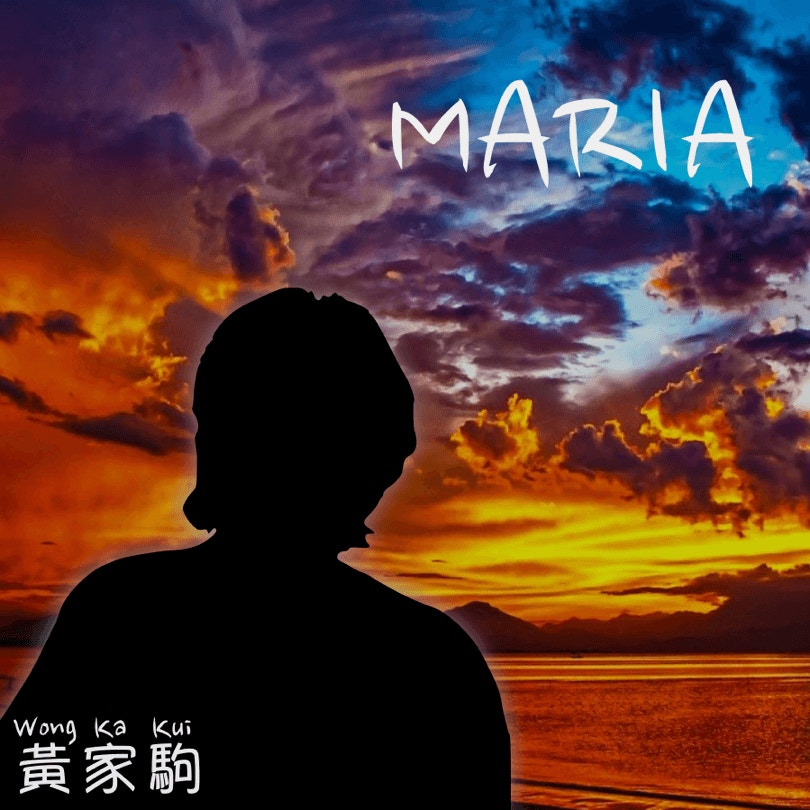
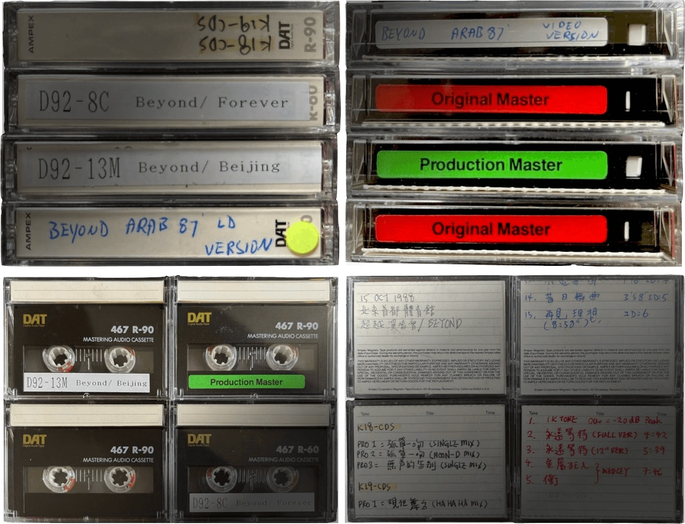

為紀念BEYOND靈魂人物黃家駒逝世30年，上周六（24日）無綫播出特備節目《永遠光輝 黃家駒》，記錄不少Beyond與家駒生前的珍貴片段。節目中肥媽透露黃家強曾找她，表示哥哥家駒生前寫過一首歌給自己，這番話卻演變成一場記憶角力。

肥媽。

黃家駒。

肥媽曬出的錄音帶。

繼昨晚（27日）肥媽貼出錄音帶照及2008年5月家強出席樹仁大學「別了家駒十五載 - 舊日的足跡座談會」做訪問時，的確提及到家強表示有首歌給予肥媽，更有當年有關報道的截圖做證。今早家強再為「自打嘴巴」解畫，事件沒完沒了。

黃家強同樣受到粉絲愛戴。（微博圖片）

不過家強在帖文中表示不清楚為甚麼網上有「肥媽」一曲家駒原聲demo tape，更指不知真偽。其實網上流傳聲稱是家駒原聲哼唱的「肥媽」demo，早於去年11月19日已曝光，全片只有50秒。

「肥媽」一曲demo，他稱家駒寫歌時會考慮適合哪些歌手演繹。（HarmoniXX網站圖片）

翻查資料，demo tape由一個名為 HarmoniXX 的網站販售。網站稱今次與Kinn’s Music創辦人、即Beyond前經理人陳健添 （Leslie）合作，推出經過AI技術及現代音頻修復的《Maria》（即『肥媽』）demo NFT，價格為0.065ETH，可售數量約1658，而肥媽本人演繹的《 感激這對手 》，歌曲版權屬亦屬Kinn’s Music，即Leslie所有。

網站聲稱為紀念傳奇搖滾⾳樂⼈黃家駒60週年⽣辰，HarmoniXX再次推出極具收藏意義的NFT作品。結合現代⾳頻優化及AI技術，修復還原黃家駒本⼈原聲哼唱，並結合他⽣前從未⾯世的珍貴原創demo -《肥媽》，隨機⽣成若⼲份獨⼀無⼆的⾳樂片段《Maria》。此外，每⼀張唱片封⾯也都有其背後的故事，採⽤WPAP畫風，藝術化地呈現黃家駒⼈⽣與⾳樂事業的⾼光時刻。借此作品，賦予⼤家希望與⼒量，以他’打不死的’搖滾精神，激勵⼀代⼜⼀代的⼈，不被定義，砥礪奮進。另外，NFT持有者還有機會得到Beyond的DAT digital master，包括1986至1988年多個演唱會現場錄音，及部份歌曲錄音母帶。

NFT持有者還有機會得到Beyond的DAT digital master，包括1986至1988年多個演唱會現場錄音，及部份歌曲錄音母帶。（HarmoniXX網站圖片）

去年初Beyond成員黃貫中（Paul）已跟HarmoniXX合作，推出NFT音樂作品《彗星》。為宣傳《Maria》NFT，HarmoniXX 還請來Leslie講解今次合作緣由。Leslie表示因見到黃貫中推出NFT，「覺得效果非常好」，故促成合作。

至於「肥媽」一曲demo，他稱家駒寫歌時會考慮適合哪些歌手演繹，「當他88年完成『肥媽』這個demo之後，他覺得這首歌適合肥媽瑪莉亞，所以在demo的卡帶上寫『肥媽』這個名字。」又指忘了為何當年沒送到肥媽手上。
